---
author:
  name: София Черная
  email: 1132236043@pfur.ru
  affiliation:
    - name: Российский университет дружбы народов
      city: Москва
title: "Лабораторная работа №1"
subtitle: "Модель экспоненциального роста"
format:
  pdf:
    toc: true
    number-sections: true
  docx:
    toc: true
---

```{julia}
#| echo: false
#| include: false
# Активация проекта
import Pkg
Pkg.activate(joinpath(@__DIR__, "..", "project"))

using DifferentialEquations
using Plots
using DataFrames

# Явно указываем использовать GR бэкенд с PNG выводом
gr(size=(800,600), dpi=150)

# Создаём папки для графиков
mkpath(joinpath(@__DIR__, "..", "project", "plots"))
```

# Цель работы

Изучение модели экспоненциального роста и освоение методов имитационного моделирования с использованием языка Julia и пакета DrWatson.

# Задание

Создать рабочее пространство для курса, настроить Git и GitHub, реализовать модель экспоненциального роста в базовом и параметрическом вариантах, оформить отчёт с использованием литературного программирования.

# Выполнение лабораторной работы

## Настройка окружения

### Установка Git и базовая настройка
Был установлен Git и выполнена базовая настройка: указаны имя пользователя и email, настроена кодировка UTF-8, задано имя начальной ветки master, настроены параметры autocrlf и safecrlf (рис. 1-3).

{#fig:001 width=70%}

{#fig:002 width=70%}

{#fig:003 width=70%}

### Создание SSH-ключа и добавление на GitHub
Сгенерирован SSH-ключ по алгоритму ed25519 для безопасного подключения к GitHub (рис. 4). Публичный ключ скопирован и добавлен в настройках аккаунта GitHub (рис. 5).

{#fig:004 width=70%}

{#fig:005 width=70%}

### Установка Node.js, npm, pnpm и git-flow
Установлены Node.js и npm (рис. 6). При попытке установить yarn через apt был установлен cmdtest (неверный пакет) (рис. 7). Позже Node.js и npm были переустановлены (рис. 8).

{#fig:006 width=70%}

{#fig:007 width=70%}

{#fig:008 width=70%}

Проверены версии Node.js (v18.19.1) и npm (9.2.0), после чего через npm установлен pnpm (рис. 9). Выполнена настройка pnpm (рис. 10). Установлен git-flow (рис. 11).

{#fig:009 width=70%}

{#fig:010 width=70%}

{#fig:011 width=70%}

## Создание репозитория курса

На GitHub из шаблона `course-directory-student-template` создан репозиторий `2026-1--study--simulation-modeling` (рис. 12-14).

{#fig:012 width=70%}

{#fig:013 width=70%}

{#fig:014 width=70%}

Репозиторий склонирован на локальную машину (рис. 15). Выполнена инициализация курса: создан файл COURSE и запущена команда `make prepare` для загрузки подмодулей (рис. 16).

{#fig:015 width=70%}

{#fig:016 width=70%}

Изменения добавлены в Git и отправлены на GitHub (рис. 17-18).

{#fig:017 width=70%}

{#fig:018 width=70%}

## Настройка Git Flow

Выполнена инициализация Git Flow с префиксом тегов `v` (рис. 19). Созданы ветки master и develop (рис. 20).

{#fig:019 width=70%}

{#fig:020 width=70%}

Создан релиз версии 1.0.0 (рис. 21). Установлен `standard-changelog` для генерации журнала изменений (рис. 22). Создан CHANGELOG.md (рис. 23) и добавлен в Git (рис. 24).

{#fig:021 width=70%}

{#fig:022 width=70%}

{#fig:023 width=70%}

{#fig:024 width=70%}

Релиз завершён, изменения отправлены на GitHub (рис. 25).

{#fig:025 width=70%}

## Установка Julia и создание проекта DrWatson

Установлена Julia через snap с флагом --classic (рис. 26-27).

{#fig:026 width=70%}

{#fig:027 width=70%}

В Julia установлен пакет DrWatson (рис. 28) и создан проект `project` в папке `labs/lab01/` (рис. 29).

{#fig:028 width=70%}

{#fig:029 width=70%}

Установлены необходимые пакеты (DifferentialEquations, Plots, DataFrames и др.) (рис. 30). Создан тестовый скрипт `test_setup.jl` для проверки установки (рис. 31-32).

{#fig:030 width=70%}

{#fig:031 width=70%}

{#fig:032 width=70%}

Запуск тестового скрипта подтвердил корректную установку всех пакетов (рис. 33).

{#fig:033 width=70%}

## Модель экспоненциального роста (базовый вариант)

```{julia}
# Определяем модель экспоненциального роста
function growth!(du, u, p, t)
    α = p
    du[1] = α * u[1]
end

# Параметры
u0 = [1.0]
α = 0.3
tspan = (0.0, 10.0)

# Решаем ODE
prob = ODEProblem(growth!, u0, tspan, α)
sol = solve(prob, Tsit5(), saveat=0.1)

# Выводим первые 5 результатов
println("Первые 5 строк результатов:")
for i in 1:5
    println("t = $(round(sol.t[i], digits=2)), u = $(round(sol.u[i][1], digits=3))")
end

# Время удвоения
doubling_time = log(2) / α
println("\nАналитическое время удвоения: $(round(doubling_time, digits=2))")
```

Создан скрипт `01_exponential_growth.jl` (рис. 34) с кодом модели (рис. 35). Скрипт реализует решение уравнения du/dt = α·u с начальными условиями u₀=1.0 и α=0.3.

{#fig:034 width=70%}

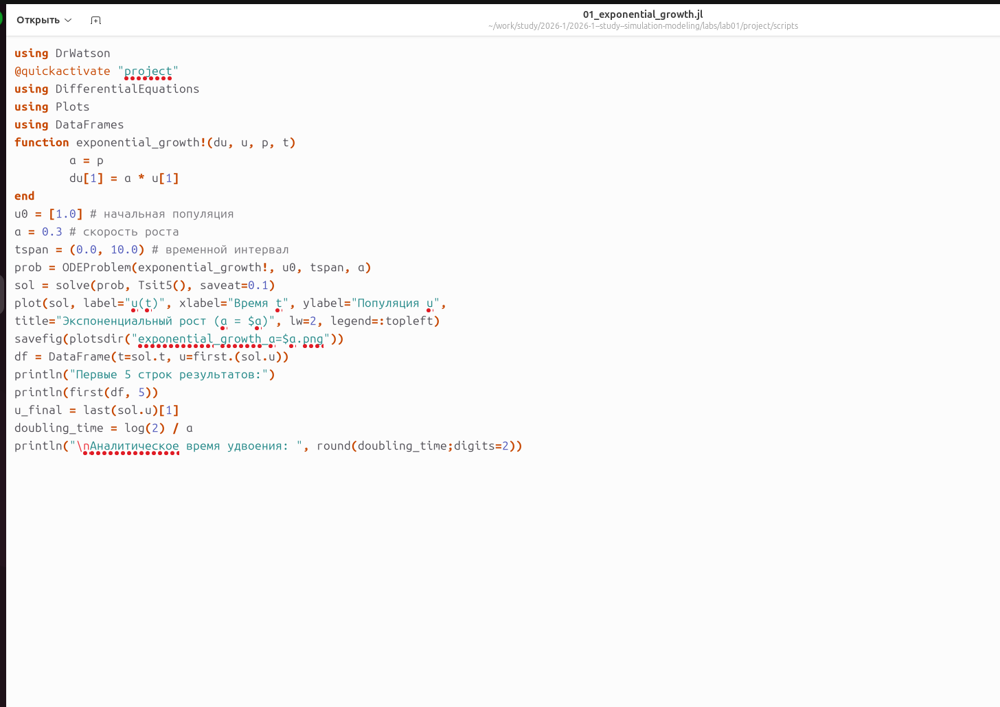{#fig:035 width=70%}

При запуске получены первые 5 строк результатов и вычислено аналитическое время удвоения (2.31) (рис. 36). Сгенерирован график экспоненциального роста (рис. 37).

```{julia}
# График
plot(sol, 
     xlabel="Время t", 
     ylabel="Популяция u",
     title="Экспоненциальный рост (α=0.3)",
     legend=false,
     lw=2)
savefig(joinpath(@__DIR__, "..", "project", "plots", "exponential_growth.png"))
```

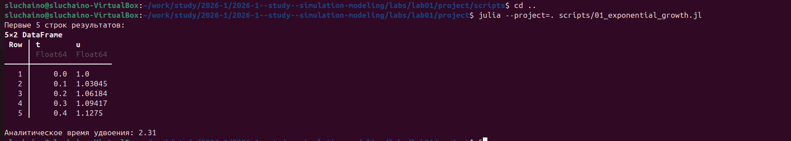{#fig:036 width=70%}

{#fig:037 width=70%}

## Литературный стиль

Скрипт преобразован в литературный стиль: добавлены комментарии с описанием модели, инициализацией проекта и анализом результатов (рис. 38). Запуск литературного скрипта дал аналогичные результаты (рис. 39-40).

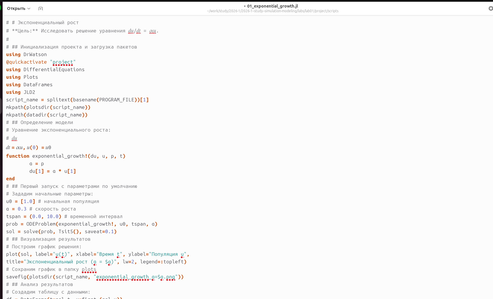{#fig:038 width=70%}

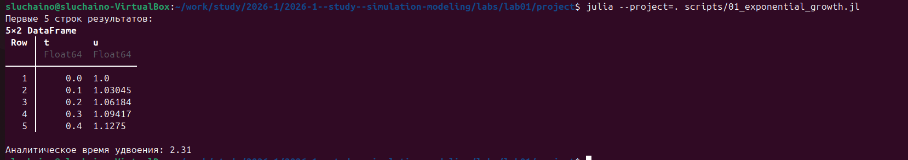{#fig:039 width=70%}

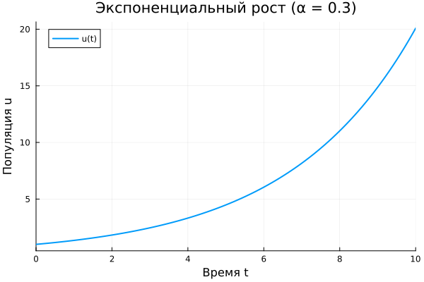{#fig:040 width=70%}

## Генерация производных форматов

Создан скрипт `tangle.jl` для генерации чистого кода, Jupyter Notebook и Quarto-документации из литературных скриптов (рис. 41-42). Выполнена генерация для скрипта `01_exponential_growth.jl` (рис. 43).

{#fig:041 width=70%}

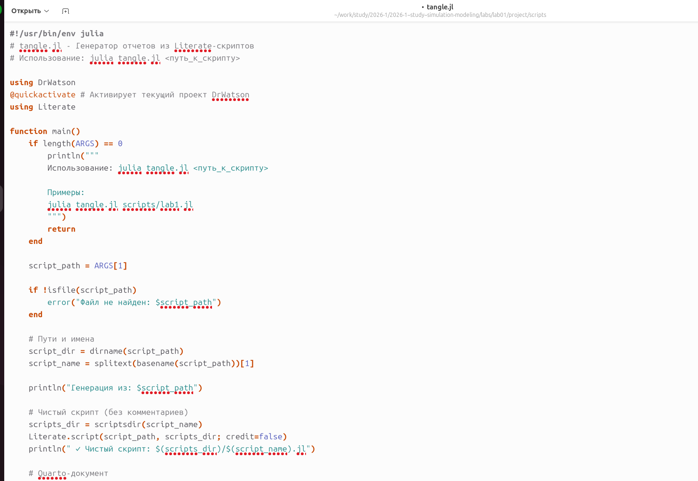{#fig:042 width=70%}

## Параметрическое исследование

```{julia}
# Параметрическое исследование
α_values = [0.1, 0.3, 0.5, 0.8, 1.0]
results = []

p = plot(xlabel="Время t", ylabel="Популяция u", 
         title="Параметрическое исследование", 
         legend=:topleft)

for α in α_values
    prob = ODEProblem(growth!, u0, tspan, α)
    sol = solve(prob, Tsit5(), saveat=0.1)
    
    plot!(p, sol.t, first.(sol.u), label="α=$α", lw=2)
    
    push!(results, (α=α, 
                   final=round(last(sol.u)[1], digits=2),
                   doubling_time=round(log(2)/α, digits=2)))
end

# Сохраняем график, но НЕ отображаем его
savefig(joinpath(@__DIR__, "..", "project", "plots", "parametric_study.png"))

# Таблица результатов
df = DataFrame(results)
println("\nСводная таблица результатов:")
println(df)
```

Создан скрипт `02_exponential_growth.jl` для исследования влияния параметра α (рис. 44). В файл `_quarto.yml` добавлена поддержка Julia (рис. 45). Скрипт содержит параметрическое сканирование для значений α = 0.1, 0.3, 0.5, 0.8, 1.0 (рис. 46).

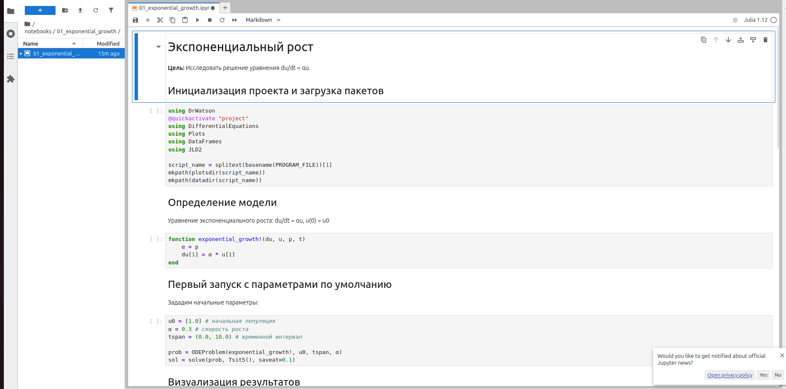{#fig:044 width=70%}

{#fig:045 width=70%}

Запуск параметрического скрипта показал процесс сканирования (рис. 47). Получена сводная таблица результатов: финальная популяция и время удвоения для каждого α (рис. 48).

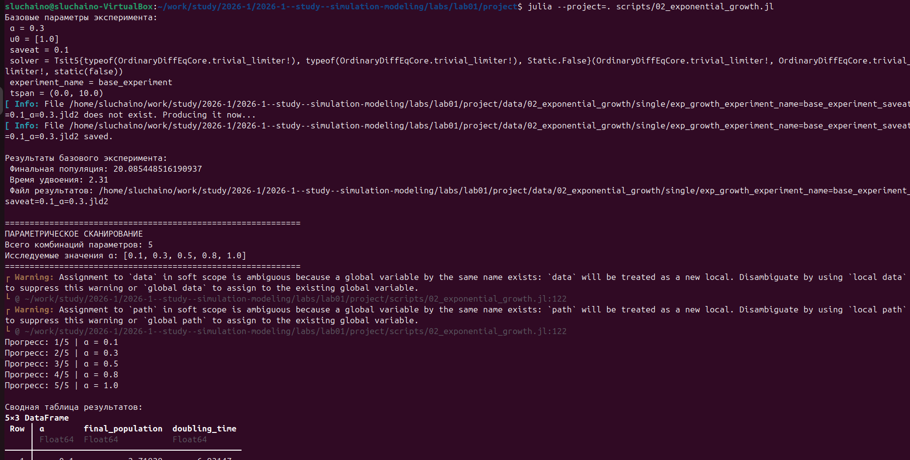{#fig:047 width=70%}

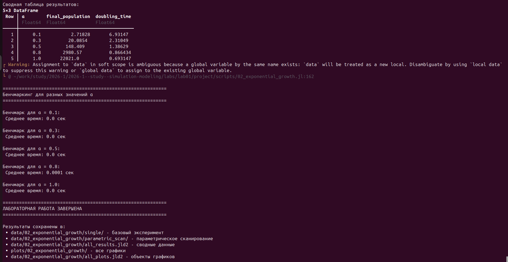{#fig:048 width=70%}

## Визуализация результатов

Построены графики: зависимость времени вычисления от α (рис. 50), сравнительные данные для разных α (рис. 52), базовый эксперимент (рис. 53). 

```{julia}
# Зависимость времени удвоения от α
α_range = 0.1:0.01:1.0
p2 = plot(α_range, log.(2)./α_range, 
          label="Теория: t₂ = ln(2)/α", 
          lw=2, ls=:dash)
scatter!(p2, [r.α for r in results], [r.doubling_time for r in results],
         label="Численное решение", ms=8)
plot!(p2, xlabel="Скорость роста α", ylabel="Время удвоения t₂",
      title="Зависимость времени удвоения от α")
savefig(joinpath(@__DIR__, "..", "project", "plots", "doubling_time.png"))
```

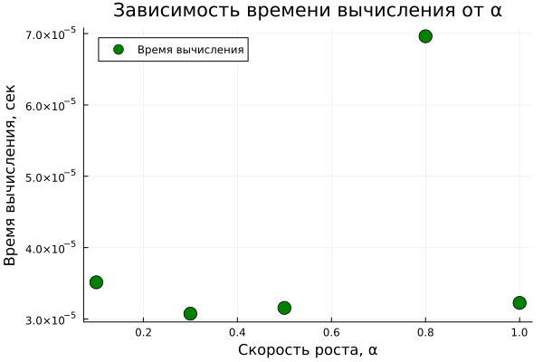{#fig:050 width=70%}

В Jupyter Notebook реализована функция-обёртка для запуска экспериментов (рис. 54-55). Выполнено сравнение всех траекторий для разных значений α (рис. 56).

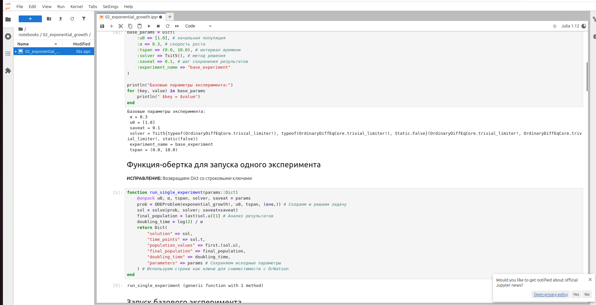{#fig:054 width=70%}

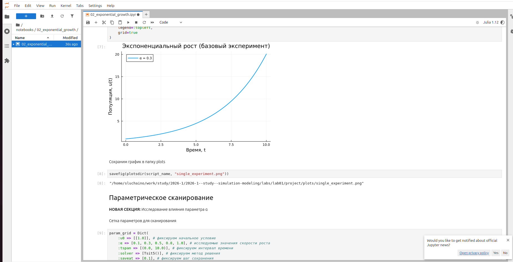{#fig:055 width=70%}

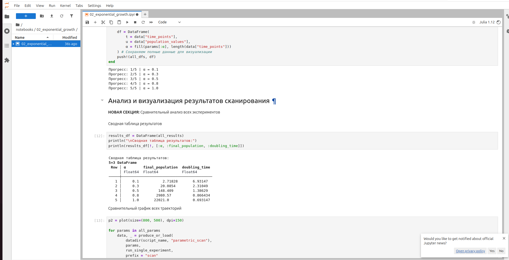{#fig:056 width=70%}

График параметрического исследования показывает, как меняется популяция при различных α (рис. 57). Чем больше α, тем быстрее рост.

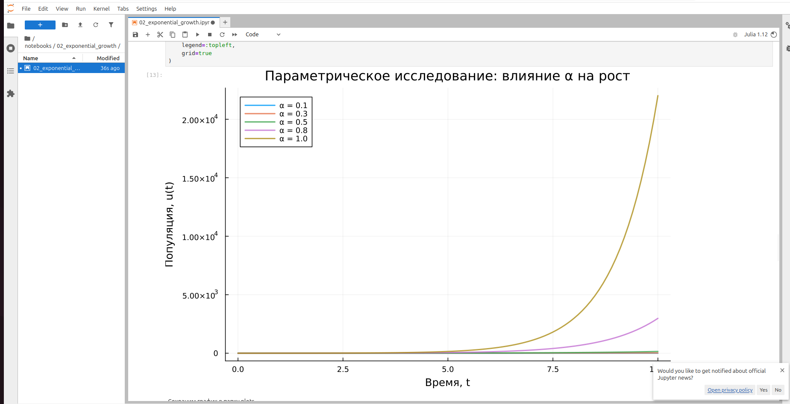{#fig:057 width=70%}

Построена зависимость времени удвоения от α (рис. 58-59). Точки численного решения совпадают с теоретической кривой t₂ = ln(2)/α.

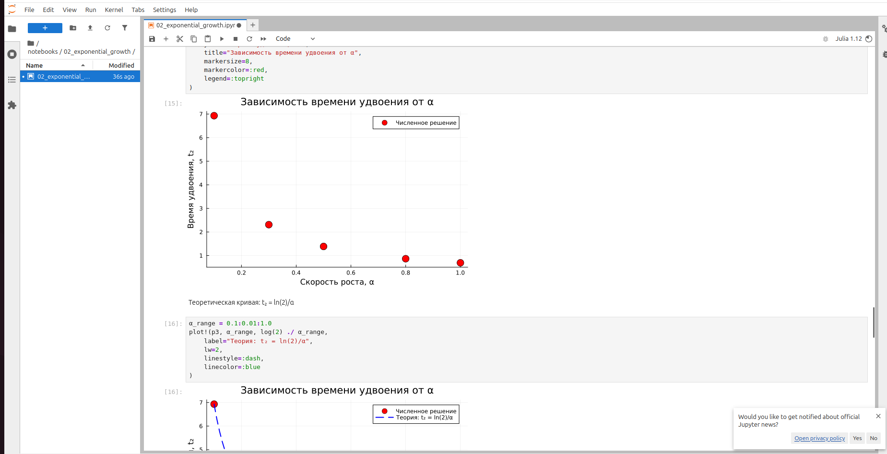{#fig:058 width=70%}

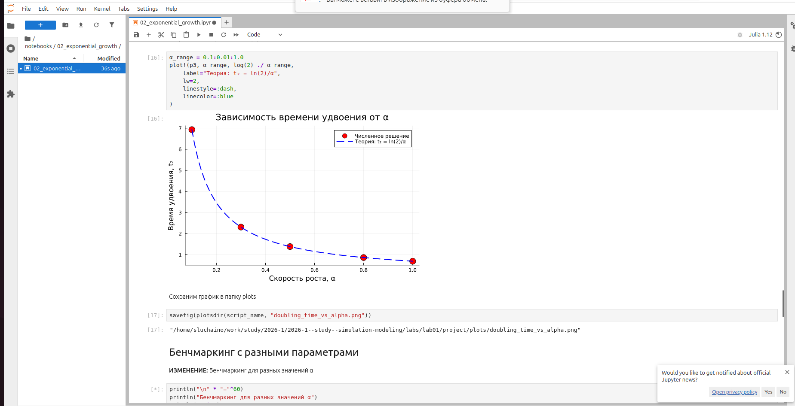{#fig:059 width=70%}

# Выводы

В ходе лабораторной работы было создано рабочее пространство для курса, настроены Git, GitHub и Git Flow. Установлены Julia и необходимые пакеты, реализована модель экспоненциального роста в базовом и параметрическом вариантах. Код оформлен в литературном стиле, сгенерированы Jupyter Notebook и Quarto-документация. Проведён анализ зависимости времени удвоения от параметра α, подтверждено совпадение численных результатов с теоретической кривой t₂ = ln(2)/α.
