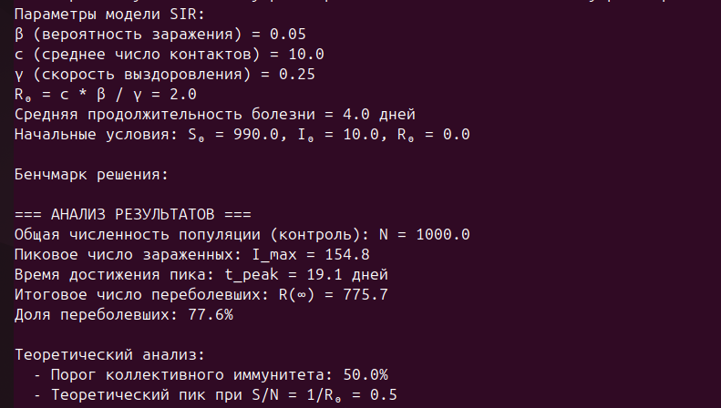
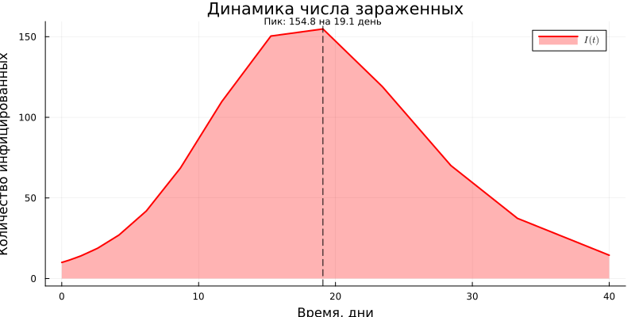
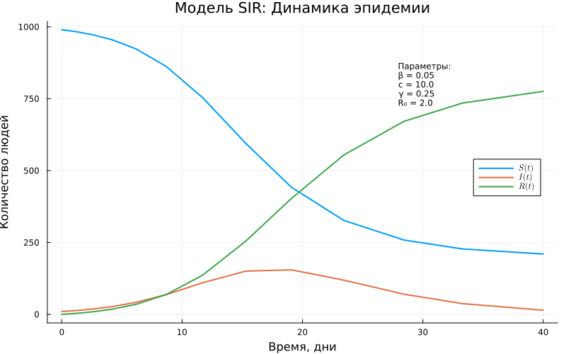
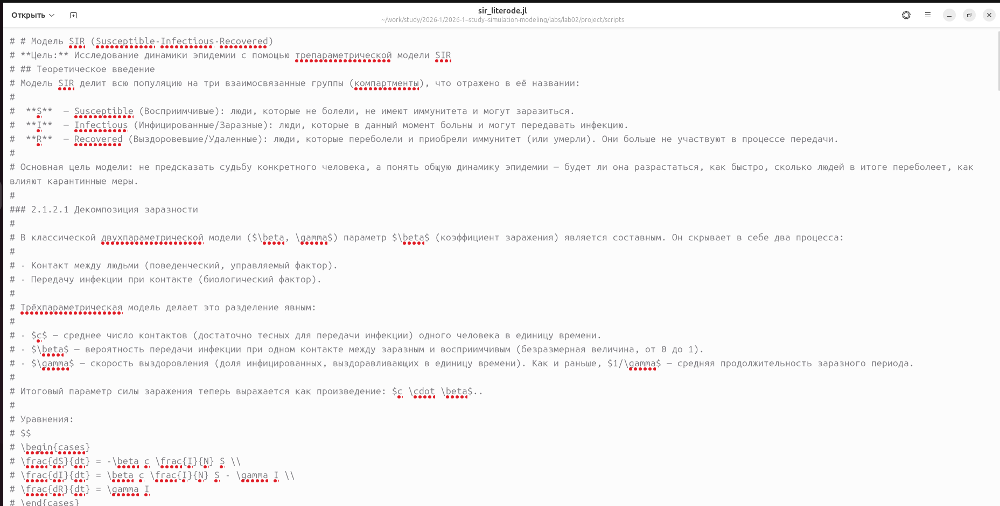
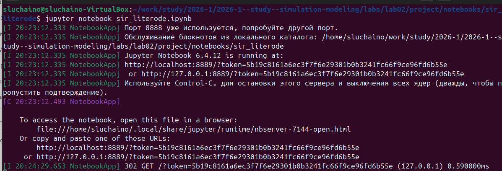
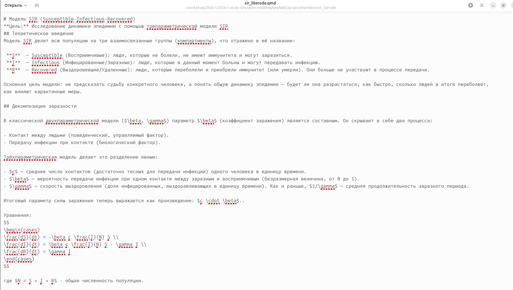
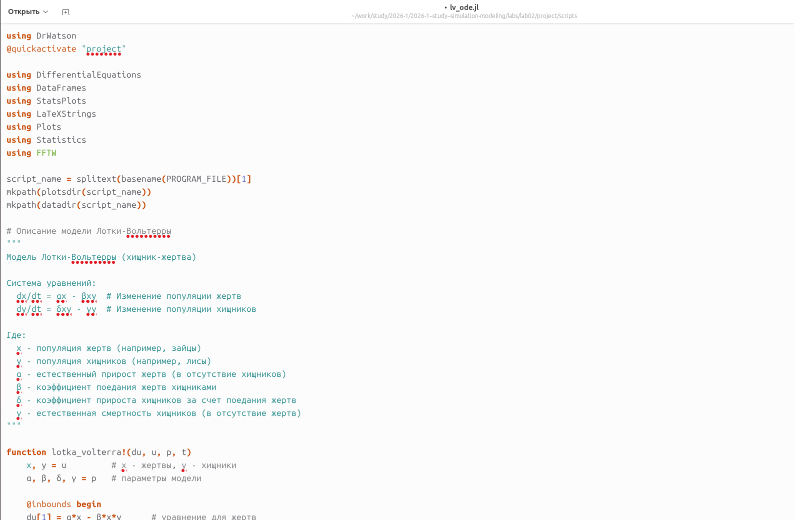
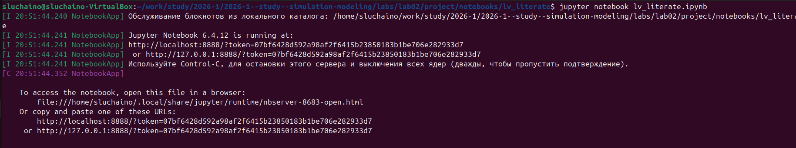
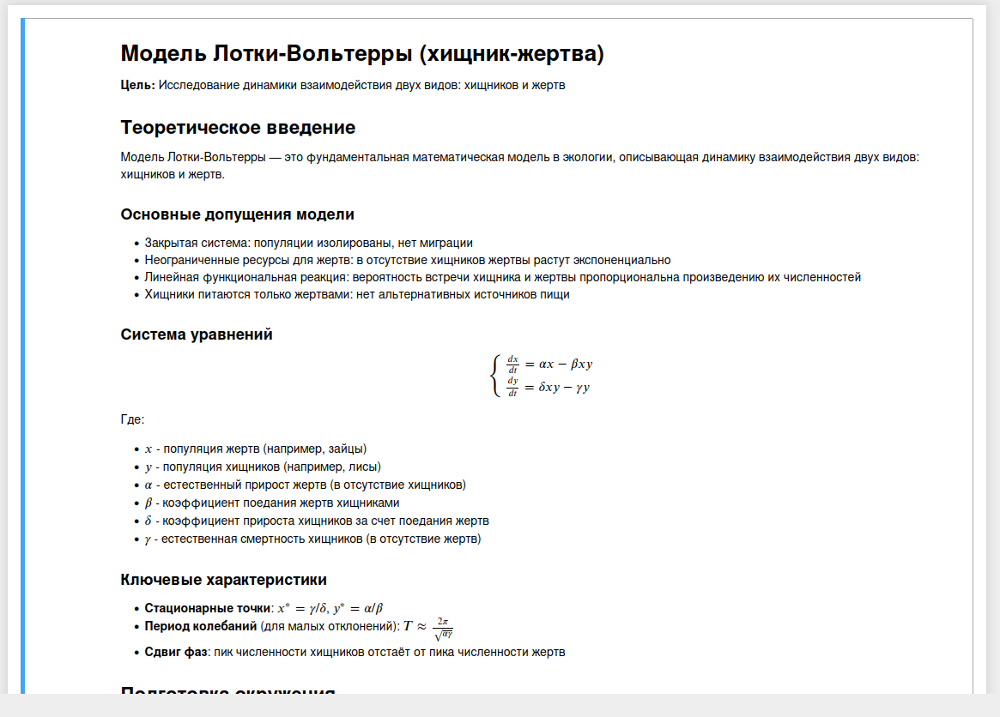
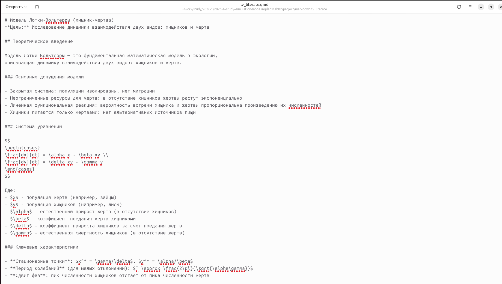

---
author:
  name: София Черная
  email: 1132236043@pfur.ru
  affiliation:
    - name: Российский университет дружбы народов
      city: Москва
title: "Лабораторная работа №2"
subtitle: "Модель SIR и модель Лотки-Вольтерры"
format:
  html:
    toc: true
  pdf:
    toc: true
    pdf-engine: pdflatex
  docx:
    toc: true
---

# Цель работы

Изучение модели SIR (эпидемиологической модели) и модели Лотки-Вольтерры (системы «хищник-жертва»). Освоение методов имитационного моделирования систем дифференциальных уравнений с использованием языка Julia и пакета DrWatson.

# Задание

1.  Создать рабочее пространство для второй лабораторной работы.
2.  Реализовать модель SIR в базовом варианте.
3.  Преобразовать код в литературный стиль с помощью Literate.jl.
4.  Сгенерировать из литературного кода чистый код, Jupyter Notebook и документацию Quarto.
5.  Провести параметрическое исследование модели SIR.
6.  Реализовать модель Лотки-Вольтерры в базовом и параметрическом вариантах.
7.  Провести анализ результатов, оформить графики и включить их в отчёт.

# Теоретическое введение

## Модель SIR

Модель SIR является классической математической моделью эпидемиологии, описывающей распространение инфекционного заболевания в замкнутой популяции.

### Компартменты модели

Модель делит популяцию на три группы:
-   **S (Susceptible, Восприимчивые)** — индивиды, которые могут заразиться.
-   **I (Infectious, Инфицированные)** — индивиды, которые больны и могут передавать инфекцию.
-   **R (Recovered, Выздоровевшие)** — индивиды, которые переболели и приобрели иммунитет (или умерли). Они больше не участвуют в распространении болезни.

### Система дифференциальных уравнений

Динамика модели описывается следующей системой уравнений:

$$
\begin{cases}
\dfrac{dS}{dt} = -\beta \dfrac{S I}{N} \\[1em]
\dfrac{dI}{dt} = \beta \dfrac{S I}{N} - \gamma I \\[1em]
\dfrac{dR}{dt} = \gamma I
\end{cases}
$$

где:
-   \( N = S + I + R \) — общая (постоянная) численность популяции;
-   \( \beta \) — коэффициент заражения (скорость передачи инфекции);
-   \( \gamma \) — коэффициент выздоровления (величина, обратная средней продолжительности болезни \( 1/\gamma \)).

### Ключевые показатели

-   **Базовое репродуктивное число**: \( R_0 = \dfrac{\beta}{\gamma} \). Показывает, сколько в среднем человек заразит один инфицированный в полностью восприимчивой популяции. При \( R_0 > 1 \) эпидемия разрастается, при \( R_0 < 1 \) — затухает.
-   **Порог коллективного иммунитета**: \( 1 - \dfrac{1}{R_0} \). Доля популяции, которая должна иметь иммунитет для предотвращения роста эпидемии.

## Модель Лотки-Вольтерры

Модель Лотки-Вольтерры (или модель «хищник-жертва») описывает динамику взаимодействия двух биологических видов.

### Система уравнений

$$
\begin{cases}
\dfrac{dx}{dt} = \alpha x - \beta x y \\[1em]
\dfrac{dy}{dt} = \delta x y - \gamma y
\end{cases}
$$

где:
-   \( x \) — численность популяции жертв (например, зайцев);
-   \( y \) — численность популяции хищников (например, лис);
-   \( \alpha \) — коэффициент естественного прироста жертв;
-   \( \beta \) — коэффициент смертности жертв в результате встреч с хищниками;
-   \( \delta \) — коэффициент прироста хищников за счёт потребления жертв;
-   \( \gamma \) — коэффициент естественной смертности хищников.

### Характеристики модели

Система имеет две стационарные точки. Нетривиальная точка сосуществования видов:
\[ x^* = \frac{\gamma}{\delta},\quad y^* = \frac{\alpha}{\beta} \]
Вокруг этой точки решения носят колебательный характер, причём пик численности хищников отстаёт от пика численности жертв.

# Выполнение лабораторной работы

Для выполнения лабораторной работы перехожу в уже созданный репозиторий labs/lab02.

## Модель SIR

Создаю файл sir_ode.jl (рис. @fig-001).

{#fig-001 width=70%}

Вставляю предложенный из методических материалов программный код в файл (рис. @fig-002). Код реализует функцию `sir_ode!`, которая описывает правые части системы дифференциальных уравнений, а также задаёт параметры модели и начальные условия.

{#fig-002 width=70%}

Запускаю скрипт с помощью команды `julia --project=. scripts/sir_ode.jl` (рис. @fig-003).

{#fig-003 width=70%}

Вывод в консоли параметров модели (рис. @fig-004). Здесь отображаются заданные значения коэффициентов \( \beta \) и \( \gamma \), рассчитанное базовое репродуктивное число \( R_0 \), а также начальные условия.

{#fig-004 width=70%}

В результате выполнения скрипта были сгенерированы несколько графиков, позволяющих проанализировать динамику эпидемии.

На рис. @fig-005 представлен график «Динамика эффективного репродуктивного числа» \( R_e(t) = R_0 \cdot S(t)/N \).
- При \( R_e(t) > 1 \): количество новых зараженных растет, эпидемия развивается.
- При \( R_e(t) = 1 \): система находится в равновесии. Это момент пика эпидемии, когда число больных \( I(t) \) перестает расти и начинает падать.
- При \( R_e(t) < 1 \): количество новых зараженных падает, эпидемия затухает.

{#fig-005 width=70%}

Следующим идет график «Динамика числа зараженных» (рис. @fig-006). На нем показано изменение числа инфицированных \( I(t) \) во времени. Хорошо виден колоколообразный пик эпидемии.

{#fig-006 width=70%}

График «Экспоненциальный рост (лог. шкала)» (рис. @fig-007) показывает ту же кривую \( I(t) \), но в полулогарифмическом масштабе. Прямолинейный участок в начале графика подтверждает экспоненциальный характер роста числа зараженных на начальном этапе эпидемии, что соответствует теоретическим предсказаниям для модели SIR при \( R_0 > 1 \).

{#fig-007 width=70%}

На графике «Модель SIR: динамика эпидемии» (рис. @fig-008) представлена полная картина: показаны кривые для всех трех групп — восприимчивых \( S(t) \), инфицированных \( I(t) \) и выздоровевших \( R(t) \). Видно, как по мере развития эпидемии число восприимчивых падает, а число выздоровевших растет.

{#fig-008 width=70%}

На рис. @fig-009 показана компактная панель из шести графиков, объединяющая различные аспекты анализа модели SIR: динамику популяций, фазовый портрет, скорости изменения и спектральный анализ.

{#fig-009 width=70%}

График «Динамика эпидемии в процентах» (рис. @fig-010) аналогичен графику на рис. @fig-008, но значения по оси Y представлены в процентах от общей численности популяции. Фиолетовая пунктирная линия обозначает «порог коллективного иммунитета» \( 1-1/R_0 \). Когда доля восприимчивых \( S/N \) опускается ниже этого порога, эпидемия начинает затухать, так как каждый больной в среднем заражает меньше одного человека.

{#fig-010 width=70%}

На фазовом портрете (рис. @fig-011) показана внутренняя структура процесса. По оси Ox — число восприимчивых \( S \), по оси Oy — число инфицированных \( I \). Траектория системы начинается в точке с максимальным \( S \) и движется к оси \( S \), где \( I = 0 \), что соответствует окончанию эпидемии.

{#fig-011 width=70%}

После успешного выполнения базового скрипта, я преобразовал файл `sir_ode.jl` в литературный код, добавив подробные комментарии и теоретические пояснения. Полученный файл назван `sir_literode.jl` (рис. @fig-012). Такой подход соответствует методологии литературного программирования.

{#fig-012 width=70%}

Запускаю скрипт `sir_literode.jl` для генерации производных форматов (рис. @fig-013). Для этого используется специальный скрипт `tangle.jl`.

{#fig-013 width=70%}

При выполнении скрипта `tangle.jl` создались три файла: `sir_literode.ipynb` (Jupyter Notebook), `sir_literode.qmd` (документ Quarto) и `sir_literode.jl` (чистый код). Запускаю файл `.ipynb` через терминал (рис. @fig-014).

{#fig-014 width=70%}

Открываю файл в Jupyter Notebook — всё работает корректно (рис. @fig-015). Можно выполнять ячейки по порядку и видеть результаты.

{#fig-015 width=70%}

Проверяю файл `sir_literode.qmd` (рис. @fig-016). Он содержит как текст, так и исполняемые ячейки кода, что позволяет в дальнейшем интегрировать его в итоговый отчёт.

{#fig-016 width=70%}

Также просматриваю чистый код в `sir_literode.jl` (рис. @fig-017). Он представляет собой извлеченный из литературного источника исполняемый код без комментариев.

{#fig-017 width=70%}

## Модель Лотки-Вольтерры

После завершения работы с моделью SIR, перехожу к реализации модели Лотки-Вольтерры.

Создаю файл `lv_ode.jl` (рис. @fig-018).

{#fig-018 width=70%}

Вставляю программный код, реализующий модель «хищник-жертва» (рис. @fig-019). Код содержит функцию `lotka_volterra!`, описывающую систему уравнений, а также задаёт классические параметры и начальные условия.

{#fig-019 width=70%}

Запускаю скрипт `lv_ode.jl` (рис. @fig-020). Система компилирует необходимые пакеты и начинает вычисления.

{#fig-020 width=70%}

После запуска в консоль выводятся рассчитанные параметры модели, начальные условия, стационарные точки, а также результаты статистического и спектрального анализа (рис. @fig-021). Рассчитанная стационарная точка \( x^* = 30.0, y^* = 5.0 \) совпадает с теоретическими значениями \( \gamma/\delta \) и \( \alpha/\beta \). Период колебаний жертв составил около 4 единиц времени.

{#fig-021 width=70%}

На рис. @fig-022 представлен график производных популяций \( dx/dt \) и \( dy/dt \). Он показывает скорость изменения численности каждого вида во времени.

{#fig-022 width=70%}

График «Модель Лотки-Вольтерры: Динамика популяций» (рис. @fig-023) является ключевым для анализа. На нём изображены колебания численности жертв (зелёная линия) и хищников (красная линия). Хорошо виден классический результат модели — циклические колебания со сдвигом фаз: пик численности хищников наступает после пика численности жертв. Горизонтальными линиями отмечены стационарные уровни \( x^* \) и \( y^* \).

{#fig-023 width=70%}

На рис. @fig-024 представлена таблица с результатами, которая, судя по всему, содержит данные для дальнейшего анализа или была сгенерирована в процессе отладки.

{#fig-024 width=70%}

Фазовый портрет системы (рис. @fig-025) представляет собой замкнутую траекторию (предельный цикл) на плоскости \( (x, y) \). Чёрная точка — стационарное состояние \( (x^*, y^*) \). Пунктирными линиями показаны изоклины — линии, где производная соответствующей переменной равна нулю. Пересечение изоклин даёт стационарную точку.

{#fig-025 width=70%}

График «Относительные темпы роста» (рис. @fig-026) показывает скорость изменения популяций в процентах от их текущей численности \( (dx/dt)/x \) и \( (dy/dt)/y \). Это позволяет сравнивать динамику видов независимо от масштаба их популяций.

{#fig-026 width=70%}

Спектральный анализ (Фурье) колебаний представлен на рис. @fig-027. Пики на графике соответствуют основным частотам колебаний жертв и хищников. Доминирующая частота позволяет определить основной период колебаний системы.

{#fig-027 width=70%}

После успешного выполнения базового скрипта, я приступил к созданию литературного кода для модели Лотки-Вольтерры. На рис. @fig-028, @fig-029 и @fig-030 представлены различные версии и фрагменты литературного кода `lv_literate.jl`, где теория сопровождается исполняемыми блоками.

{#fig-028 width=70%}

{#fig-029 width=70%}

{#fig-030 width=70%}

С помощью скрипта `tangle.jl` я сгенерировал из литературного кода чистый код, Jupyter Notebook и Quarto-документацию (рис. @fig-031). Все форматы были успешно созданы.

{#fig-031 width=70%}

Запускаю сгенерированный Jupyter Notebook `lv_literate.ipynb` (рис. @fig-032). Сервер Jupyter запускается, и я могу открыть файл в браузере для интерактивной работы.

{#fig-032 width=70%}

Файл Jupyter Notebook открыт и готов к выполнению (рис. @fig-033). Все ячейки с кодом и пояснениями корректно отображаются.

{#fig-033 width=70%}

# Выводы

В ходе выполнения лабораторной работы были успешно реализованы две классические модели: эпидемиологическая модель SIR и экологическая модель Лотки-Вольтерры.

Для модели SIR были получены и проанализированы графики динамики популяций, числа инфицированных, эффективного репродуктивного числа. Подтверждено, что пик эпидемии наступает при \( R_e = 1 \), а порог коллективного иммунитета составляет \( 1-1/R_0 \). Экспоненциальный рост на начальном этапе был верифицирован с помощью графика в логарифмическом масштабе.

Для модели Лотки-Вольтерры получены циклические решения, соответствующие теоретическим представлениям. Рассчитанные стационарные точки совпали с ожидаемыми значениями \( x^* = \gamma/\delta \) и \( y^* = \alpha/\beta \). Фазовый портрет и спектральный анализ подтвердили колебательный характер системы и позволили определить период колебаний.

Код для обеих моделей был оформлен в литературном стиле с использованием Literate.jl, что позволило сгенерировать из одного исходного файла чистый код, Jupyter Notebook и документ Quarto. Это демонстрирует преимущества подхода литературного программирования для воспроизводимых научных исследований.

Все поставленные задачи выполнены, полученные результаты визуализированы и проанализированы.
