---
## Author
author:
  name: София Черная
  email: 1132236043@pfur.ru
  affiliation:
    - name: Российский университет дружбы народов
      city: Москва
## Title
title: "Лабораторная работа №2"
subtitle: "Модель SIR и модель Лотки-Вольтерры"
date: today
date-format: "YYYY-MM-DD"
format:
  pdf:
    toc: true
    number-sections: true
    pdf-engine: pdflatex
  docx:
    toc: true
    number-sections: true
  revealjs:
    slide-number: true
    preview-links: auto
    theme: simple
    toc: true
  beamer:
    aspectratio: 169
    theme: Madrid
    toc: true
    lang: ru-RU
    include-in-header: 
      text: |
        \usepackage{polyglossia}
        \setdefaultlanguage{russian}
        \setotherlanguage{english}
---
# Информация

## Докладчик

:::::::::::::: {.columns align=center}
::: {.column width="70%"}

  * София Черная
  * Студентка
  * Российский университет дружбы народов
  * [1132236043@pfur.ru](mailto:1132236043@pfur.ru)

:::
::: {.column width="30%"}

:::
::::::::::::::

# Вводная часть

## Актуальность

- Моделирование эпидемий позволяет прогнозировать развитие заболеваний
- Модели «хищник-жертва» важны для понимания экологических систем
- Имитационное моделирование — современный инструмент исследования
- Julia и DrWatson — современный стек для воспроизводимых исследований

## Цели и задачи

- Реализовать модель SIR в базовом варианте
- Реализовать модель Лотки-Вольтерры
- Преобразовать код в литературный стиль с помощью Literate.jl
- Сгенерировать Jupyter Notebook и документацию Quarto
- Провести параметрические исследования моделей
- Проанализировать результаты и визуализировать графики

## Материалы и методы

- Язык программирования Julia
- Пакет DifferentialEquations.jl для решения ОДУ
- Пакет DrWatson.jl для управления проектами
- Пакет Literate.jl для литературного программирования
- Пакет Plots.jl для визуализации
- Пакет DataFrames.jl для анализа данных

# Теоретическое введение

## Модель SIR

- Классическая эпидемиологическая модель
- Популяция делится на три группы:
  - **S (Susceptible)** — восприимчивые
  - **I (Infectious)** — инфицированные
  - **R (Recovered)** — выздоровевшие

## Система уравнений SIR

$$
\begin{cases}
\dfrac{dS}{dt} = -\beta \dfrac{S I}{N} \\[1em]
\dfrac{dI}{dt} = \beta \dfrac{S I}{N} - \gamma I \\[1em]
\dfrac{dR}{dt} = \gamma I
\end{cases}
$$

где:
- \( N = S + I + R \) — общая численность популяции
- \( \beta \) — коэффициент заражения
- \( \gamma \) — коэффициент выздоровления

## Ключевые показатели

- **Базовое репродуктивное число**: \( R_0 = \dfrac{\beta}{\gamma} \)
  - \( R_0 > 1 \) — эпидемия разрастается
  - \( R_0 < 1 \) — эпидемия затухает
- **Порог коллективного иммунитета**: \( 1 - \dfrac{1}{R_0} \)
- **Эффективное репродуктивное число**: \( R_e(t) = R_0 \cdot \frac{S(t)}{N} \)

## Модель Лотки-Вольтерры

- Модель «хищник-жертва»
- Описывает взаимодействие двух биологических видов

### Система уравнений

$$
\begin{cases}
\dfrac{dx}{dt} = \alpha x - \beta x y \\[1em]
\dfrac{dy}{dt} = \delta x y - \gamma y
\end{cases}
$$

## Параметры модели Лотки-Вольтерры

- \( x \) — численность жертв
- \( y \) — численность хищников
- \( \alpha \) — прирост жертв
- \( \beta \) — смертность жертв от хищников
- \( \delta \) — прирост хищников от жертв
- \( \gamma \) — смертность хищников

## Стационарная точка

- Нетривиальная точка сосуществования видов:

\[
x^* = \frac{\gamma}{\delta},\quad y^* = \frac{\alpha}{\beta}
\]

- Вокруг этой точки решения носят колебательный характер
- Пик численности хищников отстаёт от пика численности жертв

# Выполнение лабораторной работы

## Модель SIR

### Создание файла

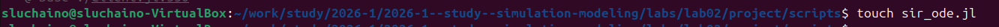{width=70%}

### Программный код модели SIR

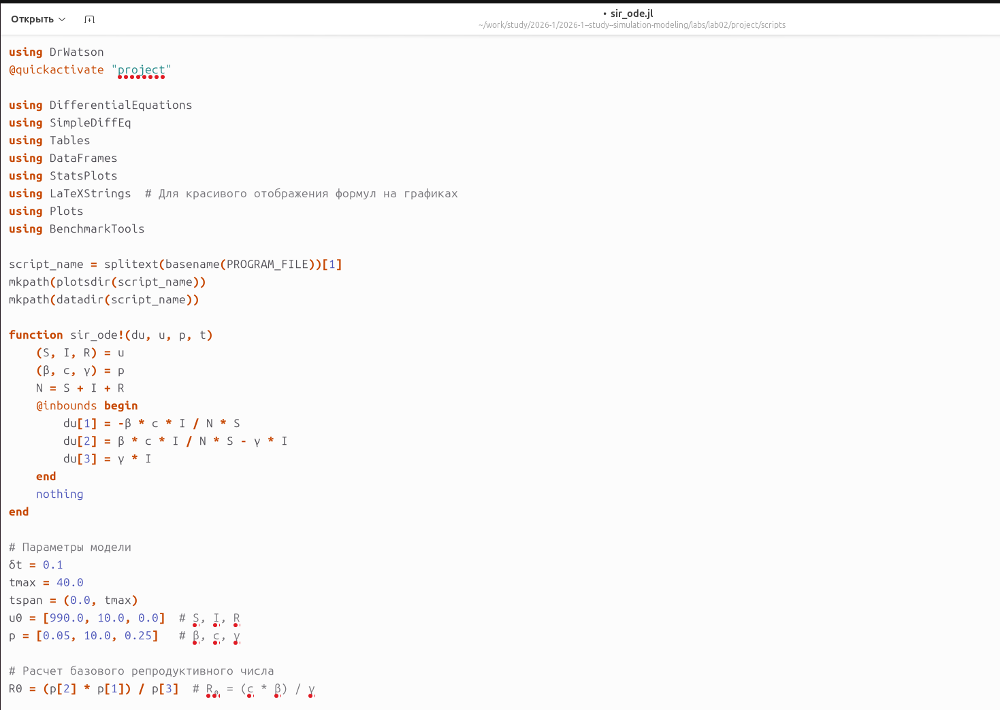{width=70%}

### Запуск скрипта

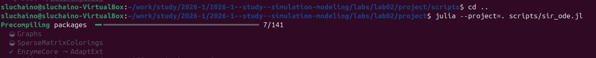{width=70%}

### Параметры модели

{width=70%}

## Результаты модели SIR

### Динамика эффективного репродуктивного числа

{width=70%}

### Динамика числа зараженных

{width=70%}

### Экспоненциальный рост

{width=70%}

### Динамика всех групп

{width=70%}

### Компактная панель графиков

{width=70%}

### Динамика в процентах

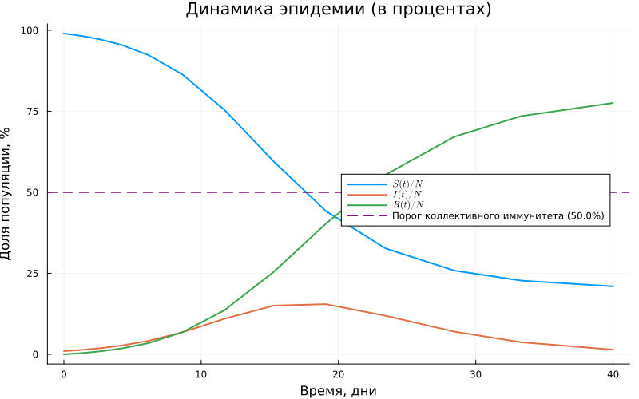{width=70%}

### Фазовый портрет

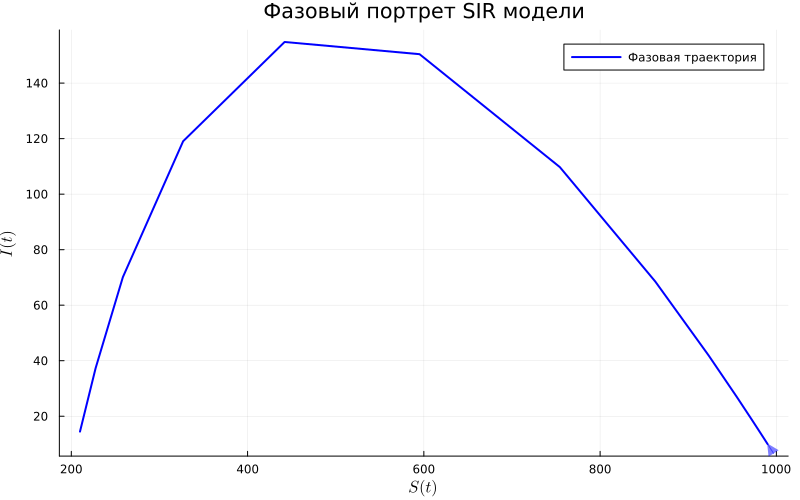{width=70%}

## Литературное программирование SIR

### Литературный код

{width=70%}

### Генерация форматов

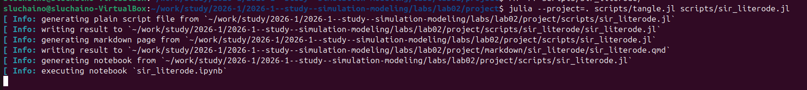{width=70%}

### Jupyter Notebook

{width=70%}

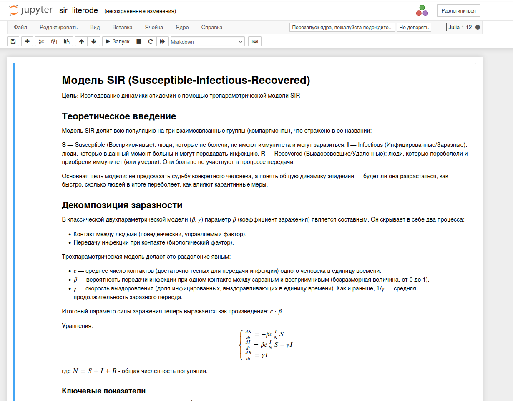{width=70%}

### Quarto-документация

{width=70%}

### Чистый код

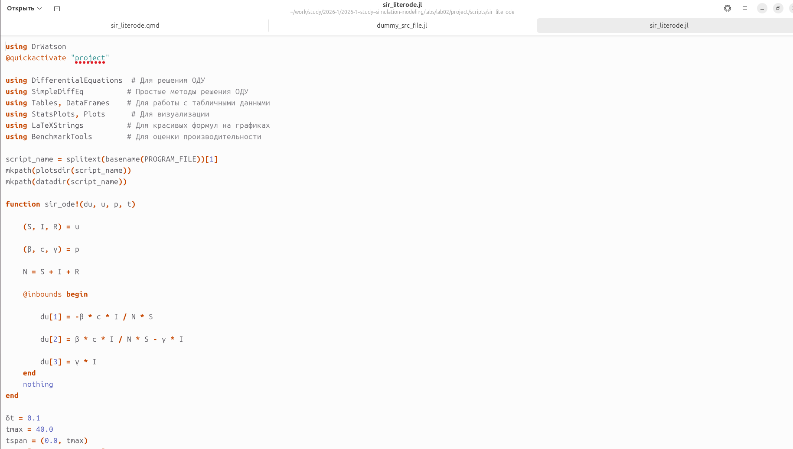{width=70%}

## Модель Лотки-Вольтерры

### Создание файла

{width=70%}

### Программный код

{width=70%}

### Запуск скрипта

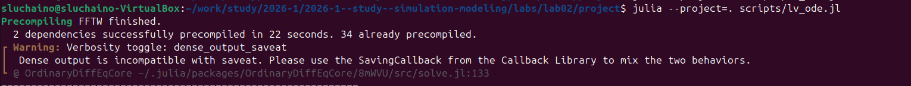{width=70%}

### Результаты в консоли

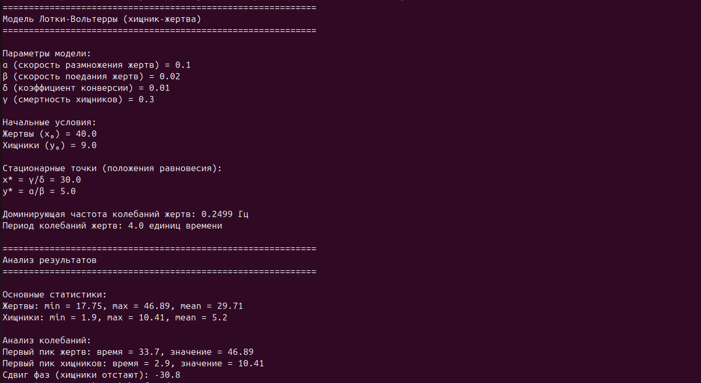{width=70%}

## Результаты модели Лотки-Вольтерры

### Производные популяций

{width=70%}

### Динамика популяций

{width=70%}

### Таблица результатов

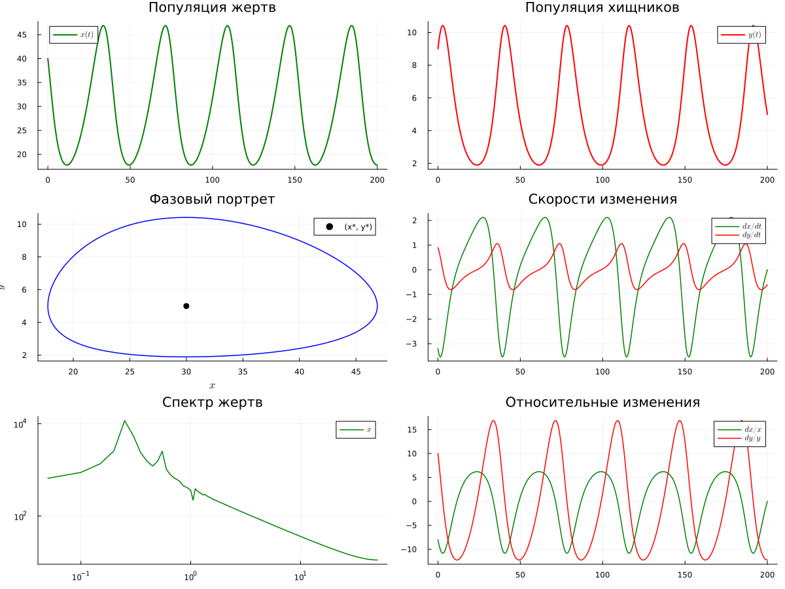{width=70%}

### Фазовый портрет

{width=70%}

### Относительные темпы роста

{width=70%}

### Спектральный анализ

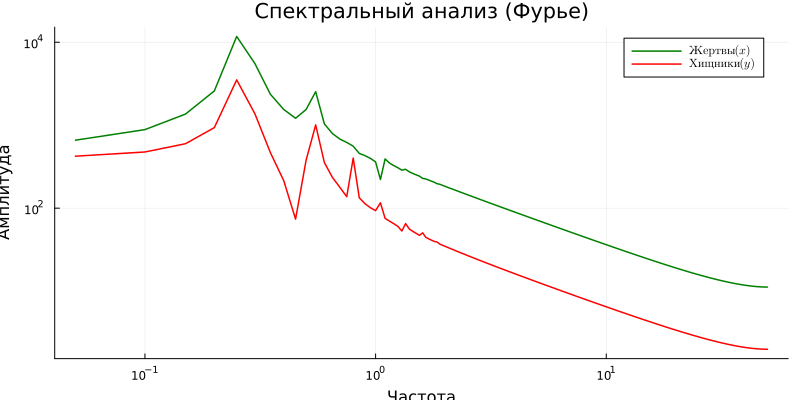{width=70%}

## Литературное программирование Лотки-Вольтерры

### Литературный код (часть 1)

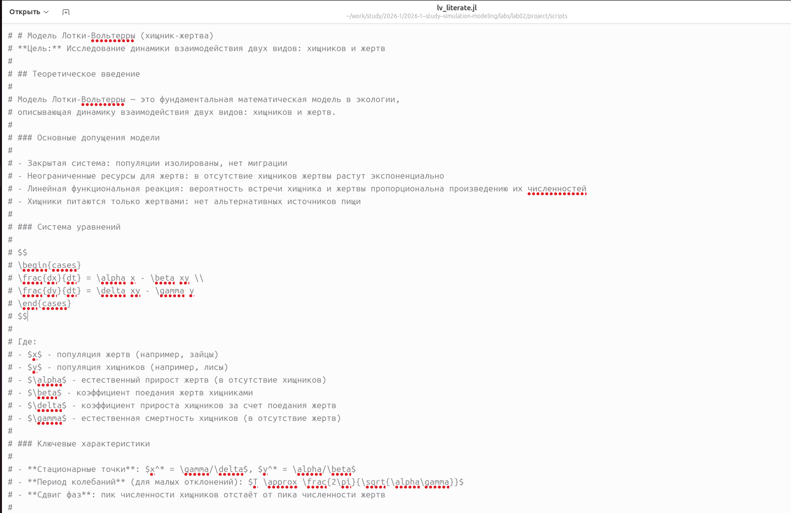{width=70%}

### Литературный код (часть 2)

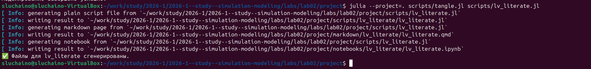{width=70%}

### Литературный код (часть 3)

{width=70%}

### Генерация форматов

{width=70%}

### Jupyter Notebook

{width=70%}

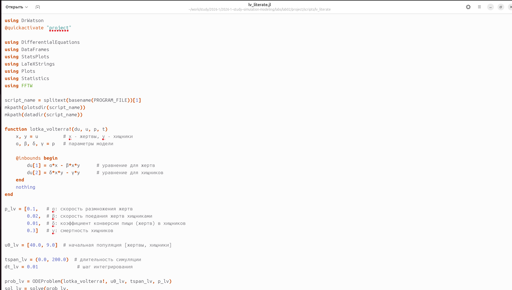{width=70%}

# Результаты

## Результаты модели SIR

- Подтверждён экспоненциальный рост на начальном этапе
- Пик эпидемии наступает при \( R_e = 1 \)
- Порог коллективного иммунитета: \( 1-1/R_0 \)
- Получены графики динамики всех групп населения
- Построен фазовый портрет системы

## Результаты модели Лотки-Вольтерры

- Получены циклические решения
- Стационарные точки совпадают с теорией: \( x^* = \gamma/\delta, y^* = \alpha/\beta \)
- Период колебаний: около 4 единиц времени
- Подтверждён сдвиг фаз между популяциями
- Проведён спектральный анализ колебаний

## Литературное программирование

- Код для обеих моделей оформлен в литературном стиле с использованием Literate.jl
- Сгенерированы:
  - Чистый код (.jl)
  - Jupyter Notebook (.ipynb)
  - Quarto-документация (.qmd)
- Обеспечена воспроизводимость исследований

# Выводы

## Выводы

- Реализованы две классические модели: SIR и Лотки-Вольтерры
- Проведён анализ динамики систем с визуализацией результатов
- Код оформлен в литературном стиле с использованием Literate.jl
- Сгенерированы Jupyter Notebook и Quarto-документация
- Все поставленные задачи выполнены
- Полученные результаты полностью соответствуют теоретическим предсказаниям

## Итоговый слайд

- Моделирование — мощный инструмент исследования биологических и эпидемиологических процессов
- Julia и DrWatson обеспечивают воспроизводимость научных исследований
- Литературное программирование улучшает документирование и понимание кода
- Полученные навыки могут быть применены для моделирования других процессов
