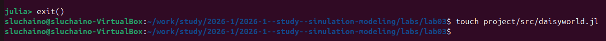
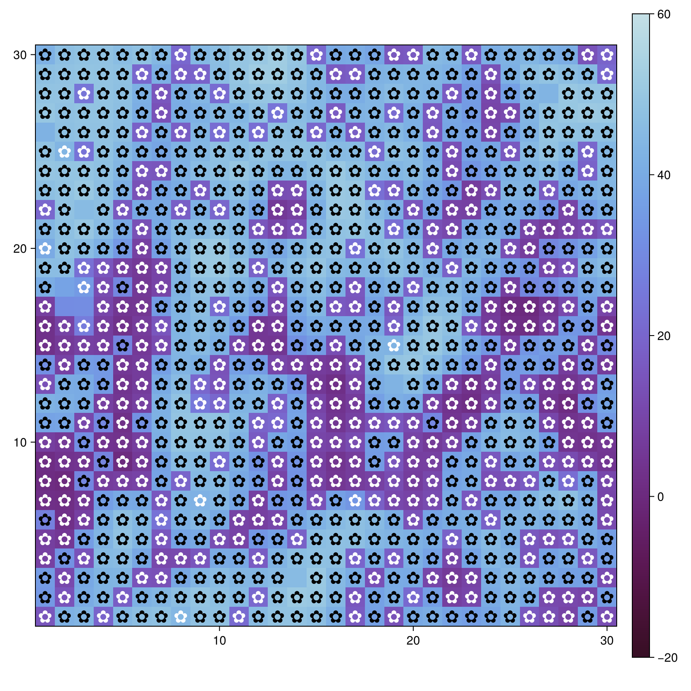
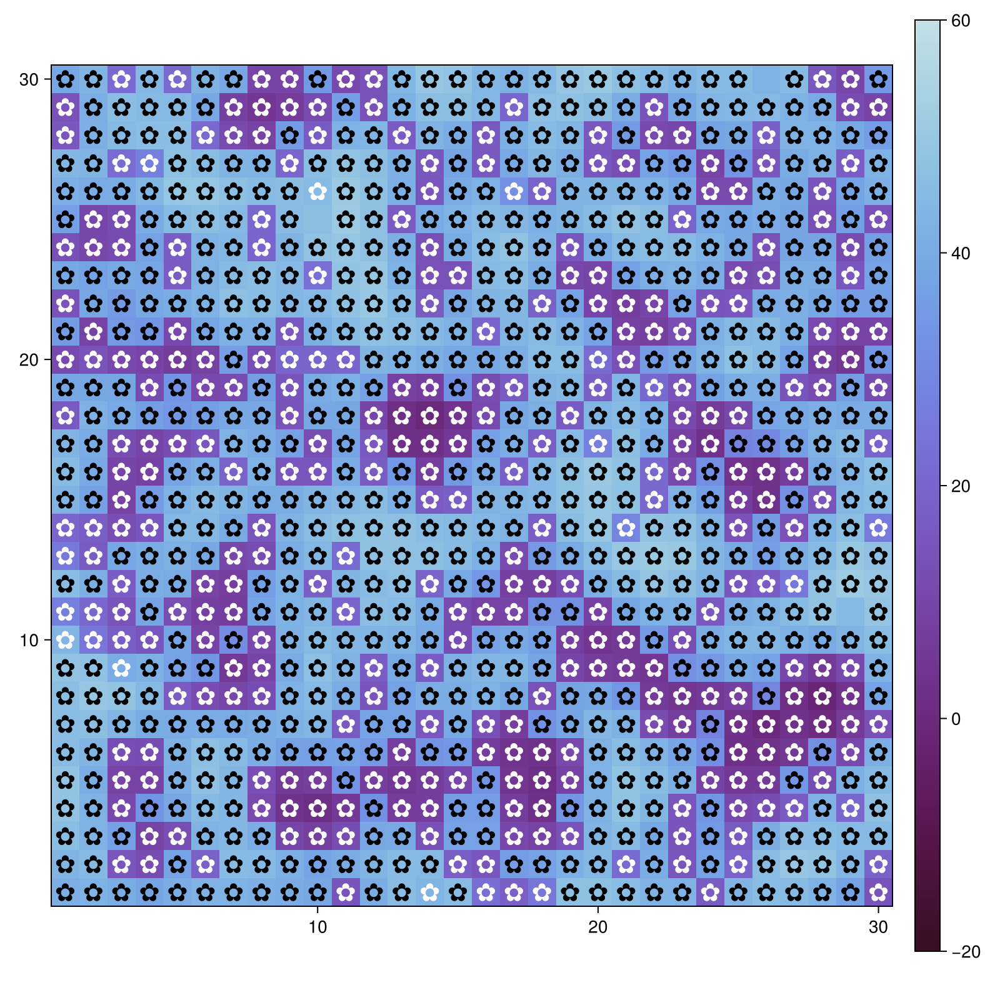
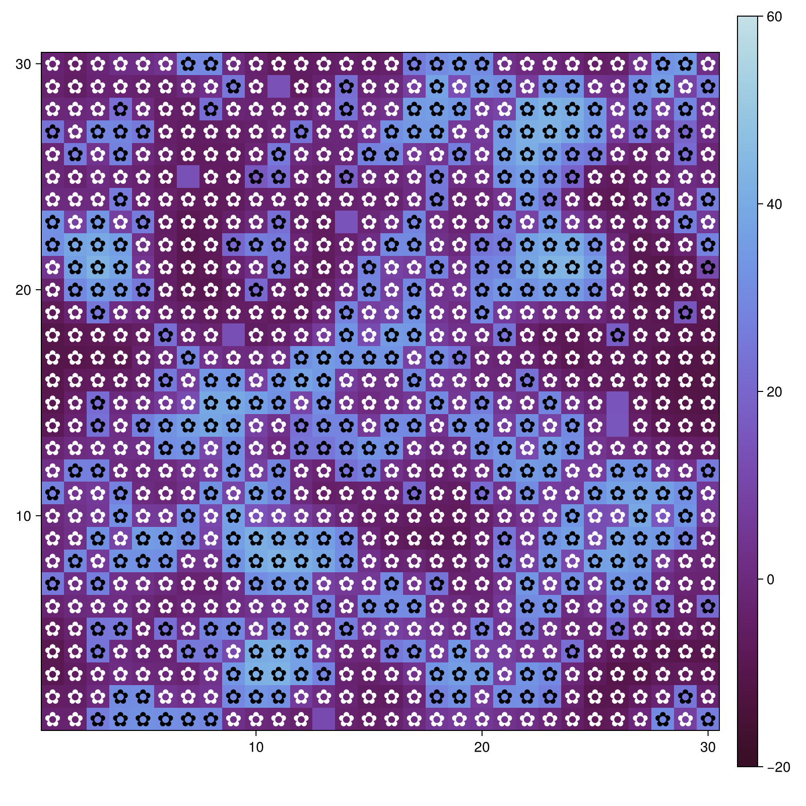
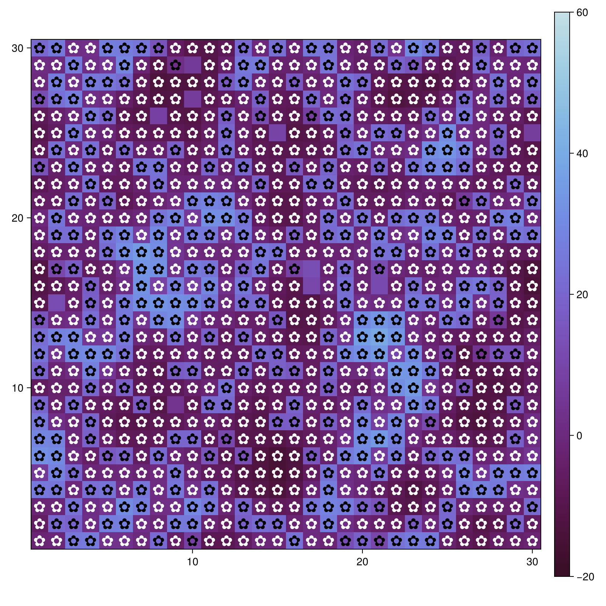
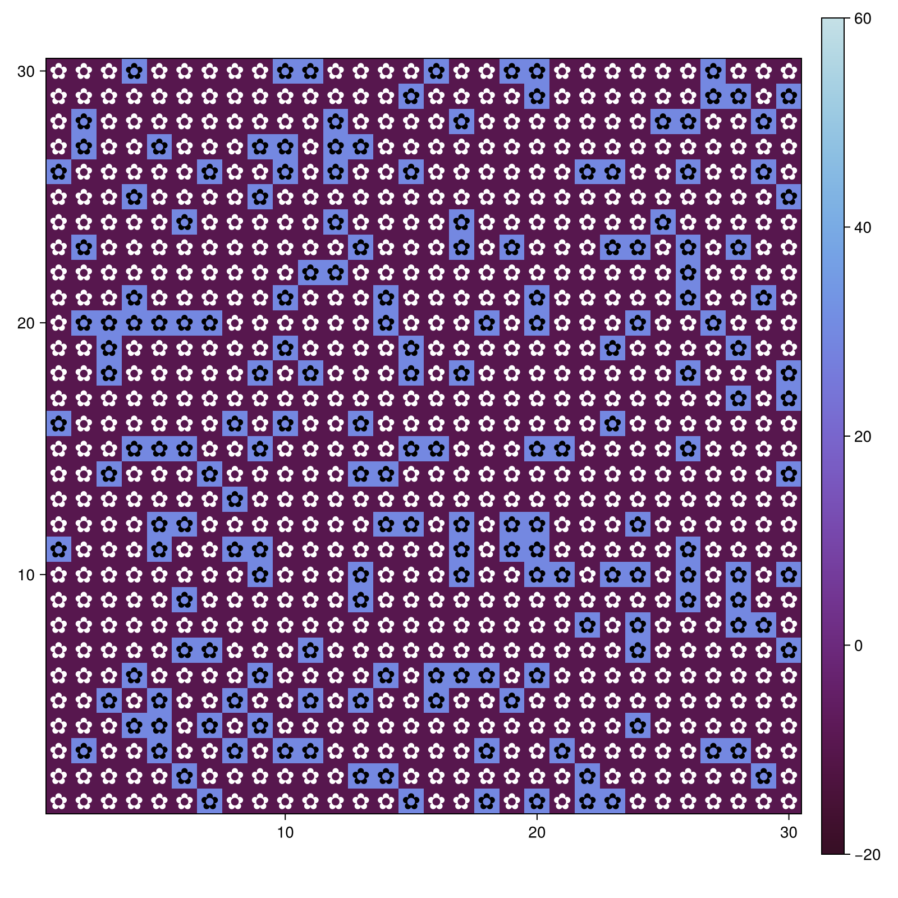
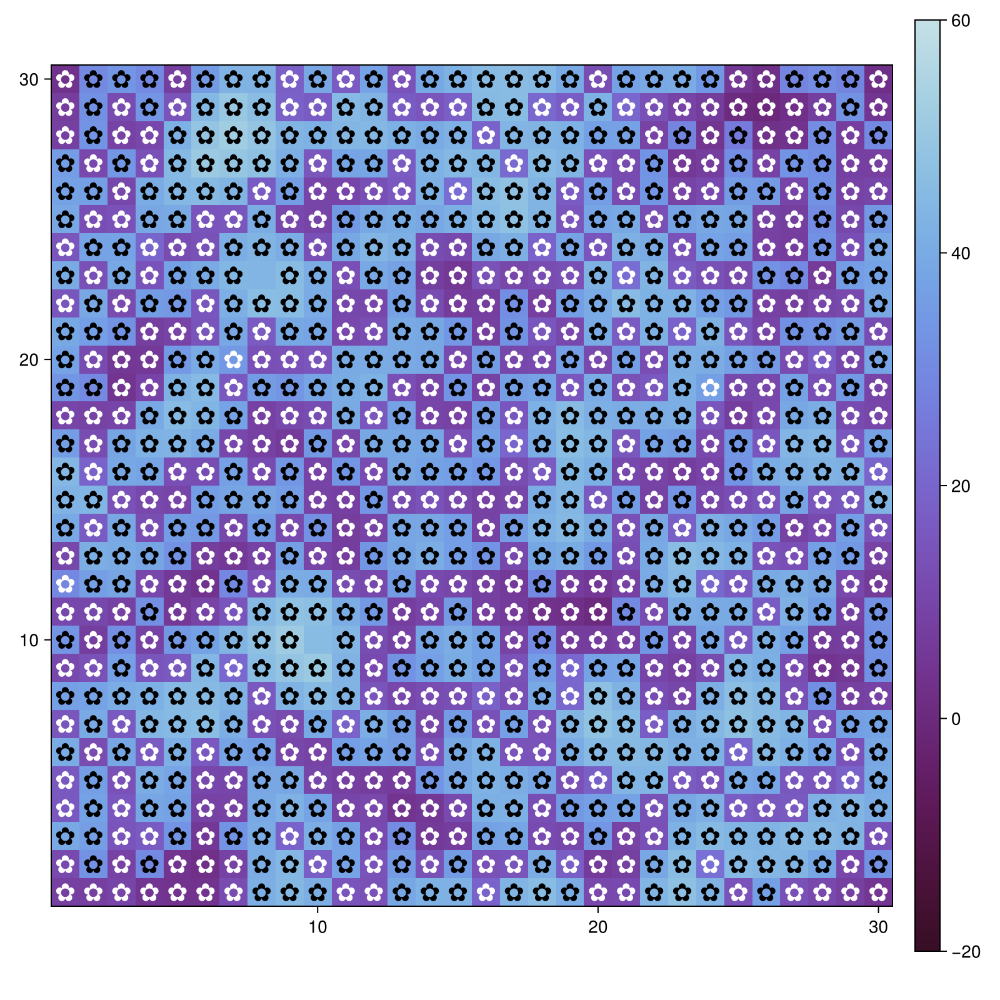
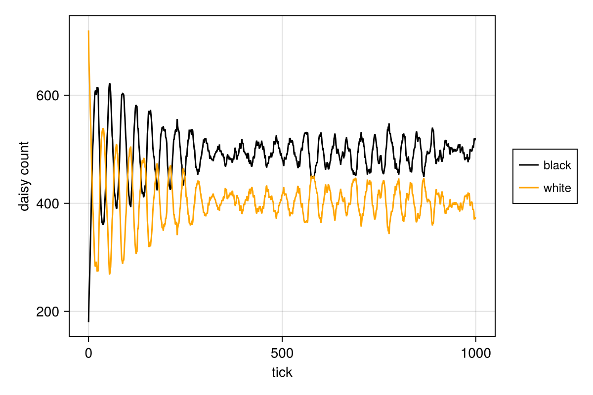
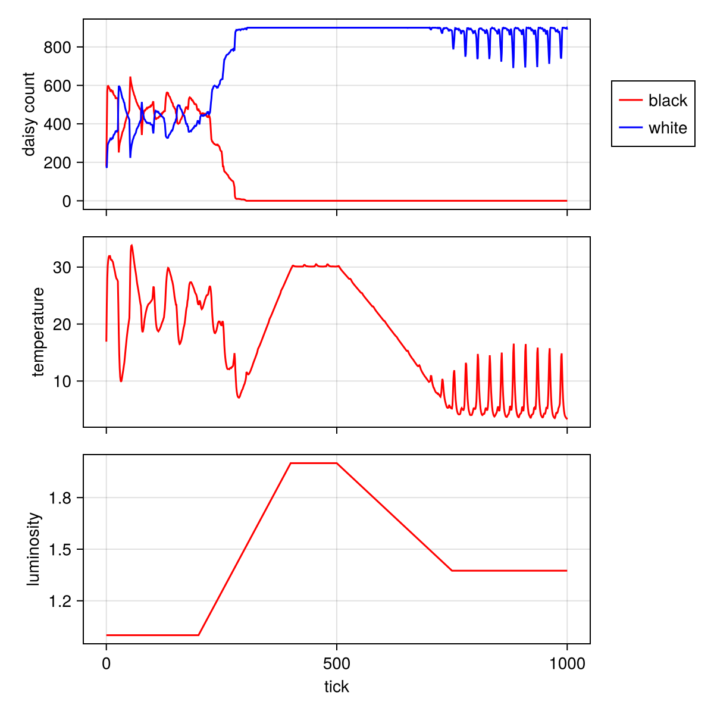
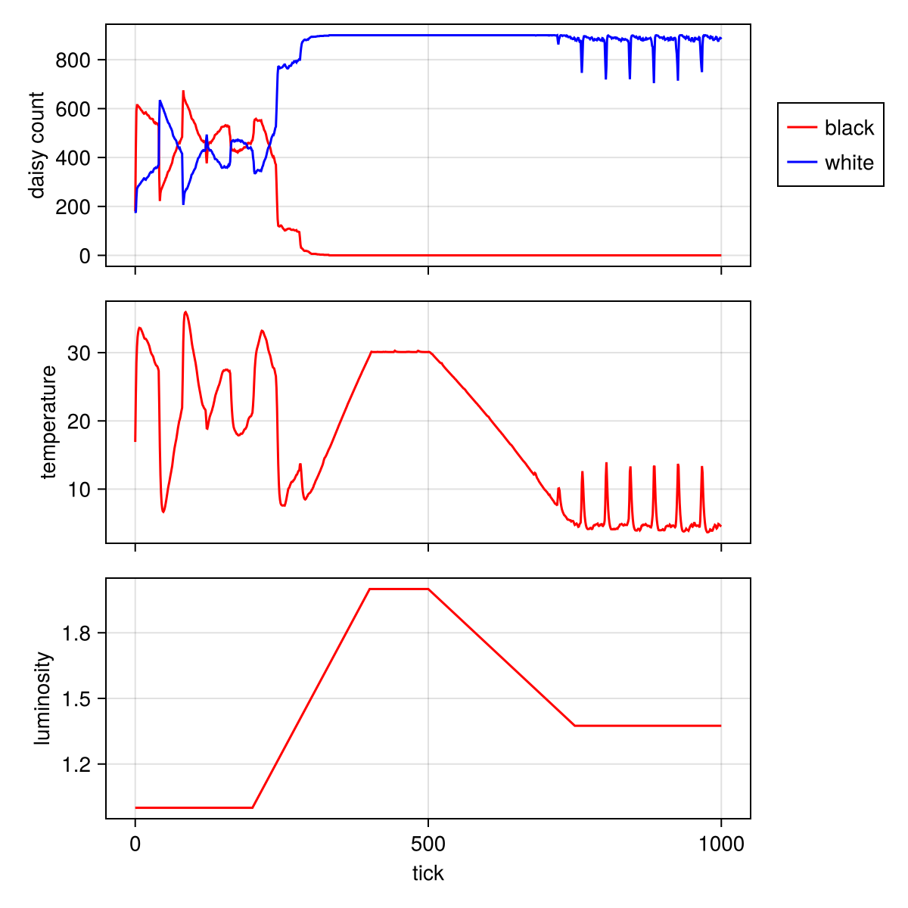

---
## Author
author:
  name: Черная София Витальевна
  email: 1132236043@rudn.ru
  affiliation:
    - name: Российский университет дружбы народов
      country: Российская Федерация
      postal-code: 117198
      city: Москва
      address: ул. Миклухо-Маклая, д. 6

## Title
title: "Презентация по лабораторной работе №3"
subtitle: "Агентное моделирование. Модель Daisyworld"
license: "CC BY"
date: today
date-format: "YYYY-MM-DD"

format:
  revealjs:
    theme: dark
    transition: slide
    slide-number: true
    incremental: true
---

# Информация

## Докладчик

:::::::::::::: {.columns align=center}
::: {.column width="70%"}

  * Черная София Витальевна
  * Студентка
  * Российский университет дружбы народов им. Патриса Лумумбы
  * [1132236043@rudn.ru]
  
:::
::::::::::::::

# Теоретическое введение

## Агентный подход

Агентный подход к имитационному моделированию (Agent-Based Modeling, ABM) — это метод исследования сложных систем, в котором поведение системы возникает из взаимодействия множества автономных сущностей, называемых **агентами**.

**Ключевые компоненты:**
- **Агенты** — активные сущности с правилами поведения
- **Среда** — пространство существования агентов
- **Взаимодействия** — правила влияния агентов друг на друга и среду

## Модель Daisyworld

Модель была разработана Джеймсом Лавлоком для демонстрации **гипотезы Геи**.

- **Белые маргаритки** — высокое альбедо (0.75) → **охлаждают** планету
- **Черные маргаритки** — низкое альбедо (0.25) → **нагревают** планету

**Механизм обратной связи:** 
- Слишком жарко → размножаются белые маргаритки → охлаждение
- Слишком холодно → размножаются черные маргаритки → нагрев

# Выполнение лабораторной работы

## Создание модели

Создаю файл `src/daisyworld.jl` с определением агента-маргаритки

{width=70%}

## Результаты визуализации

**Начальное состояние** (шаг 0)

{width=70%}

**Состояние через 5 шагов**

{width=70%}

**Состояние через 40 шагов**

{width=70%}

# Анализ динамики популяции

## График динамики численности

{width=80%}

**Выводы:**
- Черные маргаритки доминируют
- Наблюдаются колебания численности
- Система достигает динамического равновесия

# Исследование при изменяющейся светимости

## Комплексный график

{width=80%}

**Выводы:**
- Маргаритки компенсируют изменение внешней светимости
- Температура остается стабильной
- Демонстрация механизма отрицательной обратной связи

# Параметрическое исследование

## Пространственное распределение

**Серия 1:** max_age=25, init_white=0.2

{width=30%} {width=30%} {width=30%}

**Серия 2:** max_age=40, init_white=0.2

{width=30%} {width=30%} {width=30%}

**Серия 3:** max_age=25, init_white=0.8

{width=30%} {width=30%} {width=30%}

**Серия 4:** max_age=40, init_white=0.8

{width=30%} {width=30%} {width=30%}

## Динамика численности

| max_age=25, init_white=0.2 | max_age=40, init_white=0.2 |
|:--------------------------:|:--------------------------:|
| {width=90%} | {width=90%} |

| max_age=25, init_white=0.8 | max_age=40, init_white=0.8 |
|:--------------------------:|:--------------------------:|
| {width=90%} | {width=90%} |

## Динамика при изменяющейся светимости

| max_age=25, init_white=0.2 | max_age=40, init_white=0.2 |
|:--------------------------:|:--------------------------:|
| {width=90%} | {width=90%} |

| max_age=25, init_white=0.8 | max_age=40, init_white=0.8 |
|:--------------------------:|:--------------------------:|
| {width=90%} | {width=90%} |

# Сводная таблица результатов

## Влияние параметров на динамику

| Параметры | Пространственное распределение | Динамика численности | Стабилизация температуры |
|-----------|-------------------------------|---------------------|------------------------|
| max_age=25, init_white=0.2 | Преобладание черных | Черные доминируют | Средняя |
| max_age=40, init_white=0.2 | Больше белых | Сильные колебания | Хорошая |
| max_age=25, init_white=0.8 | Белые → черные | Преобладание черных | Средняя |
| max_age=40, init_white=0.8 | Преобладание черных | Плавные колебания | **Наилучшая** |

# Заключение

## Выводы

1. **Модель успешно реализована** на Julia

2. **Механизм обратной связи** продемонстрирован

3. **Наилучший результат** стабилизации температуры:
   - **max_age = 40, init_white = 0.8**

## Итоги

- Освоен агентный подход
- Создана и проанализирована модель Daisyworld
- Проведено параметрическое исследование
- **Гипотеза Геи подтверждена**

# Список литературы

::: {#refs}
:::
