---
## Author
author:
  name: Черная София Витальевна
  email: 1132236043@rudn.ru
  affiliation:
    - name: Российский университет дружбы народов
      country: Российская Федерация
      postal-code: 117198
      city: Москва
      address: ул. Миклухо-Маклая, д. 6

## Title
title: "Лабораторная работа №3"
subtitle: "Агентное моделирование"
license: "CC BY"
lang: ru-RU
julia:
  exeflags: ["--project=../project"]
format:
  docx:
    toc: true
    number-sections: true
  pdf:
    pdf-engine: xelatex
    toc: true
    number-sections: true
    colorlinks: false
    documentclass: scrreprt
    papersize: a4
    fontsize: 12pt
    linestretch: 1.5
    babel-lang: russian
    babel-otherlangs: english
    mainfont: "DejaVu Serif"
    sansfont: "DejaVu Sans"
    monofont: "DejaVu Sans Mono"
    csquotes: true
    indent: true
---

# Цель работы

Изучить принципы агентного моделирования на примере классической модели "Мир маргариток" (Daisyworld). На практике освоить создание и анализ агент-ориентированных моделей с использованием пакетов Agents, DrWatson, CairoMakie в среде Julia.

# Задачи

1. Изучить структуру агентной модели Daisyworld: агенты (Маргаритки двух видов), их свойства (альбедо, возраст) и правила взаимодействия (рост, размножение, смертность, влияние на температуру).
2. Проанализировать механизм отрицательной обратной связи, возникающей при конкуренции черных и белых маргариток.
3. Визуализировать динамику модели: анимацию пространственного распределения маргариток и температуры, графики изменения численности популяции.
4. Исследовать реакцию модели на изменение солнечной светимости (сценарий: ramp).
5. Выполнить параметрический анализ влияния максимального возраста маргариток и начальной доли белых маргариток на динамику системы.

# Задание

1. Создать рабочий каталог для кода.
2. Установить необходимые пакеты.
3. Выполнить предложенный код.
4. Преобразовать код в литературный стиль.
5. Сгенерировать из литературного кода:
   - чистый код;
   - jupyter notebook;
   - документацию в формате Quarto.
6. Выполнить код из jupyter notebook.
7. Интегрировать документацию в формате Quarto в отчёт.
8. Добавить в код в литературном стиле вычисление для набора параметров.
9. Сгенерировать из литературного кода с параметрами:
   - чистый код;
   - jupyter notebook;
   - документацию в формате Quarto.
10. Выполнить код из jupyter notebook с параметрами.
11. Интегрировать документацию с параметрами в формате Quarto в отчёт.

# Теоретическое введение

## Агентный подход

Агентный подход к имитационному моделированию (Agent-Based Modeling, ABM) — это метод исследования сложных систем, в котором поведение системы возникает из взаимодействия множества автономных сущностей, называемых агентами. Вместо того чтобы описывать систему глобальными уравнениями, мы моделируем каждую индивидуальную единицу и правила её поведения, а затем наблюдаем, какие коллективные паттерны появляются снизу вверх. Этот подход особенно полезен, когда поведение системы трудно предсказать из-за нелинейностей, гетерогенности участников или адаптивных стратегий.

## Ключевые компоненты агентной модели

Любая агентная модель включает три основных элемента:

- **Агенты** — это активные сущности. Они обладают:
  - Свойствами (атрибутами): возраст, цвет, запас ресурсов, координаты и т.п.
  - Правилами поведения: как агент реагирует на изменения среды и действия других агентов (например, перемещение, размножение, потребление).
  - Целями (не обязательно): в некоторых моделях агенты стремятся максимизировать свою выгоду или выжить.
  - Способностью к обучению или адаптации (в продвинутых моделях).

- **Среда** — это пространство, в котором существуют агенты. Она может быть:
  - Дискретной (клеточная сетка, как в Daisyworld).
  - Непрерывной (двумерное или трёхмерное пространство).
  - Сетевой (граф социальных связей).
  - Абстрактной (например, рынок без явных координат).

Среда также может иметь свои свойства (температура, ресурсы) и динамику (диффузия, обновление).

- **Взаимодействия** — правила, определяющие, как агенты влияют друг на друга и на среду. Они могут быть:
  - Локальными (только с соседями).
  - Глобальными (все агенты взаимодействуют со всеми).
  - Через среду (агенты изменяют среду, а среда влияет на агентов).

## Модель Daisyworld

Модель Daisyworld была разработана Джеймсом Лавлоком для демонстрации гипотезы Геи. В этой модели:

- **Белые маргаритки** имеют высокое альбедо (0.75), отражают солнечный свет и охлаждают планету.
- **Черные маргаритки** имеют низкое альбедо (0.25), поглощают солнечный свет и нагревают планету.
- **Температура** влияет на вероятность размножения маргариток.
- Механизм **отрицательной обратной связи** стабилизирует глобальную температуру при изменении солнечной светимости.

# Выполнение лабораторной работы

## 1. Инициализация проекта

Устанавливаю пакет DrWatson и инициализирую проект с указанием автора "Sofia" и отклонением создания автоматического Git-репозитория.

{#fig-001 width=70%}

Проверяю, что папка `project` установилась.

{#fig-002 width=70%}

## 2. Создание модели

Создаю в папке `src` файл daisyworld.jl.

{#fig-003 width=70%}

Код модели Daisyworld, который определяет агента-маргаритку с полями breed, age и albedo, а также функции для расчета локальной температуры с учетом альбедо, ее диффузии между соседними клетками и размножения маргариток на свободные клетки с вероятностью, зависящей от температуры.

{#fig-004 width=70%}

## 3. Создание скрипта визуализации

Создаю файл для последующего размещения кода визуализации модели.

{#fig-005 width=70%}

Размещаю код для этого скрипта, который подключает модель из src/daisyworld.jl, задает параметры визуализации (цвет маргариток зависит от породы, размер 20, маркер в виде цветочка) и сохраняет три снимка состояния мира на разных шагах симуляции: шаг 0 (начальное состояние), 5 и 40.

{#fig-006 width=70%}

Устанавливаю необходимые пакеты DataFrames, StatsBase и CairoMakie для работы с данными, статистическими вычислениями и визуализацией.

{#fig-007 width=70%}

{#fig-008 width=70%}

{#fig-009 width=70%}

Запускаю скрипт daisyworld.

{#fig-010 width=70%}

В результате компиляции получаю 3 файла, которые отображают расположение черных и белых маргариток и температуру вокруг них. Начальное состояние изображено на 1 графике.

{#fig-011 width=70%}

Состояние поля через 5 единиц времени.

{#fig-012 width=70%}

Состояние поля через 40 единиц времени.

{#fig-013 width=70%}


Создаю литературный скрипт `litdaisyworld.jl` в каталоге `scripts/` для оформления кода в стиле литературного программирования.

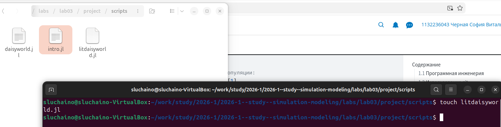{#fig-014 width=70%}

Содержимое литературного скрипта `litdaisyworld.jl`, которое включает описание цели работы, инициализацию проекта, подключение библиотек, загрузку модели и настройку параметров визуализации.

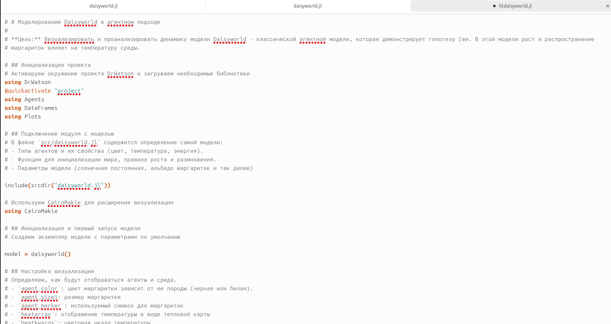{#fig-015 width=70%}

Создаю скрипт `tangle.jl` для автоматической генерации отчетов из литературных скриптов с помощью пакета Literate.jl.

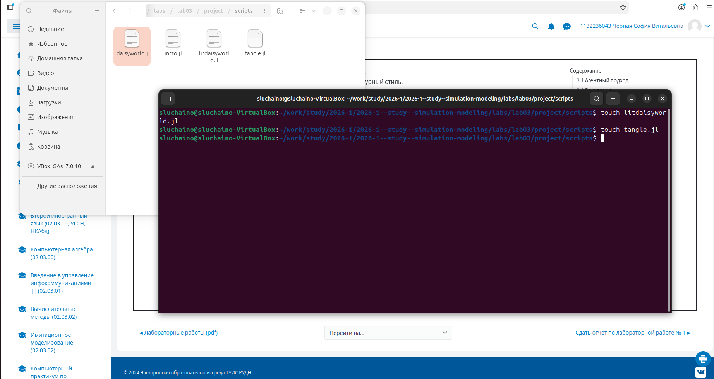{#fig-016 width=70%}

Код скрипта `tangle.jl`, который определяет функции для генерации чистого кода, Quarto-документа и Jupyter Notebook из литературного скрипта.

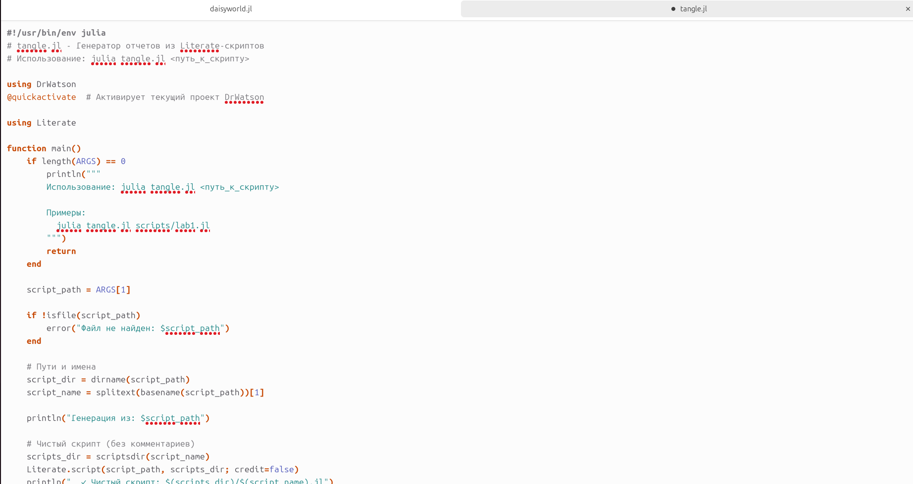{#fig-017 width=70%}

Устанавливаю пакет Literate для поддержки литературного программирования.

{#fig-018 width=70%}

Запускаю генерацию отчетов из литературного скрипта `litdaisyworld.jl`. В результате создаются чистый код, Quarto-документ и Jupyter Notebook.

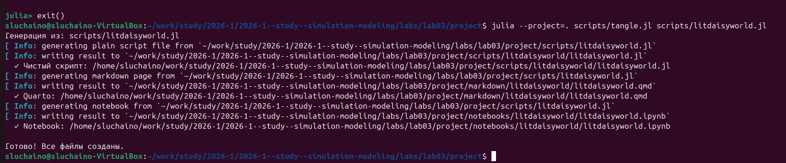{#fig-019 width=70%}

Запускаю Jupyter Notebook для выполнения сгенерированного ноутбука и проверки работоспособности кода.

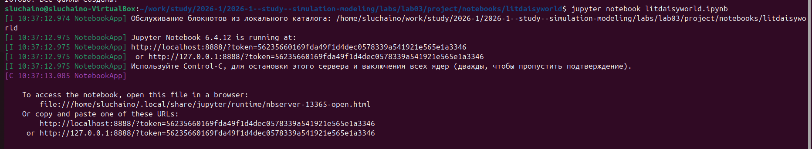{#fig-020 width=70%}

Запускаю код в Jupyter Notebook и проверяю что всё работает, графики рисует.

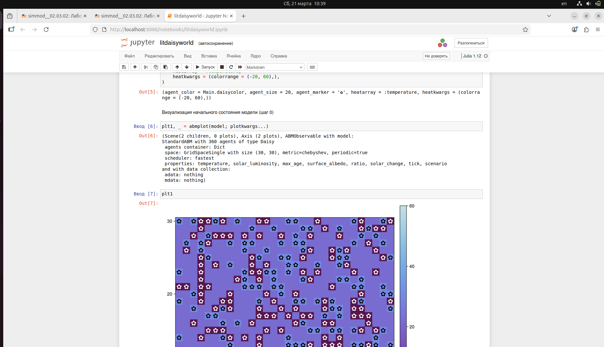{#fig-021 width=70%}

Создаю файл для последующего размещения кода для визуализации модели.

{#fig-022 width=70%}

Код, который создает видео-анимацию модели Daisyworld на 60 кадров, отображая маргаритки в виде черных и белых символов ✿ в зависимости от породы, а температуру — в виде тепловой карты с диапазоном от -20 до 60°C.

{#fig-023 width=70%}

Запускаю код daisyworld-animate.jl.

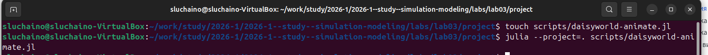{#fig-024 width=70%}

Создаю файл daisyworld-count.jl в каталоге scripts/ для построения графиков изменения численности популяций маргариток.

{#fig-025 width=70%}

Код скрипта daisyworld-count.jl, который определяет функции для подсчета черных и белых маргариток, запускает модель на 1000 шагов, собирает данные о численности и строит график динамики популяций, сохраняя его в папку plots/.

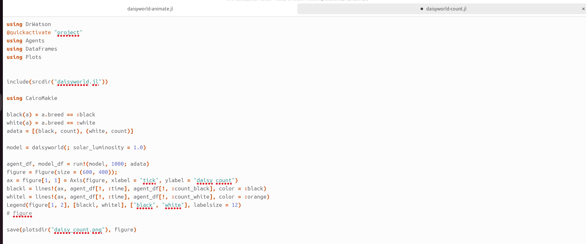{#fig-026 width=70%}

Получаю график, где видно, что черные маргаритки превосходят белых по количеству, а так же что кол-во любого вида постоянно меняется.

{#fig-027 width=70%}

Литературная версия кода daisyworld-count.jl.

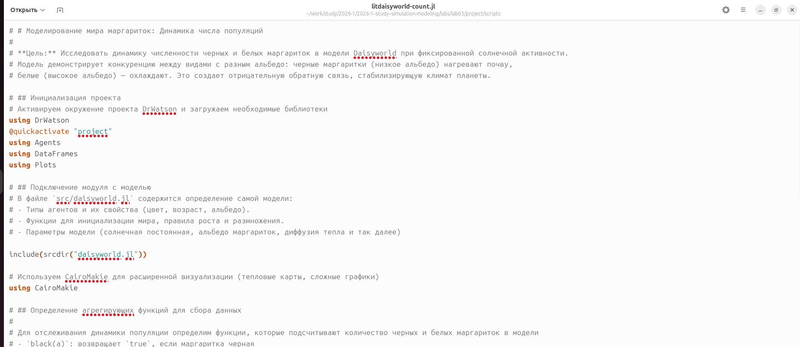{#fig-028 width=70%}

Запускаю литературный код litdaisyworld-count.jl.

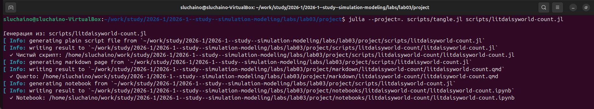{#fig-029 width=70%}

Запускаю Jupyter Notebook для выполнения сгенерированного ноутбука и проверки работоспособности кода.

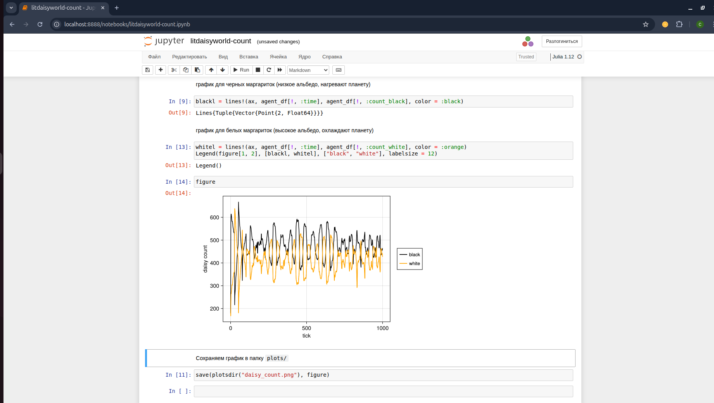{#fig-030 width=70%}

Создаю файл daisyworld-luminosity.jl в каталоге scripts/ для анализа динамики модели при изменяющейся солнечной светимости.

{#fig-031 width=70%}

Код скрипта daisyworld-luminosity.jl, который запускает модель со сценарием :ramp (линейное увеличение светимости), собирает данные о численности маргариток, средней температуре и светимости, а затем строит комплексный график из трех панелей: динамика популяций, изменение температуры и рост светимости.

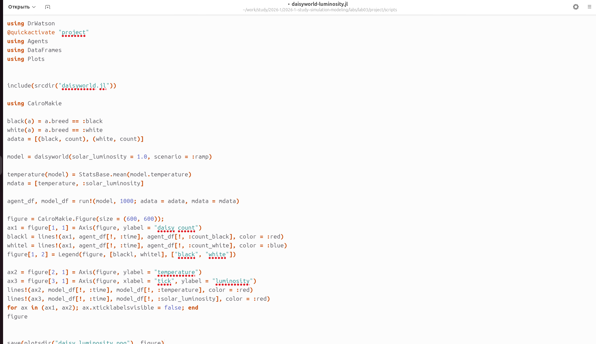{#fig-032 width=70%}

Результат графика.

{#fig-033 width=70%}

Создаю литературный скрипт litdaisyworld-luminosity.jl для оформления кода анализа динамики при изменяющейся светимости в стиле литературного программирования.

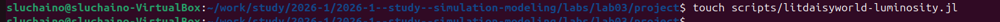{#fig-034 width=70%}

Содержимое литературного скрипта litdaisyworld-luminosity.jl, которое включает описание цели исследования, инициализацию проекта, подключение модуля модели и определение функций для сбора данных о численности черных и белых маргариток.

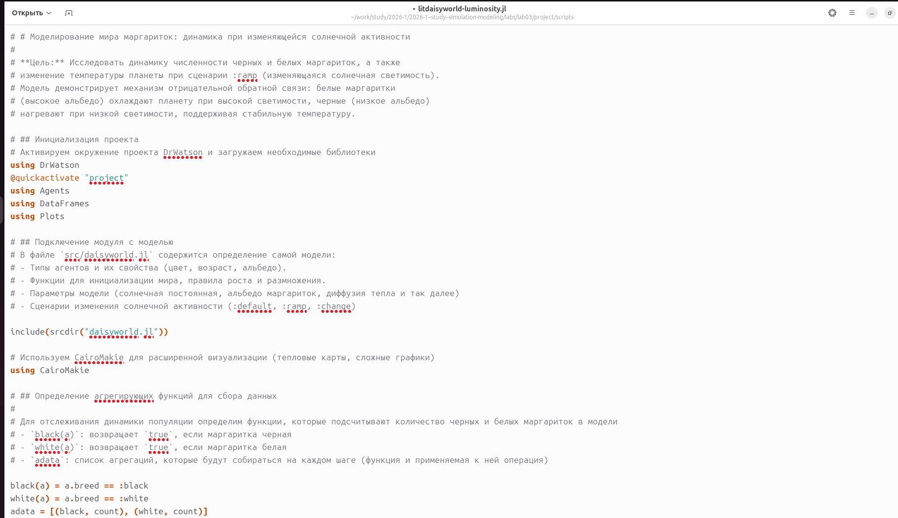{#fig-035 width=70%}

Запускаю генерацию отчетов из литературного скрипта litdaisyworld-luminosity.jl. В результате создаются чистый код, Quarto-документ и Jupyter Notebook для анализа динамики при изменяющейся светимости.

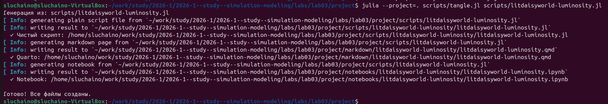{#fig-036 width=70%}

Запускаю литературный скрипт litdaisyworld-luminosity.jl через jupyter notebook и проверяю его корректность.

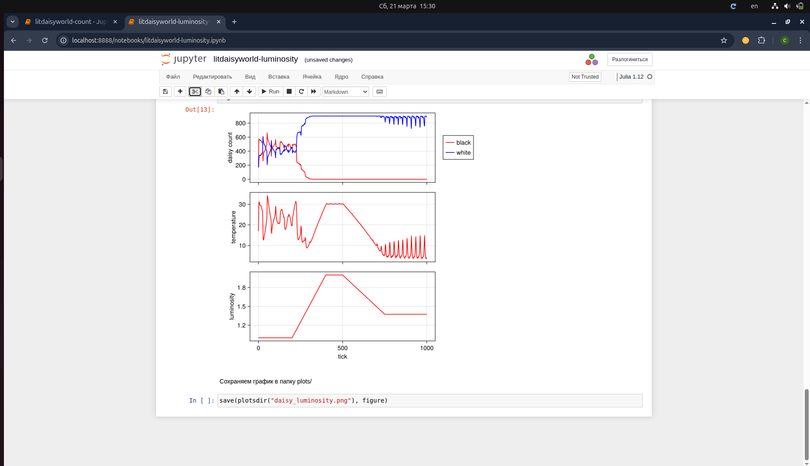{#fig-037 width=70%}

Создаю файл daisyworld_param.jl в каталоге scripts/ для параметрического исследования модели Daisyworld.

{#fig-038 width=70%}

Код скрипта daisyworld_param.jl, который определяет словарь параметров для эксперимента: перебираемые параметры max_age (25 и 40) и init_white (0.2 и 0.8), а также фиксированные параметры модели, после чего генерирует список всех комбинаций и запускает симуляцию для каждой из них.

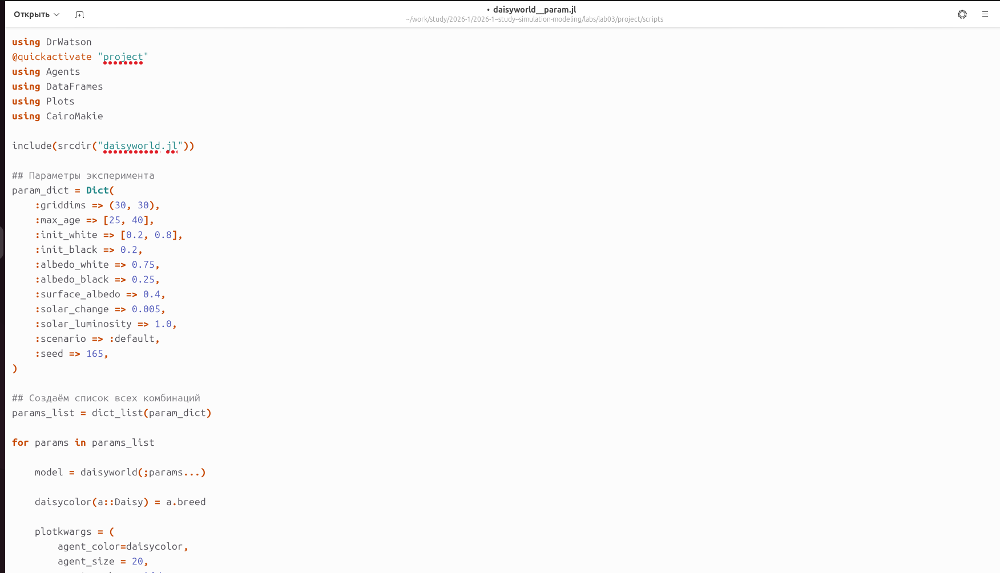{#fig-039 width=70%}

Запуск скрипта daisyworld_param.jl.

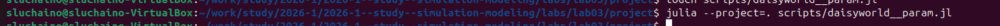{#fig-040 width=70%}

## Серия 1: max_age=25, init_white=0.2

График отображает начальное состояние модели для параметров max_age=25 и init_white=0.2, где черные и белые маргаритки распределены равномерно по полю..

{#fig-041 width=70%}

Через 5 шагов наблюдается активное размножение черных маргариток.

{#fig-042 width=70%}

Через 40 шагов популяция стабилизируется.

{#fig-043 width=70%}

## Серия 2: max_age=40, init_white=0.2

Начальное состояние при max_age=40 и init_white=0.2 аналогично предыдущей серии.

{#fig-044 width=70%}

Через 5 шагов маргаритки активно размножаются, занимая свободные клетки. Больше, как и в прошлый раз, черных.

{#fig-045 width=70%}

Через 40 шагов при max_age=40 популяция достигает более высокой численности по сравнению с max_age=25, так как маргаритки живут дольше. Больше белых.

{#fig-046 width=70%}

## Серия 3: max_age=25, init_white=0.8

Начальное состояние при init_white=0.8 показывает преобладание белых маргариток.

{#fig-047 width=70%}

Через 5 шагов черные маргаритки начнают размножаться и забирать места у белых.

{#fig-048 width=70%}

Через 40 шагов популяция стабилизируется.

{#fig-049 width=70%}

## Серия 4: max_age=40, init_white=0.8

Начальное состояние при max_age=40 и init_white=0.8 демонстрирует снова преобладание белых маргариток.

{#fig-050 width=70%}

Через 5 шагов начинает появляться черные маргаритки.

{#fig-051 width=70%}

Через 40 шагов при max_age=40 и init_white=0.8 черных становится куда больше чем белых.

{#fig-052 width=70%}

Создаю литературный скрипт litdaisyworld_param.jl для оформления параметрического исследования пространственного распределения в стиле литературного программирования.

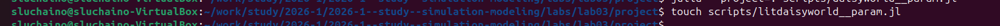{#fig-053 width=70%}

Код литературного скрипта litdaisyworld_param.jl, который настраивает визуализацию (цвет маргариток зависит от породы, размер 20, маркер ✿, температура отображается тепловой картой), выполняет три снимка состояния мира (шаг 0, 5 и 40) и формирует уникальные имена файлов для сохранения с помощью функции savename.

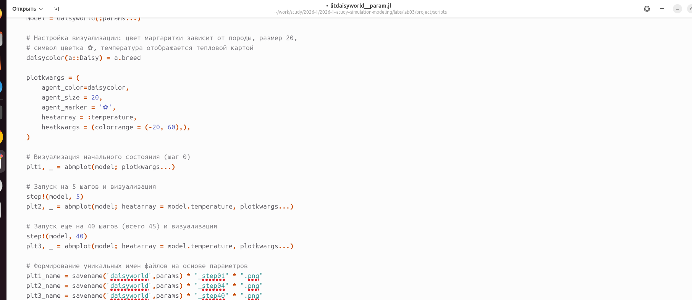{#fig-054 width=70%}

Запускаю генерацию отчетов из литературного скрипта litdaisyworld_param.jl. В результате создаются чистый код, Quarto-документ и Jupyter Notebook для параметрического исследования пространственного распределения.

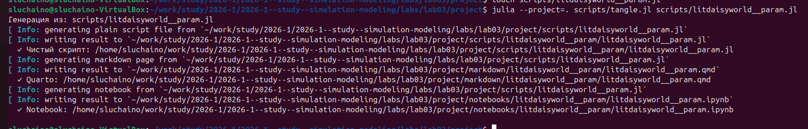{#fig-055 width=70%}

Литературный скрипт litdaisyworld_param.jl в jupyter notebook.

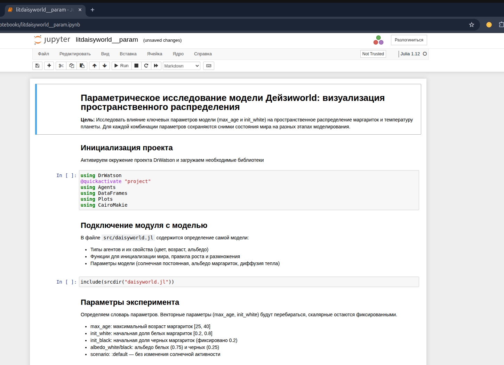{#fig-056 width=70%}

Создаю файл daisyworld-count_param.jl в каталоге scripts/ для параметрического исследования динамики численности маргариток. Соответствующий скриншот приведён ниже.

{#fig-057 width=70%}

Код скрипта daisyworld-count_param.jl, который определяет словарь параметров для эксперимента (max_age = [25, 40], init_white = [0.2, 0.8]), генерирует список всех комбинаций и для каждой запускает симуляцию на 1000 шагов, собирая данные о численности черных и белых маргариток, показан на следующем рисунке.

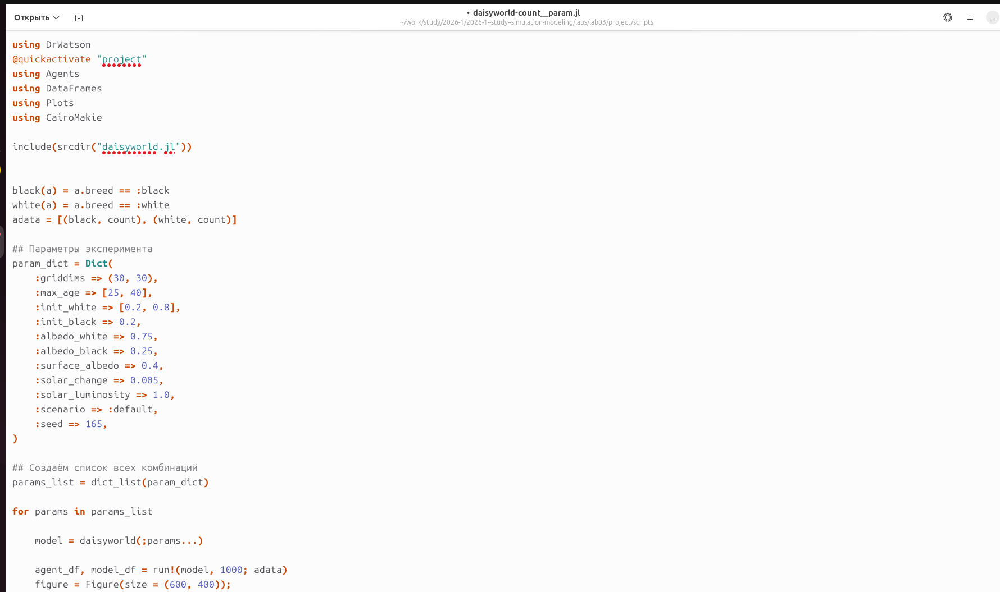{#fig-058 width=70%}

Запускаю генерацию отчетов из скрипта daisyworld-count_param.jl с помощью tangle.jl. В результате создаются чистый код, Quarto-документ и Jupyter Notebook для параметрического исследования динамики численности. Результат генерации показан ниже.

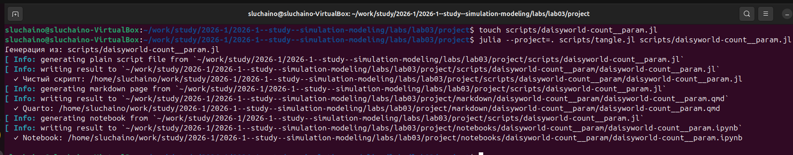{#fig-059 width=70%}

## Серия 1: max_age=25, init_white=0.2

График показывает динамику численности черных и белых маргариток при max_age=25 и init_white=0.2, где черные маргаритки доминируют на протяжении всей симуляции, достигая пика около 650 особей, а белые остаются на уровне 500 особей.

{#fig-060 width=70%}

## Серия 2: max_age=40, init_white=0.2

При max_age=40 и init_white=0.2 наблюдается более сильные колебания численности обоих видов по сравнению с предыдущей серией.

{#fig-061 width=70%}

## Серия 3: max_age=25, init_white=0.8

График для max_age=25 и init_white=0.8 демонстрирует преобладание черных маргариток, колебания стали меньше.

{#fig-062 width=70%}

## Серия 4: max_age=40, init_white=0.8

При max_age=40 и init_white=0.8 интервалы между колебаниями становятся больше.

{#fig-063 width=70%}

Создаю литературный скрипт litdaisyworld-count_param.jl для параметрического исследования динамики численности маргариток в стиле литературного программирования. Скриншот файла приведён ниже.

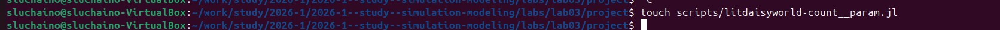{#fig-064 width=70%}

Содержимое литературного скрипта litdaisyworld-count_param.jl, которое включает описание цели параметрического исследования, инициализацию проекта, загрузку библиотек и подключение модуля модели для анализа влияния max_age и init_white на динамику численности, показано на следующем рисунке.

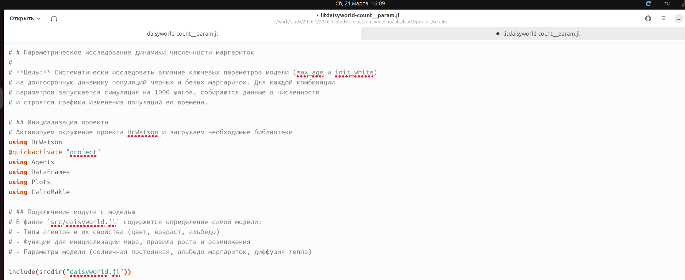{#fig-065 width=70%}

Запускаю генерацию отчетов из литературного скрипта litdaisyworld-count_param.jl. В результате создаются чистый код, Quarto-документ и Jupyter Notebook для параметрического исследования динамики численности маргариток. Это показано на следующем рисунке.

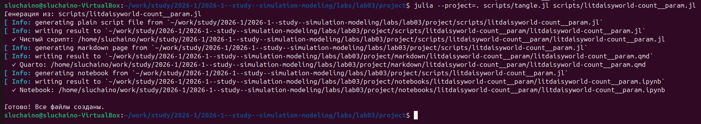{#fig-066 width=70%}

Литературный скрипт litdaisyworld-count_param.jl в jupyter notebook показан ниже.

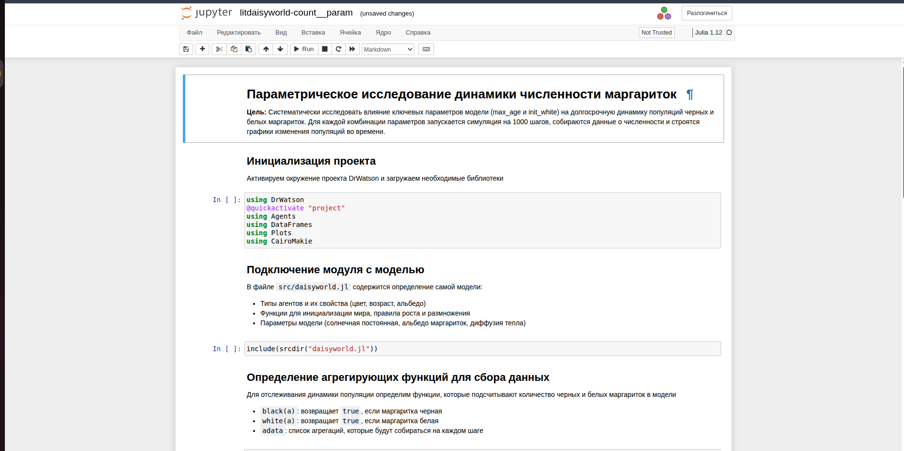{#fig-067 width=70%}

Создаю файл daisyworld-luminosity_param.jl в каталоге scripts/ для параметрического исследования динамики температуры и светимости при изменяющейся солнечной активности.

{#fig-068 width=70%}

Код скрипта daisyworld-luminosity_param.jl, который определяет словарь параметров для эксперимента со сценарием :ramp (изменяющаяся светимость), перебирает комбинации max_age (25, 40) и init_white (0.2, 0.8), и запускает симуляцию для каждой комбинации.

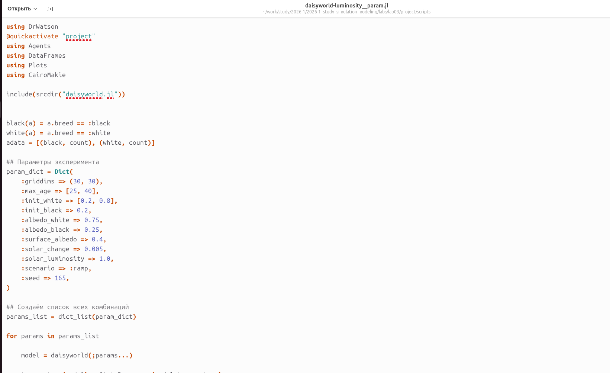{#fig-069 width=70%}

Запускаю скрипт параметрического исследования daisyworld-luminosity_param.jl для выполнения серии экспериментов с изменяющейся солнечной светимостью.

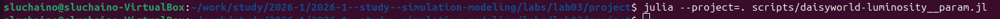{#fig-070 width=70%}

## Серия 1: max_age=25, init_white=0.2

График демонстрирует динамику при низкой начальной доле белых маргариток и небольшом возрасте: черные маргаритки доминируют вначале, но белые вытесняют черных, которых потом не остается.

{#fig-071 width=70%}

## Серия 2: max_age=40, init_white=0.2

При увеличенном возрасте и низкой начальной доле белых наблюдается более плавный переход между видами.

{#fig-072 width=70%}

## Серия 3: max_age=25, init_white=0.8

При высокой начальной доле белых и небольшом возрасте черные маргаритки доминируют с самого начала.

{#fig-073 width=70%}

## Серия 4: max_age=40, init_white=0.8

Наилучший результат стабилизации температуры достигается при max_age=40 и init_white=0.8

{#fig-074 width=70%}

Создаю литературный скрипт litdaisyworld-luminosity_param.jl для параметрического исследования динамики при изменяющейся солнечной светимости в стиле литературного программирования

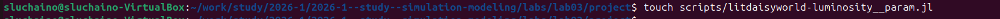{#fig-075 width=70%}

Содержимое литературного скрипта litdaisyworld-luminosity_param.jl, которое включает описание цели параметрического исследования при сценарии ramp, инициализацию проекта, подключение библиотек, загрузку модели и определение агрегирующих функций для сбора данных о численности.

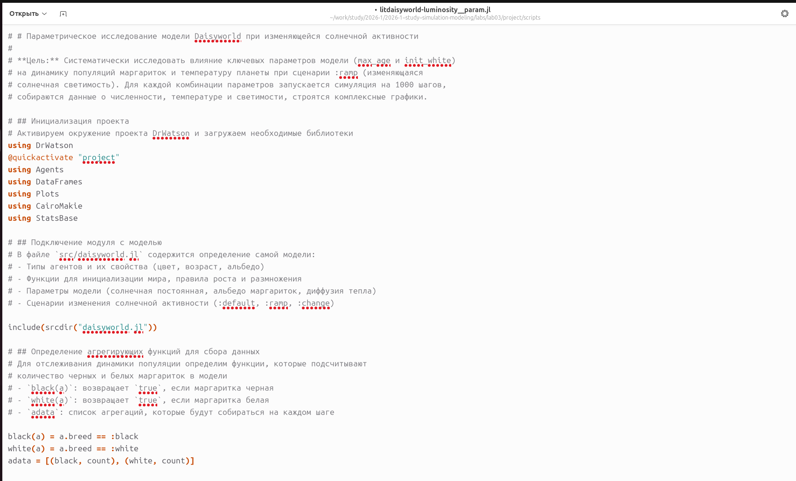{#fig-076 width=70%}

Запускаю генерацию отчетов из литературного скрипта litdaisyworld-luminosity_param.jl с помощью tangle.jl.

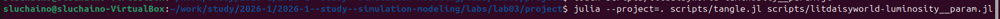{#fig-077 width=70%}

В результате генерации создаются чистый код, Quarto-документ и Jupyter Notebook для параметрического исследования динамики температуры и светимости, что подтверждается сообщениями о создании всех трех форматов.

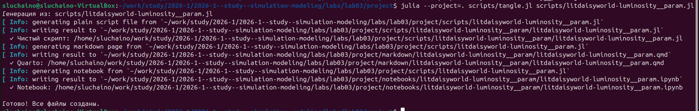{#fig-078 width=70%}

Запускаю литературный скрипт litdaisyworld-luminosity_param.jl через jupyter notebook и проверяю его корректность.

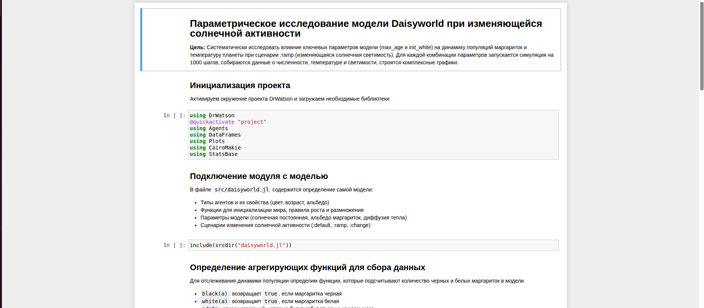{#fig-079 width=70%}

# Интеграция документации

## Подключение документации без параметров

В файл отчёта после описания выполнения лабораторной работы подключаю файлы сгенерированной документации:

### Базовая Quarto-документация модели Daisyworld

Ниже приведён фрагмент документации, отражающий базовую реализацию модели,
визуализацию и анализ её динамики.

На двумерной сетке 30×30 с периодическими границами размещаются два типа
маргариток: чёрные и белые. Их различие задаётся альбедо: чёрные маргаритки
сильнее нагревают среду, а белые сильнее её охлаждают. За счёт этой обратной
связи возникает саморегуляция температуры.

```julia
using DrWatson
@quickactivate "lab_03_models"
using Agents
using DataFrames
using CairoMakie
import StatsBase
using Random

include(srcdir("daisyworld.jl"))
model = daisyworld()
```

Для базовой визуализации использовалась тепловая карта температуры и
отображение агентов по цвету:

```julia
daisycolor(a::Daisy) = a.breed

plotkwargs = (
    agent_color = daisycolor,
    agent_size = 20,
    agent_marker = '*',
    heatarray = :temperature,
    heatkwargs = (colorrange = (-20, 60),),
)

plt1, _ = abmplot(model; plotkwargs...)
step!(model, 5)
plt2, _ = abmplot(model; heatarray = model.temperature, plotkwargs...)
step!(model, 40)
plt3, _ = abmplot(model; heatarray = model.temperature, plotkwargs...)
```

Для анализа динамики численности маргариток во времени использовался следующий
код:

```julia
black(a) = a.breed == :black
white(a) = a.breed == :white
adata = [(black, count), (white, count)]

model2 = daisyworld(; solar_luminosity = 1.0)
agent_df, model_df = run!(model2, 1000; adata)
```

Отдельно был реализован сценарий `ramp`, в котором солнечная светимость
сначала увеличивается, а затем уменьшается. Это позволило наблюдать пределы
устойчивости модели и эффект гистерезиса:

```julia
model3 = daisyworld(solar_luminosity = 1.0, scenario = :ramp)
temperature(model) = StatsBase.mean(model.temperature)
mdata = [temperature, :solar_luminosity]
agent_df3, model_df3 = run!(model3, 1000; adata = adata, mdata = mdata)
```

Таким образом, интегрированная документация без параметров показывает полный
цикл работы базовой модели: инициализацию, визуализацию пространственного
состояния, графики численности и анализ поведения при изменяющейся светимости.


## Подключение документации с параметрами

Аналогичным образом подключаю документацию, сгенерированную из литературных скриптов с параметрами:

### Параметрическая Quarto-документация

В параметрической версии исследуется влияние двух параметров:
максимального возраста маргариток `max_age` и начальной доли белых маргариток
`init_white`. Всего рассматриваются четыре комбинации параметров.

```julia
param_dict = Dict(
    :griddims => (30, 30),
    :max_age => [25, 40],
    :init_white => [0.2, 0.8],
    :init_black => 0.2,
    :albedo_white => 0.75,
    :albedo_black => 0.25,
    :surface_albedo => 0.4,
    :solar_change => 0.005,
    :solar_luminosity => 1.0,
    :scenario => :default,
    :seed => 165,
)

params_list = dict_list(param_dict)
```

Для каждой комбинации параметров строились снимки пространственного
распределения маргариток и температуры:

```julia
for params in params_list
    model = daisyworld(; params...)
    plt1, _ = abmplot(model; plotkwargs...)
    step!(model, 5)
    plt2, _ = abmplot(model; heatarray = model.temperature, plotkwargs...)
    step!(model, 40)
    plt3, _ = abmplot(model; heatarray = model.temperature, plotkwargs...)
end
```

Динамика численности для каждой серии исследовалась аналогично:

```julia
for params in params_list
    model = daisyworld(; params...)
    agent_df, model_df = run!(model, 1000; adata)
end
```

Также был выполнен параметрический анализ для сценария `ramp`, чтобы оценить,
как выбранные параметры влияют на температуру и светимость:

```julia
param_dict_ramp = Dict(
    :griddims => (30, 30),
    :max_age => [25, 40],
    :init_white => [0.2, 0.8],
    :init_black => 0.2,
    :albedo_white => 0.75,
    :albedo_black => 0.25,
    :surface_albedo => 0.4,
    :solar_change => 0.005,
    :solar_luminosity => 1.0,
    :scenario => :ramp,
    :seed => 165,
)

params_list_ramp = dict_list(param_dict_ramp)
```

Интегрированная документация с параметрами показывает, что увеличение
`max_age` делает динамику более плавной и устойчивой, а изменение
`init_white` сильнее влияет на переходный процесс, чем на итоговое
качественное поведение системы.

# Выводы

В ходе выполнения лабораторной работы были успешно реализованы все поставленные задачи. Создана и проанализирована агентная модель Daisyworld, демонстрирующая механизм отрицательной обратной связи: белые маргаритки охлаждают планету, черные — нагревают, что позволяет поддерживать стабильную температуру при изменении солнечной светимости. Выполнена визуализация модели (анимация, графики численности, динамика температуры и светимости). Освоен подход литературного программирования: из литературных скриптов сгенерированы чистый код, Jupyter Notebook и Quarto-документы. Проведено параметрическое исследование влияния max_age и init_white на динамику системы. Наилучшая стабилизация температуры достигнута при max_age=40 и init_white=0.8. Все сгенерированные документы интегрированы в итоговый отчёт.

# Список литературы{.unnumbered}

::: {#refs}
:::
