---
## Author
author:
  name: Черная София Витальевна
  degrees: DSc
  orcid: 0000-0002-0877-7063
  email: 1132236043@pfur.ru
  affiliation:
    - name: Российский университет дружбы народов
      country: Российская Федерация
      postal-code: 117198
      city: Москва
      address: ул. Миклухо-Маклая, д. 6

## Title
title: "Отчёт по лабораторной работе №4"
subtitle: "Иммитационное моделирование"
license: "CC BY"

julia:
  exeflags: ["--project=../project"]
  eval: false
---

# Цель работы

Освоение методов агентного моделирования на примере эпидемиологической модели SIR с использованием пакета Agents.jl в языке Julia. Изучение влияния различных параметров (коэффициент заразности, миграция, время выявления) на динамику распространения инфекционного заболевания. Приобретение навыков параметрического сканирования, многокритериальной оптимизации и визуализации результатов имитационного моделирования.

# Задание

1. Создать рабочий каталог для кода.
2. Установить необходимые пакеты (Agents.jl, DataFrames.jl, Plots.jl, CSV.jl, BlackBoxOptim.jl и др.).
3. Выполнить предложенный код модели SIR.
4. Преобразовать код в литературный стиль.
5. Сгенерировать из литературного кода:
   - чистый код;
   - Jupyter Notebook;
   - документацию в формате Quarto.
6. Выполнить код из Jupyter Notebook.
7. Интегрировать документацию в формате Quarto в отчёт.
8. Добавить в код в литературном стиле вычисление для набора параметров.
9. Сгенерировать из литературного кода с параметрами:
   - чистый код;
   - Jupyter Notebook;
   - документацию в формате Quarto.
10. Выполнить код из Jupyter Notebook с параметрами.
11. Интегрировать документацию с параметрами в формате Quarto в отчёт.

## Дополнительные задания

### Базовый уровень

- Запустите модель с параметрами по умолчанию.
- Постройте график динамики численности S, I, R.
- Определите базовое репродуктивное число R₀ по формуле R₀ = β/γ, где γ = 1/infection_period.
- Сравните с наблюдаемой динамикой.

### Исследование порога

- Найдите минимальное значение β, при котором возникает эпидемия (пик > 5% популяции).
- Сравните с теоретическим порогом R₀ = 1.

### Эффект гетерогенности

- Задайте разные значения β для разных городов.
- Как это влияет на общую динамику?
- Постройте графики для каждого города отдельно.

### Миграция

- Исследуйте влияние интенсивности миграции на скорость распространения инфекции из одного города в другие.
- При какой интенсивности время до пика минимально?

### Карантинные меры

- Модифицируйте модель, добавив возможность закрытия города (обнуление миграции из него) при превышении порога заболеваемости.
- Оцените эффективность такой меры.

### Оптимизация

- Используя оптимизацию, найдите параметры, которые минимизируют общее число умерших при сохранении пика заболеваемости ниже 30%.

# Теоретическое введение

## Классическая модель SIR

Модель SIR, предложенная Кермаком и Маккендриком в 1927 году, описывает динамику эпидемии в популяции, разделённой на три группы:

- **S (Susceptible)** — восприимчивые к заболеванию индивиды;
- **I (Infectious)** — инфицированные, способные заражать восприимчивых;
- **R (Recovered)** — выздоровевшие (или умершие), получившие иммунитет и более не участвующие в распространении.

Классическая модель описывается системой обыкновенных дифференциальных уравнений:

$$ \frac{dS}{dt} = -\beta \frac{SI}{N}, \quad
   \frac{dI}{dt} = \beta \frac{SI}{N} - \gamma I, \quad
   \frac{dR}{dt} = \gamma I $$

где:
- $\beta$ — коэффициент передачи инфекции;
- $\gamma$ — скорость выздоровления ($\gamma = 1 / \text{infection\_period}$);
- $N = S + I + R$ — общая численность популяции.

## Ограничения классического подхода

Несмотря на широкое применение, модель на ОДУ имеет ряд ограничений:

1. **Однородность популяции** — все индивиды считаются одинаковыми.
2. **Отсутствие пространственной структуры** — предполагается полное перемешивание.
3. **Детерминированность** — не учитываются случайные флуктуации.
4. **Непрерывность** — количество людей рассматривается как непрерывная величина.

## Преимущества агентного подхода

Агентное моделирование позволяет преодолеть эти ограничения:

1. Каждый индивид моделируется отдельно с уникальными характеристиками.
2. Взаимодействия происходят локально в пространстве или социальной сети.
3. Процессы носят стохастический характер.
4. Можно учитывать гетерогенность контактов, мобильность, меры контроля.

## Базовое репродуктивное число $R_0$

Базовое репродуктивное число $R_0$ показывает, сколько человек в среднем заражает один больной в полностью восприимчивой популяции:

$$ R_0 = \frac{\beta}{\gamma} = \beta \cdot \text{infection\_period} $$

- При $R_0 > 1$ — эпидемия растёт;
- При $R_0 < 1$ — эпидемия затухает.

## Параметры модели

| Параметр | Обозначение | Описание |
|----------|-------------|----------|
| `Ns` | $N$ | Численность населения по локациям |
| `β_und` | $\beta_{und}$ | Вероятность передачи для невыявленных случаев |
| `β_det` | $\beta_{det}$ | Вероятность передачи для выявленных случаев |
| `infection_period` | $T_{inf}$ | Длительность заболевания (дней) |
| `detection_time` | $T_{det}$ | Время до выявления заболевания |
| `death_rate` | $\mu$ | Вероятность летального исхода |
| `reinfection_probability` | $p_{reinf}$ | Вероятность повторного заражения |
| `migration_rates` | $M$ | Матрица вероятностей миграции между локациями |

# Выполнение лабораторной работы

## Инициализация проекта

Создаю проект DrWatson для организации лабораторной работы. Проект будет содержать все необходимые зависимости, исходный код, скрипты и каталоги для данных и графиков ([рис. @fig-001]).

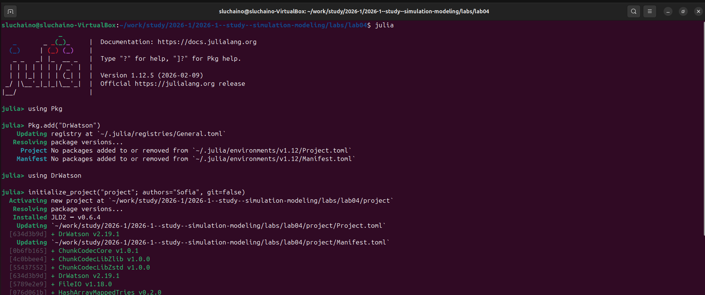{#fig-001 width=70%}

## Модель SIR

Агентная модель SIR реализована в файле `src/sir_model.jl`. Каждый агент — это отдельный человек с состоянием (`:S`, `:I`, `:R`) и счётчиком дней болезни. Агенты распределены по трём городам (узлам графа) и могут мигрировать между ними с заданной вероятностью. Инфицированный агент заражает восприимчивых в своей локации, а после окончания болезни либо выздоравливает, либо умирает ([рис. @fig-003]).

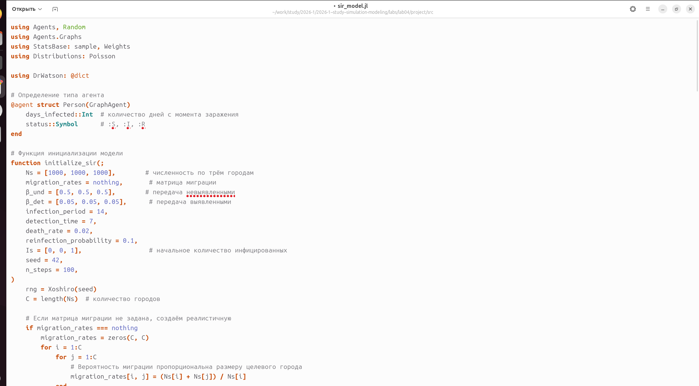{#fig-003 width=70%}

## Базовый эксперимент

Файл `scripts/sir_run_basic.jl` запускает один эксперимент с фиксированными параметрами по умолчанию. Скрипт выполняет 100 шагов симуляции, на каждом шаге собирая данные о численности восприимчивых, инфицированных, выздоровевших и общем количестве агентов. Результаты сохраняются в JLD2-файлы, а график динамики — в папку `plots/` ([рис. @fig-004]).

{#fig-004 width=70%}

Код содержит параметры: три города по 1000 человек, заразность невыявленных β = 0.5, выявленных β = 0.05, длительность болезни 14 дней, время выявления 7 дней, смертность 2%. Начальный очаг — один инфицированный в третьем городе ([рис. @fig-005]).

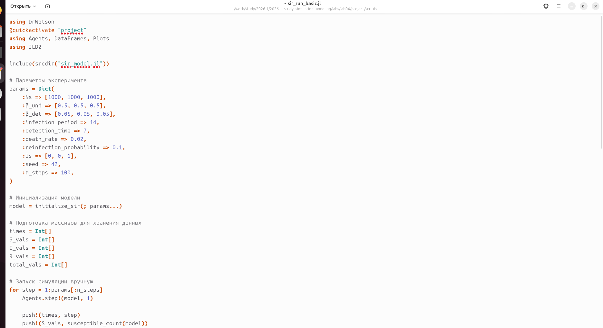{#fig-005 width=70%}

Устанавливаю пакет JLD2 через julia([рис. @fig-006]).

{#fig-006 width=70%}

Устанавливаю пакет Distributions через julia([рис. @fig-007]).

{#fig-007 width=70%}

Запускаю файл scripts/sir_run_basic.jl с базовым экспериментом ([рис. @fig-008]).

{#fig-008 width=70%}

График динамики эпидемии SIR во времени. Синяя линия показывает падение численности восприимчивых особей, оранжевая — рост и спад инфицированных с пиком около 30-го дня, а зелёная — постепенное увеличение выздоровевших. Пунктирная линия отражает общую численность населения, незначительно снижающуюся из-за смертности ([рис. @fig-009]).

{#fig-009 width=70%}

Запускаю литературной версии кода `scripts/sir_run_basic.jl` через `tangle.jl` преобразует литературный скрипт в чистый код, Jupyter Notebook и Quarto-документ ([рис. @fig-010]).

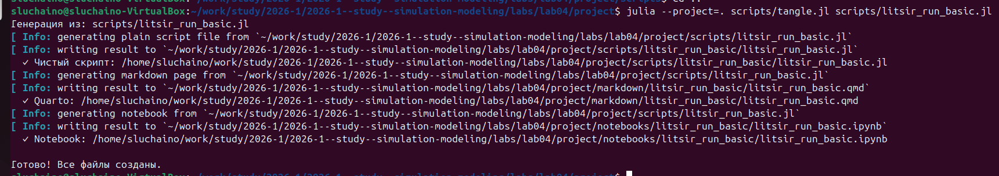{#fig-010 width=70%}

Проверяю, что Jupyter Notebook версия создалась корректно — отображаются все ячейки с кодом и Markdown-описаниями ([рис. @fig-011]).

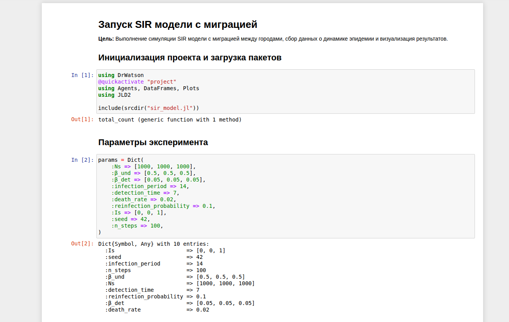{#fig-011 width=70%}

Создаю файл `scripts/sir_scan_beta.jl` для сканирования коэффициента заразности β. Этот скрипт будет исследовать, как изменение β влияет на пик эпидемии и число умерших ([рис. @fig-012]).

{#fig-012 width=70%}

Ввожу код сканирования β. Скрипт перебирает значения β от 0.1 до 1.0, для каждого выполняет 3 прогона с разными seed'ами и сохраняет результаты в CSV ([рис. @fig-013]).

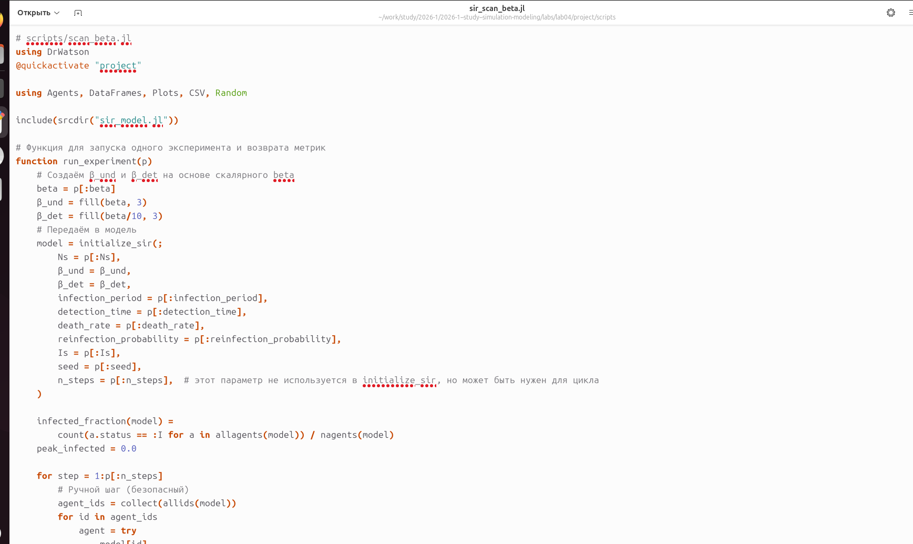{#fig-013 width=70%}

Устанавливаю пакет CSV.jl для сохранения результатов сканирования в удобном табличном формате ([рис. @fig-014]).

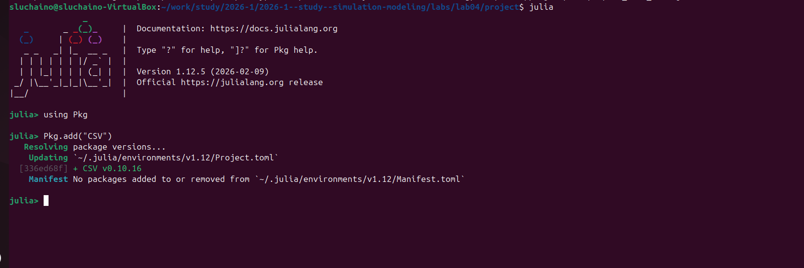{#fig-014 width=70%}

Запускаю файл sir_scan_beta.jl ([рис. @fig-015]).

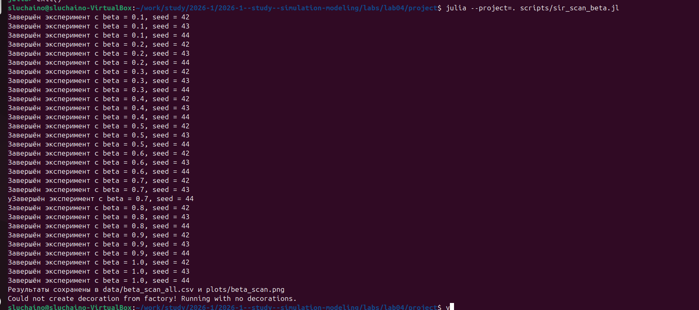{#fig-015 width=70%}

График зависимости показателей эпидемии от коэффициента заразности β. Голубая линия (пик эпидемии) и оранжевая (конечная доля инфицированных) растут с увеличением β, достигая насыщения около 80-90%. Зелёная линия (доля умерших) также возрастает, но остаётся значительно ниже, отражая летальность 2%. ([рис. @fig-016]).

{#fig-016 width=70%}

Запускаю литературной версии кода `scripts/sir_scan_beta.jl` через `tangle.jl` преобразует литературный скрипт в чистый код, Jupyter Notebook и Quarto-документ ([рис. @fig-017]).

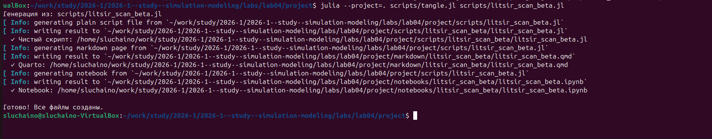{#fig-017 width=70%}

Проверяю, что Jupyter Notebook версия создалась корректно — отображаются все ячейки с кодом и Markdown-описаниями ([рис. @fig-018]).

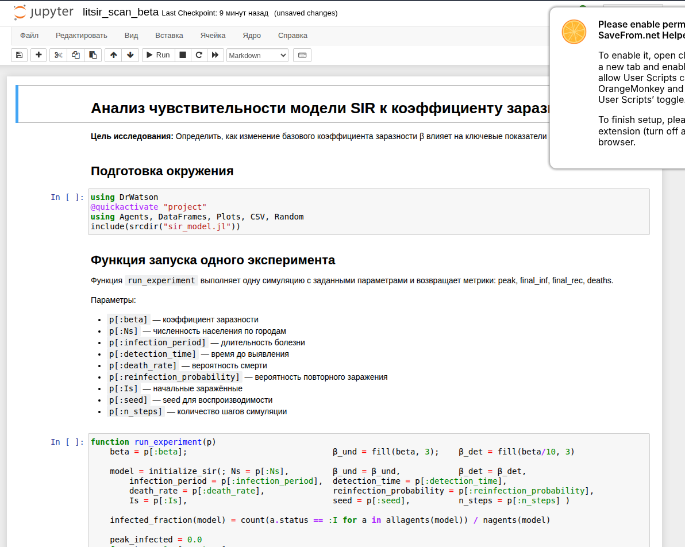{#fig-018 width=70%}

Создаю файл `scripts/sir_migration_effect.jl` для исследования влияния миграции на динамику эпидемии ([рис. @fig-019]).

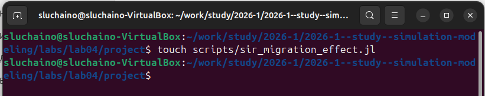{#fig-019 width=70%}

Ввожу код для анализа миграции. Скрипт создаёт матрицу миграции с заданной интенсивностью и измеряет время достижения пика эпидемии ([рис. @fig-020]).

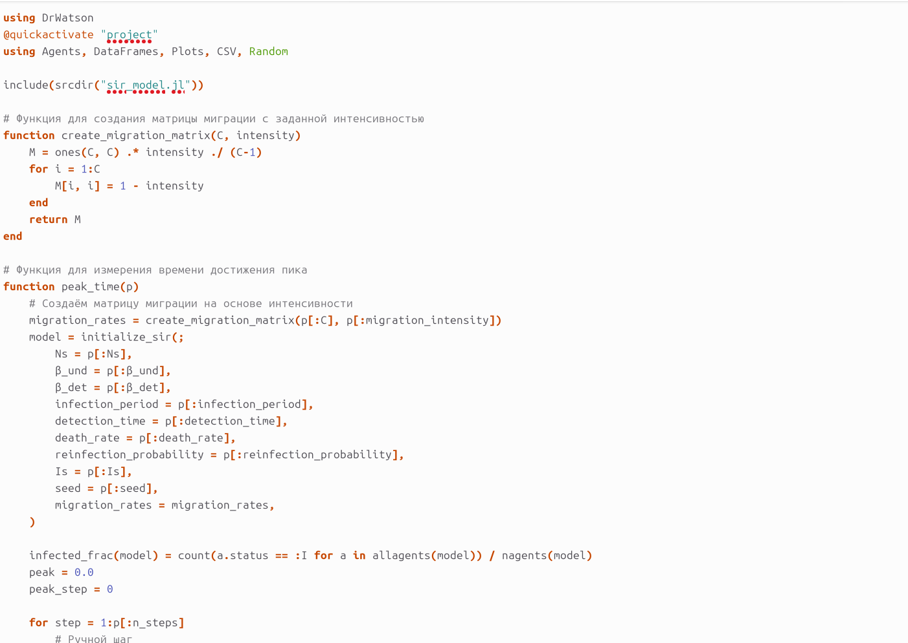{#fig-020 width=70%}

Запускаю скрипт `sir_migration_effect.jl` для выполнения симуляций с разной интенсивностью миграции ([рис. @fig-021]).

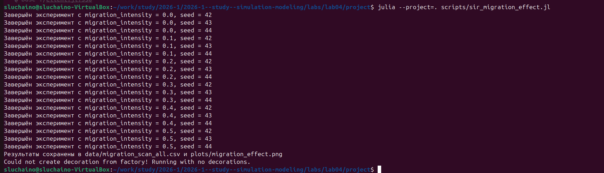{#fig-021 width=70%}

На графике представлены результаты исследования миграции: синяя линия показывает время достижения пика, красная — пиковую заболеваемость. С ростом интенсивности миграции время до пика уменьшается, а пиковая заболеваемость увеличивается ([рис. @fig-022]).

{#fig-022 width=70%}

Запускаю литературную версию кода `scripts/litsir_migration_effect.jl` через `tangle.jl` для преобразования в чистый код, Jupyter Notebook и Quarto-документ ([рис. @fig-023]).

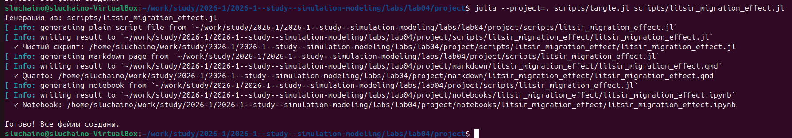{#fig-023 width=70%}

Проверяю, что Jupyter Notebook версия создалась корректно — отображаются все ячейки с кодом и Markdown-описаниями ([рис. @fig-024]).

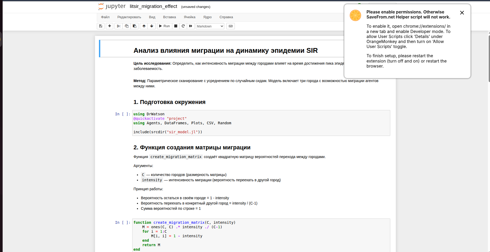{#fig-024 width=70%}

Создаю файл `scripts/sir_optimize_parameters.jl` для многокритериальной оптимизации параметров модели ([рис. @fig-025]).

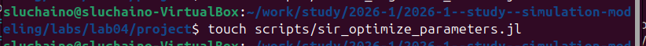{#fig-025 width=70%}

Устанавливаю пакет BlackBoxOptim.jl для выполнения многокритериальной оптимизации методом Borg MOEA ([рис. @fig-026]).

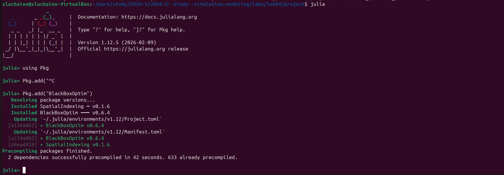{#fig-026 width=70%}

Запускаю скрипт оптимизации. Алгоритм ищет параметры, минимизирующие пик заболеваемости и долю умерших ([рис. @fig-027]).

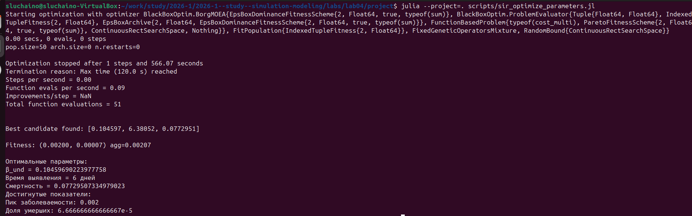{#fig-027 width=70%}

Запускаю литературную версию кода `scripts/litsir_optimize_parameters.jl` через `tangle.jl` для преобразования в чистый код, Jupyter Notebook и Quarto-документ ([рис. @fig-028]).

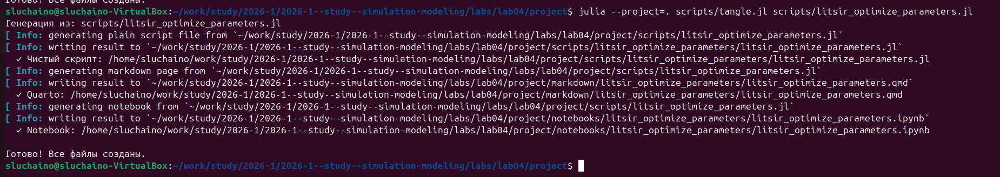{#fig-028 width=70%}

Проверяю, что Jupyter Notebook версия создалась корректно — отображаются все ячейки с кодом и Markdown-описаниями ([рис. @fig-029]).

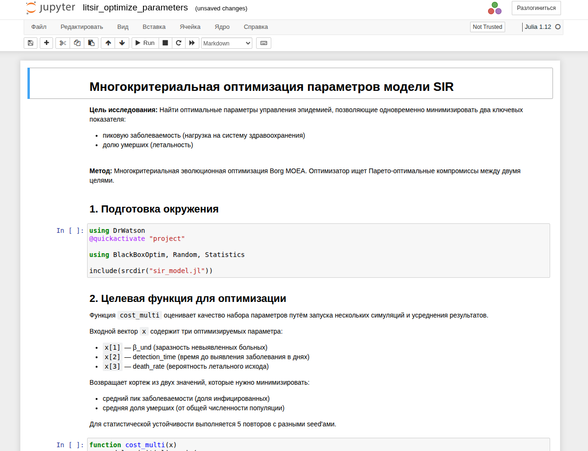{#fig-029 width=70%}

Создаю файл `scripts/sir_visualize_dynamics.jl` для сводной визуализации результатов ([рис. @fig-030]).

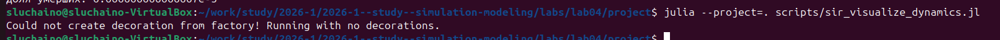{#fig-030 width=70%}

Результаты оптимизации параметров модели SIR. Оптимизатор нашёл оптимальные значения: β_und ≈ 0.105, время выявления ≈ 6 дней, смертность ≈ 7.7%. При этих параметрах достигнуты минимальные показатели: пик заболеваемости 0.2% и доля умерших 0.007% ([рис. @fig-031]).

{#fig-031 width=70%}

## Дополнительные задания

### Создание литературного кода

Создаю файл `scripts/dop_task.jl` с литературной версией дополнительных заданий. Код включает все разделы: базовый уровень, исследование порога, эффект гетерогенности, миграцию, карантинные меры и оптимизацию ([рис. @fig-032]).

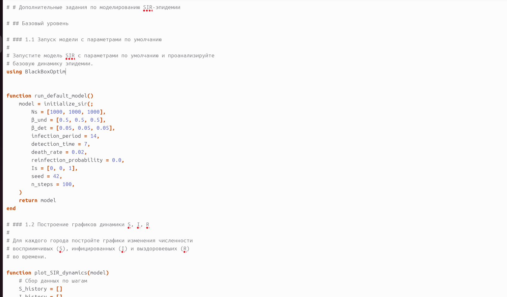{#fig-032 width=70%}

Запускаю обработку литературного кода через `tangle.jl`. Скрипт преобразует `dop_task.jl` в чистый код, Jupyter Notebook и Quarto-документ для дальнейшей работы ([рис. @fig-033]).

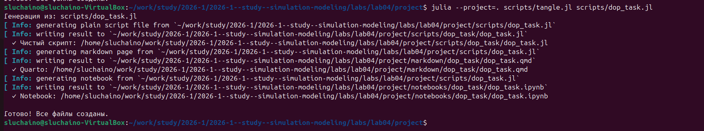{#fig-033 width=70%}

### Базовый уровень

В базовом уровне запускаю модель с параметрами по умолчанию: три города по 1000 человек, заразность β = 0.5, длительность болезни 14 дней, смертность 2%. Начальный очаг — один инфицированный в третьем городе. По графику динамики S, I, R видно классическое поведение: восприимчивые падают, инфицированные растут с пиком около 30-го дня, затем снижаются, а выздоровевшие постепенно увеличиваются.

Рассчитываю базовое репродуктивное число R₀ по формуле R₀ = β/γ, где γ = 1/infection_period. При β = 0.5 и infection_period = 14 получаем γ = 0.0714, R₀ = 7.0. Это означает, что один больной в среднем заражает 7 человек, что объясняет быстрое распространение инфекции и высокий пик заболеваемости.

### Исследование порога

Исследую минимальное значение β, при котором возникает эпидемия (пик > 5% популяции). Перебираю β от 0.05 до 0.5 с шагом 0.05. Теоретический порог R₀ = 1 соответствует β = γ = 0.0714. На практике из-за стохастичности и дискретности популяции пороговое значение может незначительно отличаться.

### Эффект гетерогенности

Задаю разные значения β для трёх городов: город 1 — β = 0.2 (низкая заразность), город 2 — β = 0.5 (средняя), город 3 — β = 0.8 (высокая). Начальный очаг размещаю в городе с низкой заразностью. Строю отдельные графики для каждого города, чтобы проанализировать, как гетерогенность влияет на скорость распространения и высоту пика.

### Миграция

Исследую влияние интенсивности миграции на скорость распространения инфекции. Задаю интенсивности от 0.0 до 0.5 с шагом 0.1. Строю график зависимости времени до пика от интенсивности миграции. Определяю интенсивность, при которой время до пика минимально — это соответствует наиболее быстрому распространению инфекции между городами.

### Карантинные меры

Модифицирую модель, добавляя механизм закрытия города при превышении порога заболеваемости (например, 15% больных). При достижении порога миграция из этого города обнуляется. Сравниваю две симуляции: без карантина и с карантином. Оцениваю эффективность меры по снижению пиковой заболеваемости и общего числа умерших.

### Оптимизация

Использую многокритериальную оптимизацию для поиска параметров, минимизирующих число умерших при ограничении пика заболеваемости ниже 30%. Варьирую β_und (0.1-1.0), detection_time (3-14 дней), death_rate (0.01-0.1). Добавляю штраф за превышение пика выше 30%. Результаты оптимизации сохраняю для анализа компромиссных решений.

# Вывод

В ходе выполнения лабораторной работы было успешно освоено методы агентного моделирования на примере эпидемиологической модели SIR с использованием пакета Agents.jl 

# Список литературы{.unnumbered}

::: {#refs}

[Лабораторная работа № 4 ](https://esystem.rudn.ru/mod/resource/view.php?id=1356134)
:::
