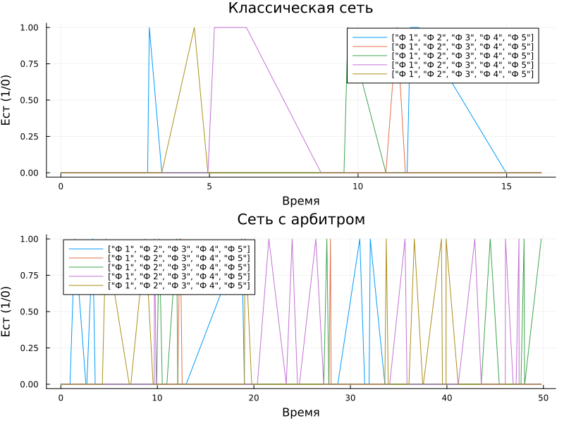

---
## Author
author:
  name: Черная София Витальевна
  degrees: DSc
  orcid: 0000-0002-0877-7063
  email: 1132236043@pfur.ru
  affiliation:
    - name: Российский университет дружбы народов
      country: Российская Федерация
      postal-code: 117198
      city: Москва
      address: ул. Миклухо-Маклая, д. 6

## Title
title: "Лабораторная работа №5"
subtitle: "Сети Петри. Задача «Обедающие философы»"
license: CC BY
date: today
date-format: "YYYY-MM-DD"
---

# Информация

## Докладчик

:::::::::::::: {.columns align=center}
::: {.column width="70%"}

  * Черная София Витальевна
  * студентка группы НФИбд-02-23
  * Российский университет дружбы народов им. П. Лумумбы
  * [1132236043@pfur.ru](mailto:1132236043@pfur.ru)

:::
::: {.column width="30%"}

:::
::::::::::::::

# Вводная часть

## Актуальность

- Параллельные системы встречаются повсюду: многопоточные программы, распределённые базы данных, операционные системы
- В таких системах легко возникают взаимные блокировки (deadlock)
- Сети Петри — мощный аппарат для анализа и предотвращения deadlock

## Объект и предмет исследования

- **Объект:** параллельные системы с разделяемыми ресурсами
- **Предмет:** сети Петри как средство моделирования и анализа deadlock

## Цели и задачи

- Освоить аппарат сетей Петри
- Построить модель задачи «Обедающие философы»
- Выявить deadlock в классической постановке
- Предотвратить deadlock с помощью арбитра
- Провести стохастическое моделирование

## Материалы и методы

- Язык программирования: Julia
- Пакеты: DrWatson, Plots, DataFrames, DifferentialEquations
- Стохастическое моделирование: алгоритм Гиллеспи
- Визуализация: графики эволюции маркировки, анимация

# Теоретическое введение

## Сети Петри

- **Позиции** (кружки) — состояния или ресурсы
- **Переходы** (прямоугольники) — события
- **Фишки** (точки) — количество ресурсов
- **Дуги** — связи между позициями и переходами

**Правило:** переход срабатывает, если во всех входных позициях есть нужное число фишек. При срабатывании фишки забираются из входов и добавляются в выходы.

## Свойства сетей Петри

- **Ограниченность** — фишки не растут бесконечно
- **Живость** — любой переход может сработать
- **Достижимость** — можно ли попасть из A в B
- **Deadlock** — ни один переход не может сработать, система встала

## Задача «Обедающие философы»

- Классическая задача синхронизации (Дейкстра, 1965)
- 5 философов сидят за круглым столом
- Между каждыми двумя — одна вилка (всего 5 вилок)
- Чтобы есть, нужны **две вилки** (левая и правая)

**Проблема:** если каждый возьмёт левую вилку — все будут ждать правую. **Deadlock.**

**Решение:** арбитр, который разрешает есть не более чем 4 философам одновременно.

# Результаты моделирования

## Классическая сеть — эволюция маркировки

На графиках показаны состояния всех пяти философов во времени: Think (думают), Hungry (голодны), Eat (едят), Fork (вилки).

{#fig-001 width=60%}

## Классическая сеть — детализация

Видно, как философы переходят из состояния Think в Hungry, затем в Eat, а вилки занимаются и освобождаются.

{#fig-002 width=50%}

## Анимация работы сети (кадр при t=0)

Анимация наглядно показывает перемещение фишек между позициями. Начальный кадр: все философы думают, все вилки свободны.

{#fig-003 width=50%}

## Сравнительный анализ: классическая сеть vs сеть с арбитром

В классической сети все линии Eat падают в ноль — deadlock. В сети с арбитром линии постоянно прыгают — система жива.

{#fig-004 width=60%}

# Выводы

## Итоги работы

- Построены две модели сети Петри: классическая и с арбитром
- Классическая модель приводит к deadlock
- Модификация с арбитром полностью предотвращает deadlock
- Проведено стохастическое моделирование (алгоритм Гиллеспи)
- Создана анимация, наглядно демонстрирующая работу сети

## Ключевой вывод

**Сети Петри — эффективный инструмент для обнаружения и предотвращения взаимных блокировок в параллельных системах.** Арбитр — простое и надёжное решение проблемы «Обедающих философов».

++
