---
## Author
author:
  name: Черная София Витальевна
  degrees: DSc
  orcid: 0000-0002-0877-7063
  email: 1132236043@pfur.ru
  affiliation:
    - name: Российский университет дружбы народов
      country: Российская Федерация
      postal-code: 117198
      city: Москва
      address: ул. Миклухо-Маклая, д. 6

## Title
title: "Отчёт по лабораторной работе №5"
subtitle: "Сети Петри. Задача «Обедающие философы»"
license: "CC BY"
---

# Цель работы

Освоение аппарата сетей Петри на примере классической задачи синхронизации «Обедающие философы». Изучение базовых элементов сетей Петри (позиции, переходы, фишки, дуги), правил срабатывания переходов и свойств систем (достижимость, живость, ограниченность). Приобретение навыков выявления и предотвращения взаимных блокировок (deadlock) в параллельных системах. Реализация детерминированного и стохастического имитационного моделирования с использованием языка Julia и пакетов DifferentialEquations.jl, Plots.jl.

# Задание

1. Создать рабочий каталог для кода.
2. Установить необходимые пакеты.
3. Выполнить предложенный код модели сети Петри для задачи «Обедающие философы».
4. Преобразовать код в литературный стиль.
5. Сгенерировать из литературного кода:
   - чистый код;
   - Jupyter Notebook;
   - документацию в формате Quarto.
6. Выполнить код из Jupyter Notebook.
7. Интегрировать документацию в формате Quarto в отчёт.
8. Добавить в код в литературном стиле вычисление для набора параметров.
9. Сгенерировать из литературного кода с параметрами:
   - чистый код;
   - Jupyter Notebook;
   - документацию в формате Quarto.
10. Выполнить код из Jupyter Notebook с параметрами.
11. Интегрировать документацию с параметрами в формате Quarto в отчёт.

# Теоретическое введение

## Сети Петри

Сети Петри — это математический аппарат для моделирования дискретных параллельных систем. Впервые предложен Карлом Адамом Петри в 1962 году.

Сеть Петри состоит из четырёх базовых элементов:

- **Позиции** (кружки) — описывают состояния системы или наличие ресурсов.
- **Фишки** (точки внутри позиций) — количество ресурсов или кратность выполнения условия.
- **Переходы** (прямоугольники) — описывают события или действия.
- **Дуги** (стрелки) — соединяют позиции с переходами (и наоборот), показывают, сколько фишек забирается или добавляется.

Правило срабатывания: переход разрешён, если во всех его входных позициях есть хотя бы столько фишек, сколько требует кратность входной дуги. При срабатывании фишки забираются из входов и добавляются в выходы.

## Свойства сетей Петри

- **Ограниченность** — количество фишек в позициях не превышает заданного предела.
- **Живость** — любой переход может сработать хотя бы один раз.
- **Достижимость** — можно ли из начальной маркировки попасть в заданную.
- **Deadlock** (взаимная блокировка) — ни один переход не может сработать, система замирает.

## Задача «Обедающие философы»

Классическая задача синхронизации, сформулированная Эдсгером Дейкстрой в 1965 году.

**Постановка:** За круглым столом сидят 5 философов. Перед каждым — тарелка с едой. Между каждыми двумя соседями лежит одна вилка. Всего вилок 5. Каждый философ может думать, быть голодным или есть. Чтобы поесть, нужны две вилки — левая и правая. Поев, философ кладёт вилки обратно.

**Проблема:** Если все философы одновременно возьмут левую вилку, каждый будет ждать правую, которая уже занята соседом. Возникает **deadlock** — никто не может есть, система встаёт.

**Решение:** Вводится арбитр (официант), который разрешает есть не более чем N-1 философам одновременно.

## Методы моделирования

- **Детерминированное моделирование** — система обыкновенных дифференциальных уравнений, решение методом Tsit5.
- **Стохастическое моделирование** — алгоритм Гиллеспи, случайные времена между событиями.

# Выполнение лабораторной работы

## Создание модуля сети Петри

Создаю файл `src/DiningPhilosophers.jl` с определением структуры `PetriNet`, функций построения сетей и симуляции ([рис. @fig-001]).

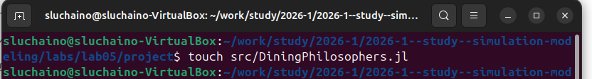{#fig-001 width=70%}

Код модуля содержит определение структуры `PetriNet` (позиции, переходы, матрица инцидентности), функции `build_classical_network` и `build_arbiter_network` для построения сетей, а также `simulate_ode` и `simulate_stochastic` для двух типов моделирования ([рис. @fig-002]).

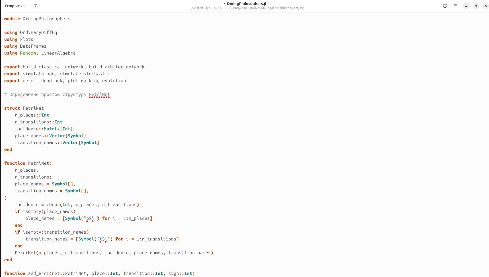{#fig-002 width=70%}

## Создание основного скрипта 

Создаю файл `scripts/dining_philosophers.jl` для запуска базовых экспериментов ([рис. @fig-003]).

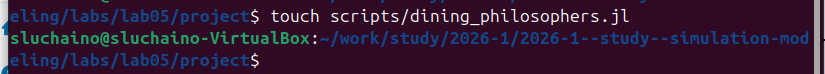{#fig-003 width=70%}

Ввожу код для классической сети и сети с арбитром ([рис. @fig-004]).

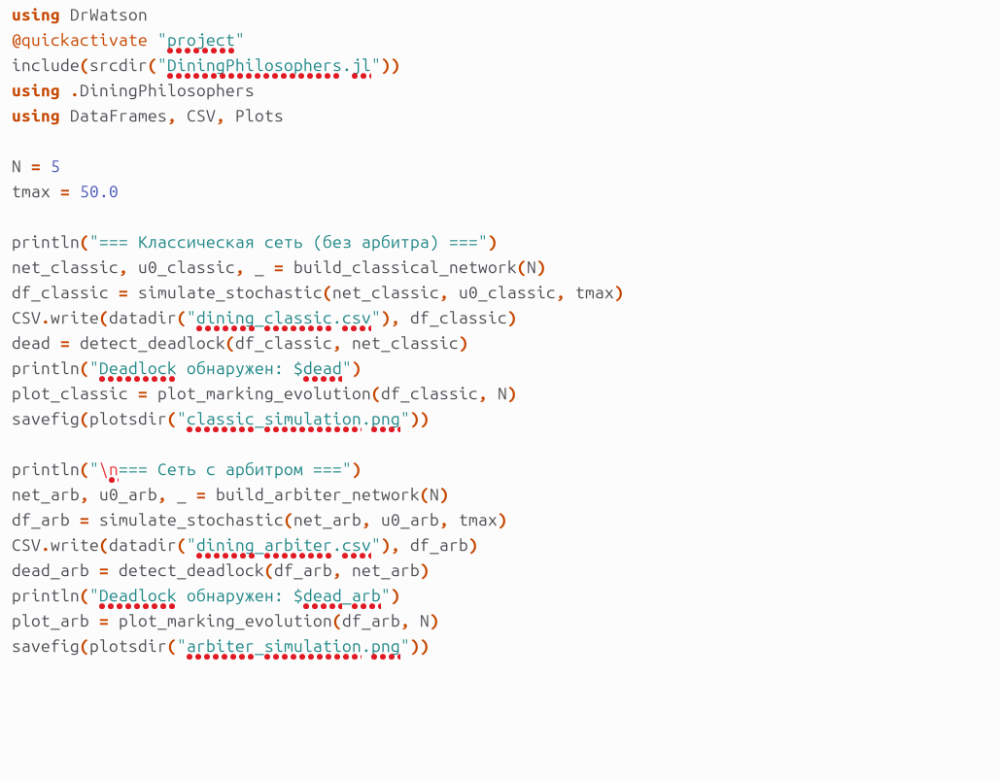{#fig-004 width=70%}

Устанавливаю необходимые пакеты: OrdinaryDiffEq для решения ОДУ ([рис. @fig-005]).

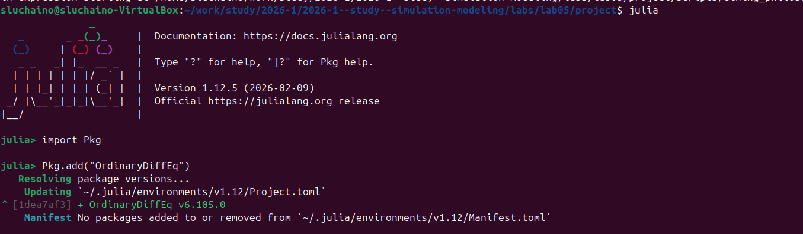{#fig-005 width=70%}

Запускаю основной скрипт `dining_philosophers.jl` ([рис. @fig-006]).

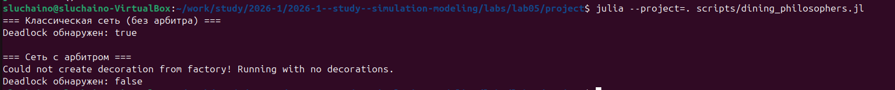{#fig-006 width=70%}

Графики эволюции маркировки для классической сети. На четырех панелях показаны состояния Think, Hungry, Eat и Fork для каждого философа ([рис. @fig-007]).

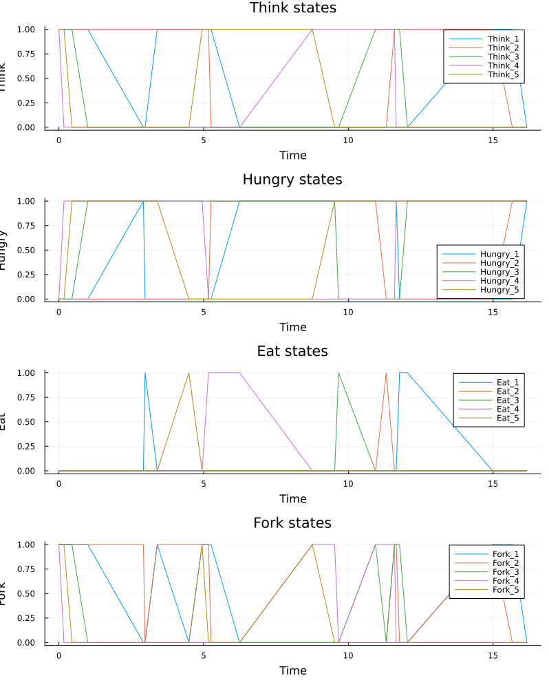{#fig-007 width=70%}

Графики эволюции маркировки для сети с арбитром. Видно, что система не встаёт в deadlock. А так же скачки стали более частыми  ([рис. @fig-008]).

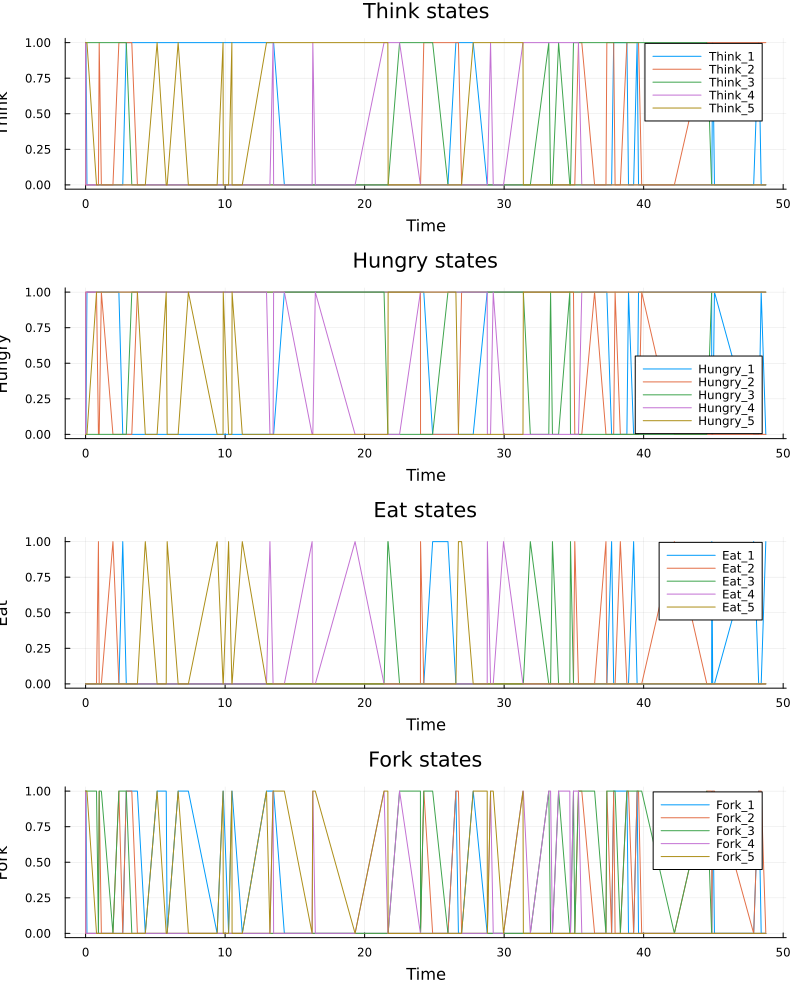{#fig-008 width=70%}

## Создание анимации

Создаю файл `scripts/dining_pholosophers_animation.jl` для анимации процесса  ([рис. @fig-009]).

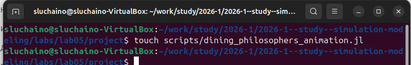{#fig-009 width=70%}

Ввожу код анимации с использованием макроса `@animate`([рис. @fig-010]).

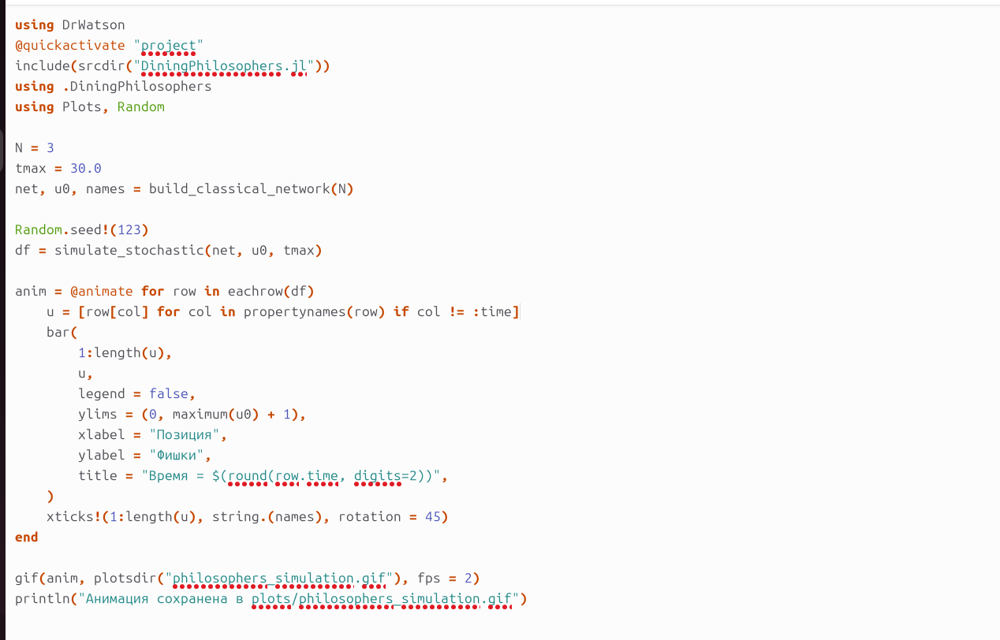{#fig-010 width=70%}

Запускаю скрипт анимации ([рис. @fig-011]).

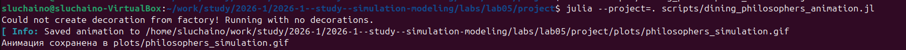{#fig-011 width=70%}

Анимация сохранена в файл `philosophers_simulation.gif` и наглядно показывает, как фишки перемещаются между позициями в процессе работы сети. ([рис. @fig-012]).

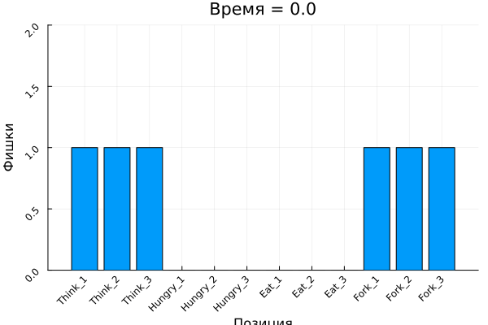{#fig-012 width=70%}

## Создание отчета с графиками

Создаю файл `scripts/dining_philosophers_report.jl` для построения сравнительного графика ([рис. @fig-013]).

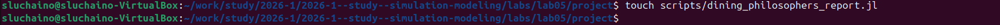{#fig-013 width=70%}

Ввожу код для загрузки CSV-файла и построения графиков "Ест" для обеих сетей ([рис. @fig-014]).

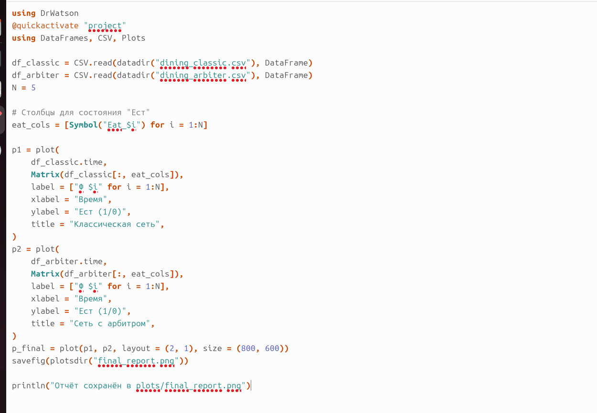{#fig-014 width=70%}

Запускаю скрипт отчёта ([рис. @fig-015]).

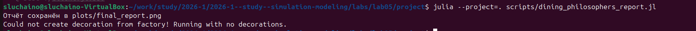{#fig-015 width=70%}

Сравнительный график сохранён в `final_report.png` ([рис. @fig-016]).

{#fig-016 width=70%}

## Литературное программирование

Все скрипты преобразованы в литературный стиль с подробными комментариями. Через `tangle.jl` из литературных скриптов сгенерированы чистый код, Jupyter Notebook и Quarto-документы.

# Код и анализ

## Код LITdining_philosophers.jl

```julia 

# # Simulation of the Dining Philosophers problem using Petri nets

# This script models the classic synchronization problem using Petri nets.
# Two models are compared: classical (leads to deadlock) and modified with an arbiter (prevents deadlock).

# ## Environment setup

using DrWatson
@quickactivate "project"

include(srcdir("DiningPhilosophers.jl"))
using .DiningPhilosophers

using DataFrames, CSV, Plots, Random

# ## Simulation parameters

N = 5
tmax = 50.0

# ## Classical network (without arbiter)

println("=== Classical network (without arbiter) ===")

net_classic, u0_classic, _ = build_classical_network(N)

Random.seed!(456)

df_classic = simulate_stochastic(net_classic, u0_classic, tmax)

CSV.write(datadir("dining_classic.csv"), df_classic)

dead = detect_deadlock(df_classic, net_classic)
println("Deadlock detected: $dead")

plot_classic = plot_marking_evolution(df_classic, N)
savefig(plotsdir("classic_simulation.png"))

# ## Network with arbiter

println("\n=== Network with arbiter ===")

net_arb, u0_arb, _ = build_arbiter_network(N)

df_arb = simulate_stochastic(net_arb, u0_arb, tmax)

CSV.write(datadir("dining_arbiter.csv"), df_arb)

dead_arb = detect_deadlock(df_arb, net_arb)
println("Deadlock detected: $dead_arb")

plot_arb = plot_marking_evolution(df_arb, N)
savefig(plotsdir("arbiter_simulation.png"))

```

## Код LITdining_philosophers_animation.jl

```julia 

# # Animation of Petri net for the Dining Philosophers problem

# This script creates an animation showing how the Petri net marking changes over time.
# The animation clearly demonstrates the occurrence of deadlock.

# ## Environment setup

using DrWatson
@quickactivate "project"

include(srcdir("DiningPhilosophers.jl"))
using .DiningPhilosophers

using Plots, Random

# ## Simulation parameters

N = 3
tmax = 30.0

net, u0, names = build_classical_network(N)

Random.seed!(123)

df = simulate_stochastic(net, u0, tmax)

# ## Creating animation

anim = @animate for row in eachrow(df)

    u = [row[col] for col in propertynames(row) if col != :time]

    bar(
        1:length(u),
        u,
        legend = false,
        ylims = (0, maximum(u0) + 1),
        xlabel = "Place",
        ylabel = "Tokens",
        title = "Time = $(round(row.time, digits=2))",
    )

    xticks!(1:length(u), string.(names), rotation = 45)
end

# ## Saving animation

gif(anim, plotsdir("philosophers_simulation.gif"), fps = 2)

println("Animation saved to plots/philosophers_simulation.gif")

```

## Код LITdining_philosophers_report.jl

```julia

# # Comparative analysis of classical network and network with arbiter

# This script loads results from two simulations (classical and arbiter)
# and builds a comparative plot of the "Eating" state for all five philosophers.
# The plot clearly shows the difference: classical network ends in deadlock,
# while the network with arbiter does not.

# ## Loading data

using DrWatson
@quickactivate "project"

using DataFrames, CSV, Plots

df_classic = CSV.read(datadir("dining_classic.csv"), DataFrame)
df_arbiter = CSV.read(datadir("dining_arbiter.csv"), DataFrame)

N = 5

eat_cols = [Symbol("Eat_$i") for i in 1:N]

# ## Plotting

p1 = plot(
    df_classic.time,
    Matrix(df_classic[:, eat_cols]),
    label = ["P$i" for i in 1:N],
    xlabel = "Time",
    ylabel = "Eating (1/0)",
    title = "Classical network",
)

p2 = plot(
    df_arbiter.time,
    Matrix(df_arbiter[:, eat_cols]),
    label = ["P$i" for i in 1:N],
    xlabel = "Time",
    ylabel = "Eating (1/0)",
    title = "Network with arbiter",
)

p_final = plot(p1, p2, layout = (2, 1), size = (800, 600))

savefig(plotsdir("final_report.png"))

println("Report saved to plots/final_report.png")

```


# Вывод

В ходе выполнения лабораторной работы был освоен аппарат сетей Петри на примере классической задачи «Обедающие философы». Построены две модели сети Петри: классическая (с deadlock) и модифицированная с арбитром (без deadlock). Проведены детерминированное и стохастическое имитационное моделирование. Построены графики эволюции маркировки и создана анимация работы сети. Выполнено преобразование кода в литературный стиль и генерация производных форматов. Полученные результаты наглядно демонстрируют проблему взаимной блокировки в параллельных системах и способы её предотвращения.

# Список литературы{.unnumbered}

::: {#refs}

[Лабораторная работа № 5](https://esystem.rudn.ru/mod/resource/view.php?id=1356135)

[Материалы курса «Имитационное моделирование»](https://esystem.rudn.ru/course/view.php?id=1234)

:::
