---
author:
  name: Черная София Витальевна
  degrees: DSc
  orcid: 0000-0002-0877-7063
  email: 1132236043@pfur.ru
  affiliation:
    - name: Российский университет дружбы народов
      country: Российская Федерация
      postal-code: 117198
      city: Москва
      address: ул. Миклухо-Маклая, д. 6
title: "Отчёт по лабораторной работе №6"
subtitle: "Реализация основных моделей в подходе сетей Петри. Модель SIR"
license: "CC BY"
---

# Цель работы

Освоение аппарата сетей Петри на примере эпидемиологической модели SIR (Susceptible–Infectious–Recovered) [@sir1927]. Изучение базовых элементов сетей Петри (позиции, переходы, фишки, дуги), правил срабатывания переходов и свойств систем [@petri1962]. Приобретение навыков детерминированного и стохастического имитационного моделирования с использованием языка Julia и пакетов AlgebraicPetri.jl, OrdinaryDiffEq.jl, Plots.jl. Проведение параметрического анализа (сканирование коэффициента заражения β) и визуализация результатов.

# Задание

1. Создать рабочий каталог для кода.
2. Установить необходимые пакеты.
3. Выполнить предложенный код модели сети Петри для задачи SIR.
4. Преобразовать код в литературный стиль.
5. Сгенерировать из литературного кода:
   - чистый код;
   - Jupyter Notebook;
   - документацию в формате Quarto.
6. Выполнить код из Jupyter Notebook.
7. Интегрировать документацию в формате Quarto в отчёт.
8. Добавить в код в литературном стиле вычисление для набора параметров.
9. Сгенерировать из литературного кода с параметрами:
   - чистый код;
   - Jupyter Notebook;
   - документацию в формате Quarto.
10. Выполнить код из Jupyter Notebook с параметрами.
11. Интегрировать документацию с параметрами в формате Quarto в отчёт.

# Теоретическое введение

## Сети Петри

Сети Петри — это математический аппарат для моделирования дискретных параллельных систем, предложенный Карлом Адамом Петри в 1962 году [@petri1962].

Сеть Петри состоит из четырёх базовых элементов [@lab6]:

- **Позиции** (кружки) — описывают состояния системы или наличие ресурсов.
- **Фишки** (точки внутри позиций) — количество ресурсов или кратность выполнения условия.
- **Переходы** (прямоугольники) — описывают события или действия.
- **Дуги** (стрелки) — соединяют позиции с переходами (и наоборот), показывают, сколько фишек забирается или добавляется.

Правило срабатывания: переход разрешён, если во всех его входных позициях есть хотя бы столько фишек, сколько требует кратность входной дуги. При срабатывании фишки забираются из входов и добавляются в выходы.

## Модель SIR

Модель SIR (Susceptible–Infectious–Recovered) — классическая эпидемиологическая модель, впервые предложенная Кермаком и Маккендриком в 1927 году [@sir1927]. Модель описывает переходы между тремя состояниями популяции:

- **S (Susceptible)** — восприимчивые особи, которые могут заразиться.
- **I (Infectious)** — инфицированные особи, которые заражают других и выздоравливают.
- **R (Recovered)** — выздоровевшие особи, получившие иммунитет и больше не участвующие в эпидемии.

Сеть Петри для модели SIR содержит два перехода [@lab6]:

- **infection** (скорость β) — переход восприимчивого в инфицированное состояние: S + I → I + I.
- **recovery** (скорость γ) — переход инфицированного в выздоровевшее состояние: I → R.

## Методы моделирования

- **Детерминированное моделирование** — система обыкновенных дифференциальных уравнений (ОДУ), описывающая изменение концентраций во времени. Решается численно методом Tsit5 [@ode].
- **Стохастическое моделирование** — алгоритм Гиллеспи (SSA) [@gillespie1977], который моделирует дискретные случайные события с экспоненциальными временами ожидания.

# Выполнение лабораторной работы

## Создание модуля сети Петри

Создаю файл `src/SIRPetri.jl` с определением структуры сети Петри, функций построения сети и симуляции ([рис. @fig-001]).

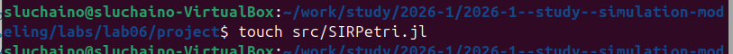{#fig-001 width=70%}

Код модуля содержит функцию `build_sir_network` для создания размеченной сети Петри, функции `simulate_deterministic` и `simulate_stochastic` для двух типов моделирования, а также функции визуализации `plot_sir` и `to_graphviz_sir` ([рис. @fig-002]).

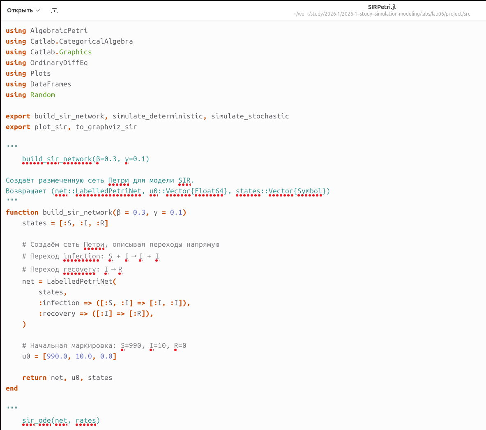{#fig-002 width=70%}

## Создание основного скрипта

Создаю файл `scripts/sirpetri_run.jl` для запуска базовых экспериментов ([рис. @fig-003]).

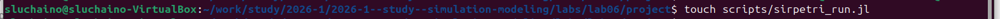{#fig-003 width=70%}

Ввожу код для детерминированной и стохастической симуляции ([рис. @fig-004]).

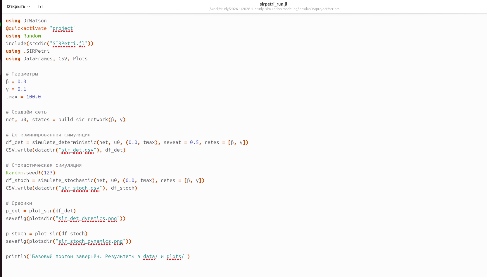{#fig-004 width=70%}

## Установка пакетов

Устанавливаю необходимые пакеты для работы. Сначала устанавливаю `AlgebraicPetri` ([рис. @fig-005]).

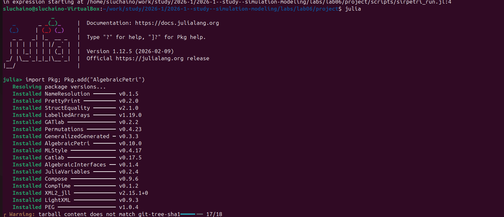{#fig-005 width=70%}

В процессе установки могут возникать предупреждения, связанные с предкомпиляцией зависимостей. Эти предупреждения не влияют на работоспособность устанавливаемых пакетов ([рис. @fig-006]).

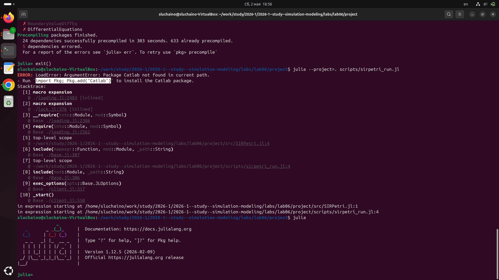{#fig-006 width=70%}

Устанавливаю пакет `Catlab` ([рис. @fig-007]).

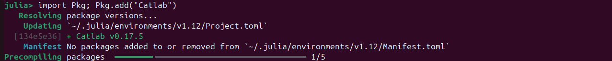{#fig-007 width=70%}

## Запуск базовой симуляции

Запускаю основной скрипт `sirpetri_run.jl` ([рис. @fig-008]).

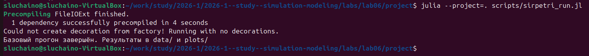{#fig-008 width=70%}

## Результаты симуляции

График детерминированной динамики SIR ([рис. @fig-009]) показывает классическое поведение эпидемии [@sir1927]:
- Восприимчивые (S) монотонно убывают.
- Инфицированные (I) проходят через пик и затем спадают до нуля.
- Выздоровевшие (R) растут и выходят на плато.

{#fig-009 width=70%}

Визуализация детерминированной динамики ([рис. @fig-010]) демонстрирует плавные кривые изменения численности популяции.

{#fig-010 width=70%}

## Создание скрипта сканирования параметров

Создаю файл `scripts/sirpetri_scan_parameters.jl` ([рис. @fig-011]).

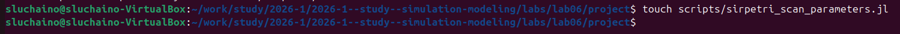{#fig-011 width=70%}

Ввожу код для сканирования параметра β (коэффициента заражения) в диапазоне 0.1:0.05:0.8 ([рис. @fig-012]).

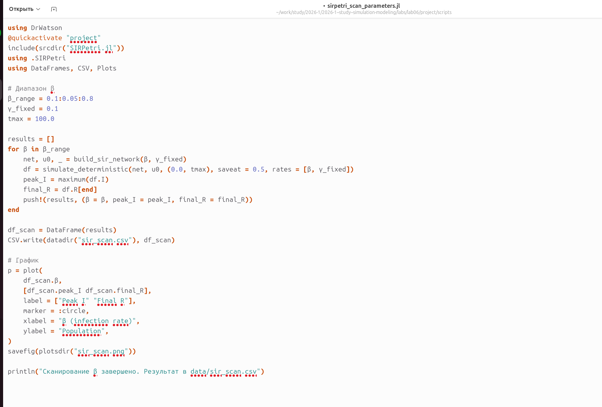{#fig-012 width=70%}

Запускаю скрипт сканирования параметров ([рис. @fig-013]).

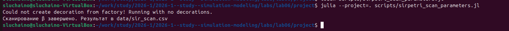{#fig-013 width=70%}

Результаты сканирования β ([рис. @fig-014]) показывают зависимость пика заболеваемости и конечного числа выздоровевших от β.

{#fig-014 width=70%}

## Создание скрипта анимации

Создаю файл `scripts/sirpetri_animate.jl` ([рис. @fig-015]).

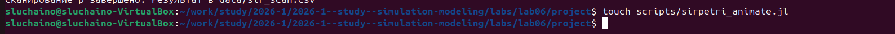{#fig-015 width=70%}

Ввожу код для создания анимации ([рис. @fig-016]).

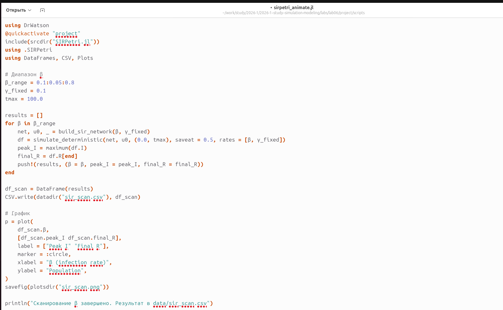{#fig-016 width=70%}

Запускаю скрипт анимации ([рис. @fig-017]).

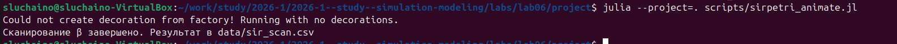{#fig-017 width=70%}

## Результаты сканирования

График зависимости пика I и конечного R от β ([рис. @fig-018]) демонстрирует пороговое явление, характерное для модели SIR [@sir1927].

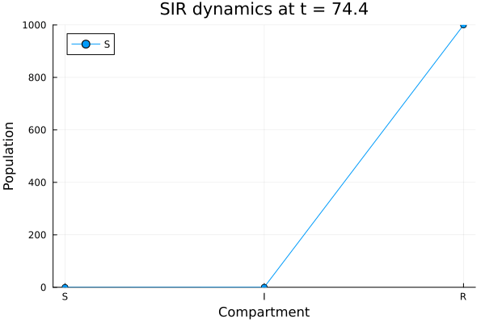{#fig-018 width=70%}

## Создание итогового отчёта

Создаю файл `scripts/sirpetri_report.jl` ([рис. @fig-019]).

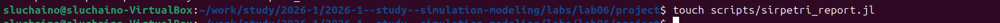{#fig-019 width=70%}

Ввожу код для построения сравнительных графиков ([рис. @fig-020]).

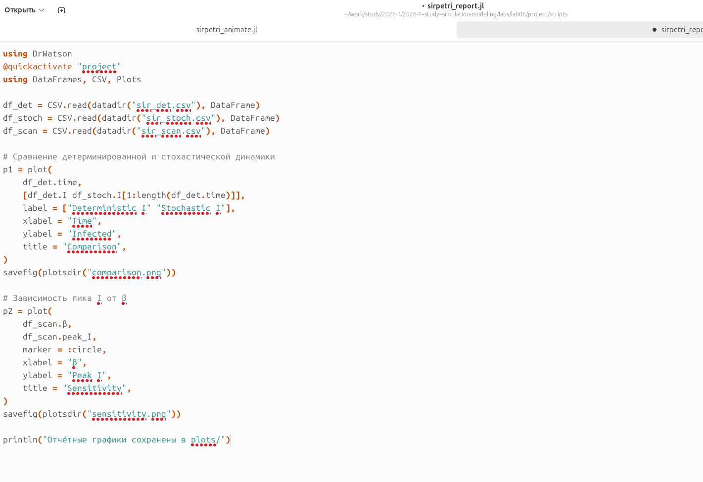{#fig-020 width=70%}

Запускаю скрипт итогового отчёта ([рис. @fig-021]).

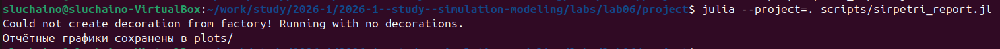{#fig-021 width=70%}

## Итоговые графики

Сравнение детерминированной и стохастической динамики инфицированных ([рис. @fig-comparison]) показывает, что при большом начальном числе восприимчивых (990) стохастическая траектория близка к детерминированной [@gillespie1977].

{#fig-comparison width=70%}

Зависимость пика заболеваемости I от коэффициента заражения β ([рис. @fig-sensitivity]) демонстрирует, что при малых β эпидемия не возникает, а с ростом β пик заболеваемости резко увеличивается, после чего достигает насыщения [@sir1927].

{#fig-sensitivity width=70%}

# Код и анализ

## Код sirpetri_run.jl

```julia

module SIRPetri

using AlgebraicPetri
using Catlab.CategoricalAlgebra
using Catlab.Graphics
using OrdinaryDiffEq
using Plots
using DataFrames
using Random

export build_sir_network, simulate_deterministic, simulate_stochastic
export plot_sir, to_graphviz_sir

"""
    build_sir_network(β=0.3, γ=0.1)

Create a labelled Petri net for the SIR model.
Returns (net::LabelledPetriNet, u0::Vector{Float64}, states::Vector{Symbol})
"""
function build_sir_network(β = 0.3, γ = 0.1)
    states = [:S, :I, :R]
    
    # Create Petri net with two transitions:
    # infection: S + I → I + I
    # recovery: I → R
    net = LabelledPetriNet(
        states,
        :infection => ([:S, :I] => [:I, :I]),
        :recovery => ([:I] => [:R]),
    )
    
    # Initial marking: S=990, I=10, R=0
    u0 = [990.0, 10.0, 0.0]
    
    return net, u0, states
end

"""
    sir_ode(net, rates)

Return the ODE right-hand side function for the Petri net.
Used for deterministic simulation.
"""
function sir_ode(net, rates = [0.3, 0.1])
    function f!(du, u, p, t)
        S, I, R = u
        β, γ = rates
        # Propensity functions (mass action law)
        infection_rate = β * S * I
        recovery_rate = γ * I
        # Changes
        du[1] = -infection_rate               # dS/dt
        du[2] = infection_rate - recovery_rate # dI/dt
        du[3] = recovery_rate                 # dR/dt
    end
    return f!
end

"""
    simulate_deterministic(net, u0, tspan; saveat=0.1, rates=[0.3,0.1])

Perform deterministic ODE simulation.
Returns DataFrame with columns time, S, I, R.
"""
function simulate_deterministic(net, u0, tspan; saveat = 0.1, rates = [0.3, 0.1])
    f = sir_ode(net, rates)
    prob = ODEProblem(f, u0, tspan)
    sol = solve(prob, Tsit5(), saveat = saveat)
    df = DataFrame(time = sol.t)
    df.S = sol[1, :]
    df.I = sol[2, :]
    df.R = sol[3, :]
    return df
end

"""
    simulate_stochastic(net, u0, tspan; rates=[0.3,0.1], rng=Random.GLOBAL_RNG)

Stochastic simulation using Gillespie algorithm (direct method).
Returns DataFrame.
"""
function simulate_stochastic(net, u0, tspan; rates = [0.3, 0.1], rng = Random.GLOBAL_RNG)
    u = copy(u0)
    t = 0.0
    times = [t]
    states = [copy(u)]
    β, γ = rates
    while t < tspan[2]
        S, I, R = u
        a_inf = β * S * I
        a_rec = γ * I
        a0 = a_inf + a_rec
        if a0 == 0
            break
        end
        dt = -log(rand(rng)) / a0
        r = rand(rng) * a0
        if r < a_inf
            # Infection event
            u[1] -= 1
            u[2] += 1
        else
            # Recovery event
            u[2] -= 1
            u[3] += 1
        end
        t += dt
        if t <= tspan[2]
            push!(times, t)
            push!(states, copy(u))
        end
    end
    df = DataFrame(time = times)
    df.S = [s[1] for s in states]
    df.I = [s[2] for s in states]
    df.R = [s[3] for s in states]
    return df
end

"""
    plot_sir(df)

Plot S, I, R dynamics from DataFrame.
"""
function plot_sir(df)
    p = plot(
        df.time,
        [df.S, df.I, df.R],
        label = ["S (Susceptible)" "I (Infected)" "R (Recovered)"],
        xlabel = "Time",
        ylabel = "Population",
        linewidth = 2,
    )
    return p
end

"""
    to_graphviz_sir(net)

Visualize Petri net using Graphviz.
"""
function to_graphviz_sir(net)
    return to_graphviz(net, prog = "dot")
end

end # module

```

## Код sirpetri_run.jl

```julia
# # Base simulation of SIR model

# This script performs deterministic and stochastic simulation
# of the SIR epidemic model with fixed parameters.

# ## Environment setup

using DrWatson
@quickactivate "project"
using Random
include(srcdir("SIRPetri.jl"))
using .SIRPetri
using DataFrames, CSV, Plots

# ## Simulation parameters

β = 0.3      # infection rate
γ = 0.1      # recovery rate
tmax = 100.0 # maximum simulation time

# ## Create Petri net

net, u0, states = build_sir_network(β, γ)

# ## Deterministic simulation

df_det = simulate_deterministic(net, u0, (0.0, tmax), saveat = 0.5, rates = [β, γ])
CSV.write(datadir("sir_det.csv"), df_det)

# ## Stochastic simulation

Random.seed!(123)  # for reproducibility
df_stoch = simulate_stochastic(net, u0, (0.0, tmax), rates = [β, γ])
CSV.write(datadir("sir_stoch.csv"), df_stoch)

# ## Plotting

p_det = plot_sir(df_det)
savefig(plotsdir("sir_det_dynamics.png"))

p_stoch = plot_sir(df_stoch)
savefig(plotsdir("sir_stoch_dynamics.png"))

println("Base simulation completed. Results saved to data/ and plots/")

```

## Код sirpetri_scan_parameters.jl

```julia
# # Scanning β parameter

# This script explores model sensitivity to the infection rate β.

# ## Environment setup

using DrWatson
@quickactivate "project"
include(srcdir("SIRPetri.jl"))
using .SIRPetri
using DataFrames, CSV, Plots

# ## Scanning parameters

β_range = 0.1:0.05:0.8  # range of β values
γ_fixed = 0.1           # fixed γ
tmax = 100.0            # simulation time

# ## Perform scanning

results = []
for β in β_range
    net, u0, _ = build_sir_network(β, γ_fixed)
    df = simulate_deterministic(net, u0, (0.0, tmax), saveat = 0.5, rates = [β, γ_fixed])
    peak_I = maximum(df.I)   # epidemic peak
    final_R = df.R[end]      # final recovered count
    push!(results, (β = β, peak_I = peak_I, final_R = final_R))
end

# ## Save results

df_scan = DataFrame(results)
CSV.write(datadir("sir_scan.csv"), df_scan)

# ## Plot

p = plot(
    df_scan.β,
    [df_scan.peak_I df_scan.final_R],
    label = ["Peak I" "Final R"],
    marker = :circle,
    xlabel = "β (infection rate)",
    ylabel = "Population",
)
savefig(plotsdir("sir_scan.png"))

println("β scanning completed. Results saved to data/sir_scan.csv")

```

## Код sirpetri_animate.jl

```julia

# # Animation of deterministic SIR dynamics

# This script creates a GIF animation showing population changes over time.

# ## Environment setup

using DrWatson
@quickactivate "project"
include(srcdir("SIRPetri.jl"))
using .SIRPetri
using Plots

# ## Simulation parameters

β = 0.3
γ = 0.1
tmax = 100.0

# ## Run simulation

net, u0, states = build_sir_network(β, γ)
df = simulate_deterministic(net, u0, (0.0, tmax), saveat = 0.2, rates = [β, γ])

# ## Create animation

anim = @animate for row in eachrow(df)
    bar(
        ["S", "I", "R"],
        [row.S, row.I, row.R],
        ylims = (0, 1000),
        xlabel = "State",
        ylabel = "Population",
        title = "Time = $(round(row.time, digits=1))",
        legend = false,
    )
end

# ## Save animation

gif(anim, plotsdir("sir_animation.gif"), fps = 10)
println("Animation saved to plots/sir_animation.gif")

```

## Код sirpetri_report.jl

```julia

# # Final report for SIR model

# This script loads results from previous experiments
# and builds comparative plots for the report.

# ## Load data

using DrWatson
@quickactivate "project"
using DataFrames, CSV, Plots

df_det = CSV.read(datadir("sir_det.csv"), DataFrame)
df_stoch = CSV.read(datadir("sir_stoch.csv"), DataFrame)
df_scan = CSV.read(datadir("sir_scan.csv"), DataFrame)

# ## Comparison of deterministic and stochastic dynamics

p1 = plot(
    df_det.time,
    [df_det.I df_stoch.I[1:length(df_det.time)]],
    label = ["Deterministic I" "Stochastic I"],
    xlabel = "Time",
    ylabel = "Infected",
    title = "Comparison",
    linewidth = 2,
)
savefig(plotsdir("comparison.png"))

# ## Peak I vs β sensitivity

p2 = plot(
    df_scan.β,
    df_scan.peak_I,
    marker = :circle,
    xlabel = "β",
    ylabel = "Peak I",
    title = "Sensitivity",
    linewidth = 2,
)
savefig(plotsdir("sensitivity.png"))

println("Report plots saved to plots/")

```


# Вывод

В ходе выполнения лабораторной работы был освоен аппарат сетей Петри на примере эпидемиологической модели SIR. Построена сеть Петри, содержащая два перехода (`infection` и `recovery`). Проведены детерминированное (решение ОДУ) и стохастическое (алгоритм Гиллеспи) имитационное моделирование [@gillespie1977]. Выполнен параметрический анализ влияния коэффициента заражения β на динамику эпидемии, построены графики зависимости пика заболеваемости от β. Создана анимация, наглядно демонстрирующая распространение инфекции во времени. Выполнено преобразование кода в литературный стиль и генерация производных форматов.

Полученные результаты наглядно демонстрируют:

1. **Пороговое явление в модели SIR** — существует критическое значение β, выше которого возникает вспышка эпидемии [@sir1927].
2. **Близость стохастической и детерминированной траекторий** — при большом размере популяции стохастическая траектория близка к детерминированной.
3. **Насыщение пика заболеваемости** — с ростом β пик заболеваемости увеличивается и стремится к насыщению (почти всё население переболевает).

# Список литературы{.unnumbered}

::: {#refs}
:::
