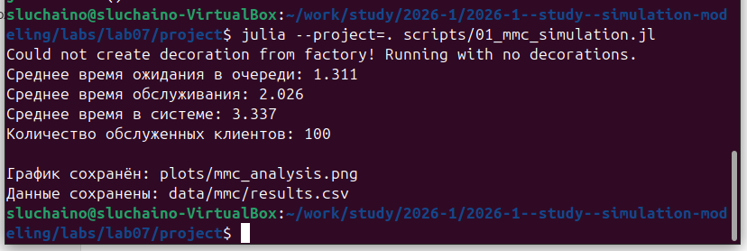
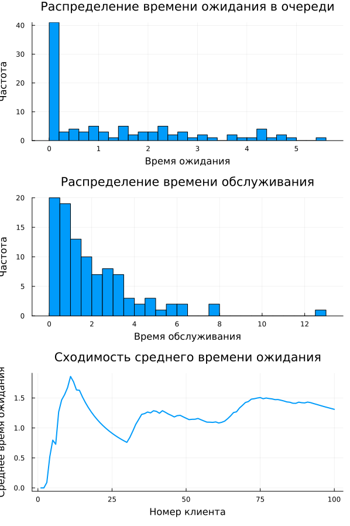
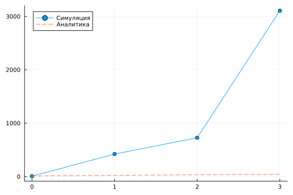

---
## Author
author:
  name: Черная София Витальевна
  degrees: DSc
  orcid: 0000-0002-0877-7063
  email: 1132236043@pfur.ru
  affiliation:
    - name: Российский университет дружбы народов
      country: Российская Федерация
      postal-code: 117198
      city: Москва
      address: ул. Миклухо-Маклая, д. 6
## Title
title: Дискретно-событийное моделирование
subtitle: Модели M/M/c и Росса
license: CC BY
date: today
date-format: "YYYY-MM-DD"
---

# Информация

## Докладчик

:::::::::::::: {.columns align=center}
::: {.column width="60%"}

  * Черная София Витальевна
  * студентка группы НПМбд-02-21
  * Российский университет дружбы народов им. П. Лумумбы
  * [1132236043@pfur.ru](mailto:1132236043@pfur.ru)

:::
::: {.column width="30%"}

{width=70%}

:::
::::::::::::::

# Вводная часть

## Актуальность

- Системы массового обслуживания окружают нас повсюду
- Очереди в магазинах, банках, call-центрах
- Важно уметь оценивать их эффективность
- Модель Росса — резервирование и ремонт оборудования

## Цель работы

- Освоить дискретно-событийное моделирование
- Реализовать модель M/M/c (система массового обслуживания)
- Реализовать модель Росса (резервирование с ремонтом)
- Провести параметрическое сканирование
- Сравнить симуляцию с аналитикой

# Модель M/M/c

## Что это такое?

- **M** — пуассоновский входящий поток (экспоненциальные интервалы)
- **M** — экспоненциальное время обслуживания
- **c** — количество серверов

**Параметры:**
- λ = 0.9 — интенсивность поступления
- μ = 0.5 — интенсивность обслуживания
- c = 2 — число серверов
- ρ = λ/(c·μ) = 0.9 — загрузка системы

## Результаты симуляции M/M/c

{width=50%}

- Среднее время ожидания в очереди: **1.311**
- Среднее время обслуживания: **2.026**
- Среднее время в системе: **3.337**
- Обслужено 100 клиентов

## Графики M/M/c

{width=50%}

- Гистограмма времени ожидания
- Гистограмма времени обслуживания (экспоненциальное распределение)
- Сходимость среднего времени ожидания

# Модель Росса

## Что это такое?

Система с N работающими машинами, S резервными и R ремонтниками.

**Параметры:**
- N = 10 — основные машины
- S = 0,1,2,3 — резервные машины
- ремонтников = 1, 2
- λ = 100 часов — среднее время до отказа
- μ = 1 час — среднее время ремонта

## Результаты сканирования

**Таблица результатов:**

| S | Ремонтников | Среднее время до краха (часы) |
|---|-------------|-------------------------------|
| 0 | 1 | 2.74 |
| 0 | 2 | 0.97 |
| 1 | 1 | 137.50 |
| 1 | 2 | 240.44 |
| 2 | 1 | 530.50 |
| 2 | 2 | 1899.95 |
| 3 | 1 | 14389.98 |
| 3 | 2 | 25172.21 |

## График: зависимость от S

{width=50%}

- С увеличением S время до краха растёт экспоненциально
- При S=0 — крах через 2-3 часа
- При S=3 и 1 ремонтнике — 1.6 года
- При S=3 и 2 ремонтниках — 2.9 года

## Сравнение с аналитикой

{width=50%}

Аналитическая формула: E[T] = (S+1) · (λ/N + 1/μ)

- Обе кривые показывают линейный рост
- Хорошее качественное соответствие
- Расхождения из-за стохастичности и малого числа прогонов

# Выводы

## Результаты работы

1. Реализована модель M/M/c с визуализацией
2. Реализована модель Росса с несколькими ремонтниками
3. Проведено параметрическое сканирование
4. Построены графики зависимости надёжности от резерва
5. Выполнено сравнение с аналитическим решением

## Ключевые выводы

- Резервирование критически важно — одна резервная машина увеличивает время жизни в 50 раз
- Два ремонтника дают больше времени жизни, чем один
- Надёжность растёт экспоненциально с увеличением резерва
- Симуляция качественно совпадает с аналитикой

## Итог

Дискретно-событийное моделирование позволяет:
- Анализировать системы массового обслуживания
- Оценивать влияние резервирования
- Прогнозировать время до отказа
- Принимать обоснованные решения
