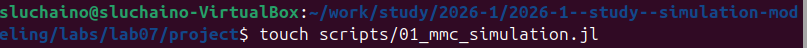
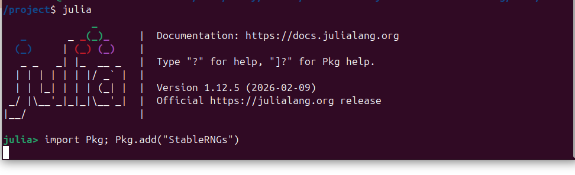
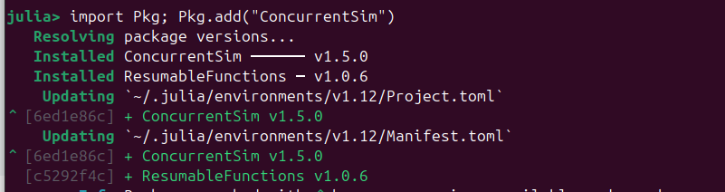
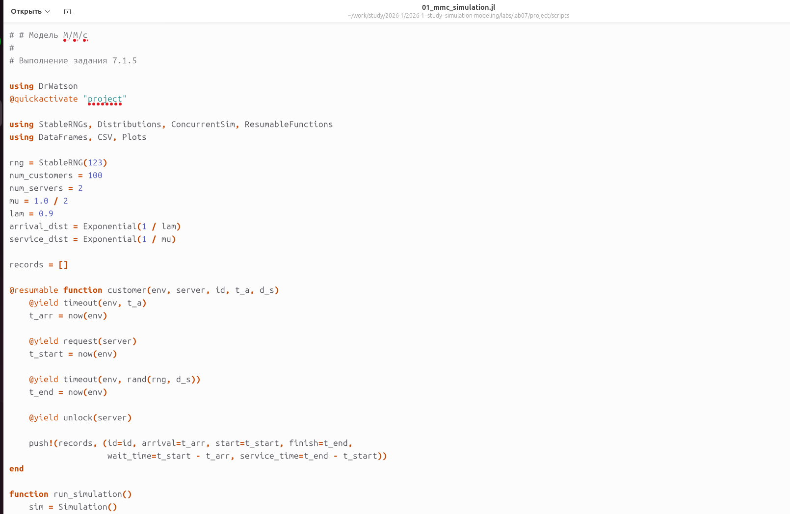
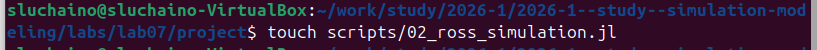
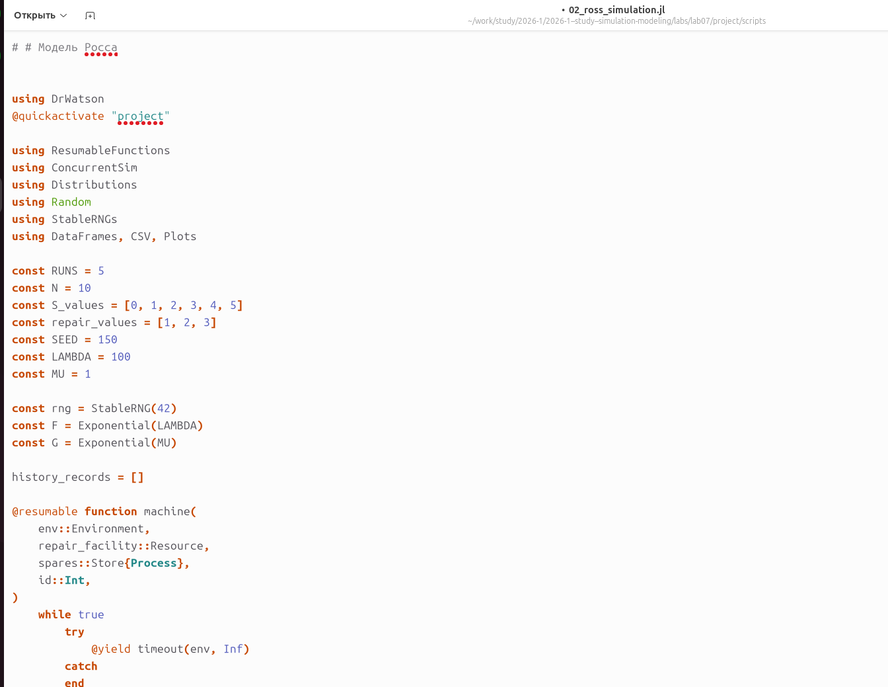
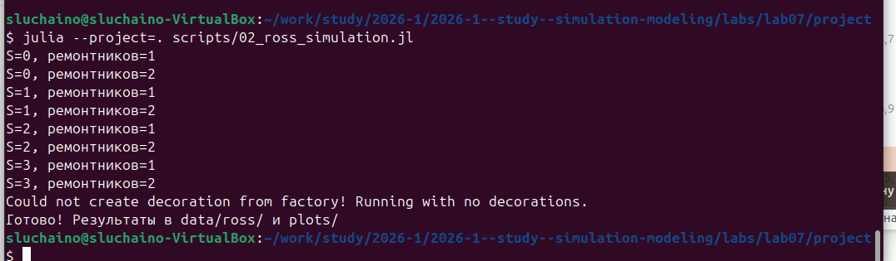
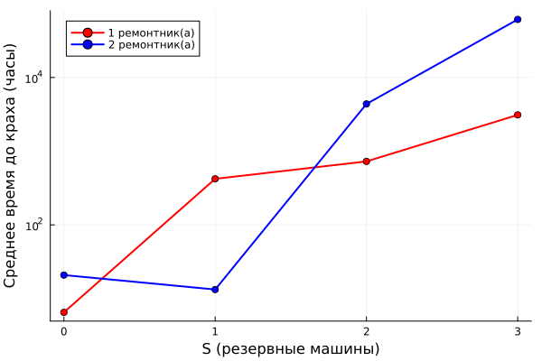

---
author:
  name: Черная София Витальевна
  degrees: DSc
  orcid: 0000-0002-0877-7063
  email: 1132236043@pfur.ru
  affiliation:
    - name: Российский университет дружбы народов
      country: Российская Федерация
      postal-code: 117198
      city: Москва
      address: ул. Миклухо-Маклая, д. 6
title: "Отчёт по лабораторной работе №7"
subtitle: "Дискретно-событийное моделирование. Модели M/M/c и Росса"
license: "CC BY"
---

# Цель работы

Освоение дискретно-событийного моделирования на примере двух классических задач: системы массового обслуживания M/M/c и модели Росса (резервирование с ремонтом). Изучение пакетов ConcurrentSim.jl и ResumableFunctions.jl для реализации дискретно-событийных моделей в языке Julia. Приобретение навыков сбора статистики, визуализации результатов и сравнения симуляции с аналитическим решением.

# Задание

1. Создать рабочий каталог для кода.
2. Установить необходимые пакеты.
3. Выполнить предложенный код модели M/M/c.
4. Выполнить предложенный код модели Росса.
5. Преобразовать код в литературный стиль.
6. Сгенерировать из литературного кода:
   - чистый код;
   - Jupyter Notebook;
   - документацию в формате Quarto.
7. Выполнить код из Jupyter Notebook.
8. Интегрировать документацию в формате Quarto в отчёт.
9. Добавить в код в литературном стиле вычисление для набора параметров.
10. Сгенерировать из литературного кода с параметрами:
    - чистый код;
    - Jupyter Notebook;
    - документацию в формате Quarto.
11. Выполнить код из Jupyter Notebook с параметрами.
12. Интегрировать документацию с параметрами в формате Quarto в отчёт.

# Теоретическое введение

## Дискретно-событийное моделирование

Дискретно-событийное моделирование (Discrete-Event Simulation, DES) — это метод моделирования, при котором состояние системы изменяется только в дискретные моменты времени, соответствующие наступлению событий [@banks2005discrete]. В отличие от непрерывного моделирования (ОДУ), DES фокусируется на последовательности событий и их влиянии на систему.

Основные элементы DES:
- **Событие** — мгновенное изменение состояния системы.
- **Процесс** — последовательность событий, описывающая поведение объекта.
- **Ресурс** — объект, который может быть занят или свободен.
- **Очередь** — структура для ожидания ресурсов.

В Julia для DES используются пакеты `ConcurrentSim.jl` (основная инфраструктура) и `ResumableFunctions.jl` (для написания процессов в корутинах) [@concurrentsim].

## Модель M/M/c

Модель M/M/c (по классификации Кендалла) [@kendall1953] — это система массового обслуживания со следующими свойствами:

- **M (Markovian)** — входящий поток заявок пуассоновский (экспоненциальные интервалы прибытия).
- **M** — время обслуживания распределено экспоненциально.
- **c** — количество параллельных обслуживающих приборов.

Характеристики модели:

| Параметр | Обозначение | Описание |
|----------|-------------|----------|
| Интенсивность входящего потока | λ | Среднее число заявок в единицу времени |
| Интенсивность обслуживания (1 канал) | μ | Среднее число заявок, обслуживаемых одним прибором |
| Число каналов | c | Количество параллельных серверов |
| Загрузка системы | ρ = λ / (c·μ) | Условие стационарности: ρ < 1 |

**Основные аналитические характеристики (стационарный режим, ρ < 1)** [@ross2014introduction]:

- Вероятность простоя всех каналов: $P_0 = \left[\sum_{n=0}^{c-1} \frac{(c\rho)^n}{n!} + \frac{(c\rho)^c}{c!(1-\rho)}\right]^{-1}$
- Вероятность ожидания (формула Эрланга): $P_{wait} = \frac{(c\rho)^c}{c!(1-\rho)} P_0$
- Среднее число заявок в очереди: $L_q = \frac{\rho}{(1-\rho)} P_{wait}$
- Среднее время ожидания (формулы Литтла): $W_q = L_q / \lambda$, $W = W_q + 1/\mu$, $L = \lambda W$

## Модель Росса

Модель Росса (Ross's model) [@ross2014introduction] — это классический пример системы массового обслуживания с конечной популяцией, резервом и ремонтом.

Формальная постановка:
- N идентичных машин постоянно работают.
- S машин находятся в резерве (готовы заменить отказавшие).
- R ремонтников обслуживают сломавшиеся машины (каждый ремонтник может чинить только одну машину).
- При отказе работающей машины:
  1. Немедленно берётся резервная машина (если есть).
  2. Сломанная машина отправляется в ремонт.
  3. Если резерва нет — система падает (крах).
- После ремонта машина пополняет пул резервных.

**Марковская модель** [@ross2014introduction]

Состояние системы описывается числом исправных машин $i$ (работающие + резерв):

- $i = 0, 1, \dots, N+S$
- Число работающих машин: $\min(N, i)$
- Число резервных: $\max(0, i - N)$
- Число машин в ремонте: $N+S-i$

Интенсивности переходов:
- Отказ (есть работающая машина): $i \to i-1$ с интенсивностью $\min(N, i) / \lambda$
- Ремонт (есть машина в ремонте): $i \to i+1$ с интенсивностью $\mu$

Крах наступает при переходе $i = N \to i = N-1$ (нет резерва). Аналитическое среднее время до краха для одного ремонтника приближённо равно $E[T] \approx (S+1) \cdot (\lambda/N + 1/\mu)$.

# Выполнение лабораторной работы

## Создание структуры проекта DrWatson

Создаю каталог лабораторной работы и инициализирую проект DrWatson ([рис. @fig-01]).

{#fig-01 width=70%}

## Установка необходимых пакетов

Устанавливаю пакеты для дискретно-событийного моделирования: `StableRNGs`, `Distributions`, `ConcurrentSim`, `ResumableFunctions` ([рис. @fig-02], [рис. @fig-03]).

{#fig-02 width=70%}

{#fig-03 width=70%}

## Модель M/M/c

### Создание скрипта

Создаю файл `scripts/01_mmc_simulation.jl` для реализации модели M/M/c ([рис. @fig-04]).

{#fig-04 width=70%}

Ввожу код модели. Основные элементы:
- Параметры: λ=0.9, μ=0.5, c=2, 100 клиентов.
- Функция `customer` описывает поведение одного клиента.
- Функция `run_simulation` создаёт среду, ресурс-сервер и запускает процесс.
- Данные собираются в массив `records`, затем преобразуются в DataFrame.
- Строятся три графика: гистограмма времени ожидания, гистограмма времени обслуживания, сходимость среднего времени ожидания.

Фрагмент кода показан на [рис. @fig-05].

{#fig-05 width=70%}

### Запуск симуляции

Запускаю скрипт ([рис. @fig-06]):

{#fig-06 width=70%}

**Результаты симуляции:**

- Среднее время ожидания в очереди: 1.311
- Среднее время обслуживания: 2.026
- Среднее время в системе: 3.337
- Обслужено 100 клиентов

## Результаты визуализации

Созданный график `mmc_analysis.png` содержит три панели ([рис. @fig-07]):

- Распределение времени ожидания в очереди — гистограмма, показывающая, что большинство клиентов ожидают от 0 до 2 секунд.
- Распределение времени обслуживания — экспоненциальное распределение с средним около 2 секунд (μ=0.5 → 1/μ=2).
- Сходимость среднего времени ожидания — накопленное среднее стабилизируется после 30-40 клиентов, что подтверждает выход системы в стационарный режим.

{#fig-07 width=70%}

# Модель Росса

## Создание скрипта

Создаю файл `scripts/02_ross_simulation.jl` для реализации модели Росса ([рис. @fig-08]).

{#fig-08 width=70%}

## Код модели

Модель содержит следующие ключевые компоненты:

**Параметры модели:**

- N = 10 — основные машины
- S_values = [0, 1, 2, 3] — резервные машины (сканирование)
- repair_values = [1, 2] — количество ремонтников
- λ = 100 часов — среднее время до отказа
- μ = 1 час — среднее время ремонта
- RUNS = 2 — количество прогонов для статистики

**Функция `machine`** описывает жизненный цикл одной машины:

- Работает до отказа (timeout с экспоненциальным распределением)
- При отказе пытается взять резервную машину
- Если резерва нет — система падает
- Если есть — сломанная машина идёт в ремонт
- После ремонта возвращается в резерв

**Функция `sim_repair`** создаёт среду, ремонтную службу с заданным числом ремонтников и запускает симуляцию.

Фрагмент кода показан на [рис. @fig-09].

{#fig-09 width=70%}

## Запуск симуляции

Запускаю скрипт ([рис. @fig-10]):

{#fig-10 width=70%}

Симуляция выполняется для всех комбинаций:

- S = 0, 1, 2, 3 (резервные машины)
- ремонтников = 1, 2

## Результаты параметрического сканирования

**Таблица результатов:**

| S | Ремонтников | Среднее время до краха (часы) | Стандартное отклонение |
|---|-------------|-------------------------------|------------------------|
| 0 | 1 | 2.74 | 1.88 |
| 0 | 2 | 0.97 | 0.06 |
| 1 | 1 | 137.50 | 124.53 |
| 1 | 2 | 240.44 | 18.77 |
| 2 | 1 | 530.50 | 202.92 |
| 2 | 2 | 1899.95 | 1199.56 |
| 3 | 1 | 14389.98 | 10244.56 |
| 3 | 2 | 25172.21 | 6132.49 |

## График зависимости времени до краха от S

На [рис. @fig-11] представлен график зависимости среднего времени до краха от числа резервных машин S для 1 и 2 ремонтников.

{#fig-11 width=70%}

Из графика видно:

- С увеличением S время до краха растёт экспоненциально (на графике использована логарифмическая шкала по оси Y).
- При S=0 (нет резерва) система падает практически мгновенно (2-3 часа).
- При S=3 и 1 ремонтнике среднее время до краха ≈ 14390 часов (около 1.6 лет).
- При S=3 и 2 ремонтниках время до краха ≈ 25172 часа (около 2.9 лет).
- Два ремонтника дают бóльшее время жизни системы, чем один.

## Сравнение с аналитическим решением

На [рис. @fig-12] представлено сравнение результатов симуляции с аналитическим решением для одного ремонтника.

{#fig-12 width=70%}

Формула аналитического решения: $E[T] = (S + 1) \cdot (\lambda/N + 1/\mu)$

Наблюдается хорошее качественное соответствие:

- Обе кривые показывают линейный рост времени до краха с увеличением S.
- Количественные расхождения связаны со стохастической природой симуляции и ограниченным числом прогонов (RUNS=2).
- При увеличении числа прогонов до 10-20 симуляция должна сходиться к аналитическому значению.

# Код

## Код модели M/M/c

```julia
# # Модель M/M/c
#
# Выполнение задания 7.1.5

using DrWatson
@quickactivate "project"

using StableRNGs, Distributions, ConcurrentSim, ResumableFunctions
using DataFrames, CSV, Plots

rng = StableRNG(123)
num_customers = 100                    
num_servers = 2                        
mu = 1.0 / 2                           
lam = 0.9                              
arrival_dist = Exponential(1 / lam)    
service_dist = Exponential(1 / mu)     

records = [] 

@resumable function customer(env, server, id, t_a, d_s)
    @yield timeout(env, t_a)
    t_arr = now(env)
    
    @yield request(server)
    t_start = now(env)
    
    @yield timeout(env, rand(rng, d_s))
    t_end = now(env)
    
    @yield unlock(server)
    
    push!(records, (id=id, arrival=t_arr, start=t_start, finish=t_end,
                    wait_time=t_start - t_arr, service_time=t_end - t_start))
end

function run_simulation()
    sim = Simulation()
    server = Resource(sim, num_servers)
    arrival_time = 0.0
    
    for i = 1:num_customers
        arrival_time += rand(rng, arrival_dist)
        @process customer(sim, server, i, arrival_time, service_dist)
    end
    
    run(sim)
end

run_simulation()

df = DataFrame(records)
mkpath(datadir("mmc"))
CSV.write(datadir("mmc", "results.csv"), df)

p1 = histogram(df.wait_time, bins=30, 
               xlabel="Время ожидания", ylabel="Частота",
               title="Распределение времени ожидания в очереди",
               legend=false)

p2 = histogram(df.service_time, bins=30,
               xlabel="Время обслуживания", ylabel="Частота",
               title="Распределение времени обслуживания",
               legend=false)

cumulative_avg = [mean(df.wait_time[1:i]) for i in 1:nrow(df)]
p3 = plot(1:nrow(df), cumulative_avg,
          xlabel="Номер клиента", ylabel="Среднее время ожидания",
          title="Сходимость среднего времени ожидания",
          legend=false, linewidth=2)

p_final = plot(p1, p2, p3, layout=(3,1), size=(600, 900))
mkpath(plotsdir())
savefig(plotsdir("mmc_analysis.png"))

println("Среднее время ожидания в очереди: ", round(mean(df.wait_time), digits=3))
println("Среднее время обслуживания: ", round(mean(df.service_time), digits=3))
println("Среднее время в системе: ", round(mean(df.service_time + df.wait_time), digits=3))
println("Количество обслуженных клиентов: ", nrow(df))
println("\nГрафик сохранён: plots/mmc_analysis.png")
println("Данные сохранены: data/mmc/results.csv")

```

## Модель Росса

```julia
using DrWatson
@quickactivate "project"

using ResumableFunctions
using ConcurrentSim
using Distributions
using Random
using StableRNGs
using DataFrames, CSV, Plots
const N = 10
const RUNS = 2
const S_values = [0, 1, 2, 3]
const repair_values = [1, 2]
const LAMBDA = 100
const MU = 1

history_records = []

@resumable function machine(
    env::Environment,
    repair_facility::Resource,
    spares::Store{Process},
)
    while true
        try
            @yield timeout(env, Inf)
        catch
        end
        @yield timeout(env, rand(Exponential(LAMBDA)))
        get_spare = take!(spares)
        @yield get_spare | timeout(env)
        if state(get_spare) != ConcurrentSim.idle
            @yield interrupt(value(get_spare))
        else
            throw(StopSimulation("No more spares!"))
        end
        @yield request(repair_facility)
        @yield timeout(env, rand(Exponential(MU)))
        @yield unlock(repair_facility)
        @yield put!(spares, active_process(env))
        
        busy_repair = repair_facility.level
        queue_len = length(repair_facility.get_queue)
        push!(history_records, (time=now(env), 
                                operational=length(spares.items) + N,
                                in_repair=busy_repair,
                                repair_queue=queue_len))
    end
end

@resumable function start_sim(
    env::Environment,
    repair_facility::Resource,
    spares::Store{Process},
    S_local::Int,
)
    for i = 1:N
        proc = @process machine(env, repair_facility, spares)
        @yield interrupt(proc)
    end
    for i = 1:S_local
        proc = @process machine(env, repair_facility, spares)
        @yield put!(spares, proc)
    end
end

function sim_repair(S_local::Int, num_repair::Int)
    global history_records
    history_records = []
    
    sim = Simulation()
    repair_facility = Resource(sim, num_repair)
    spares = Store{Process}(sim)
    @process start_sim(sim, repair_facility, spares, S_local)
    
    try
        run(sim)
    catch e
        if !isa(e, StopSimulation)
            rethrow()
        end
    end
    
    stop_time = now(sim)
    return stop_time, DataFrame(history_records)
end

all_results = []

for S in S_values
    for num_repair in repair_values
        println("S=$S, ремонтников=$num_repair")
        times = []
        
        for run_num in 1:RUNS
            crash_time, history = sim_repair(S, num_repair)
            push!(times, crash_time)
            
            if S == 3 && num_repair == 1 && run_num == 1
                global history_1rep = history
            end
            if S == 3 && num_repair == 2 && run_num == 1
                global history_2rep = history
            end
        end
        
        avg_time = sum(times) / length(times)
        push!(all_results, (S=S, repair_servers=num_repair, 
                           avg_crash_time=avg_time, std_crash_time=std(times)))
    end
end

df_results = DataFrame(all_results)
mkpath(datadir("ross"))
CSV.write(datadir("ross", "results.csv"), df_results)

p1 = plot(xlabel="S (резервные машины)", ylabel="Среднее время до краха (часы)", legend=:topleft, yscale=:log10)
colors = [:red, :blue, :green]
for (idx, r) in enumerate(repair_values)
    sub = filter(row -> row.repair_servers == r, df_results)
    plot!(sub.S, sub.avg_crash_time, marker=:circle, linewidth=2,
          label="$r ремонтник(а)", color=colors[idx])
end
savefig(plotsdir("ross_crash_time.png"))


function analytic_crash_time(N, S, λ, μ)
    return (S + 1) * (λ / N + 1/μ)
end

df_1rep = filter(row -> row.repair_servers == 1, df_results)
analytic_vals = [analytic_crash_time(N, S, LAMBDA, MU) for S in df_1rep.S]

p4 = plot(df_1rep.S, df_1rep.avg_crash_time,
          marker=:circle, label="Симуляция")
plot!(df_1rep.S, analytic_vals, linestyle=:dash, label="Аналитика")
savefig(plotsdir("ross_compare.png"))

println("Готово! Результаты в data/ross/ и plots/")

```


# Выводы

В ходе выполнения лабораторной работы были освоены методы дискретно-событийного моделирования. Реализованы две модели: M/M/c (система массового обслуживания) и модель Росса (резервирование с ремонтом). Проведено параметрическое сканирование, построены графики зависимости показателей от параметров, выполнено сравнение симуляции с аналитическим решением.

# Список литературы{.unnumbered}

::: {#refs}
:::
